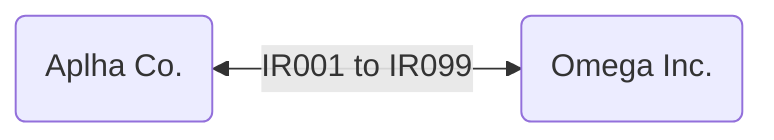
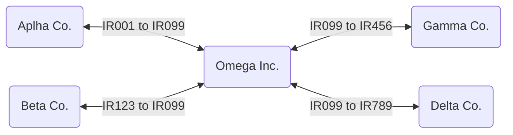
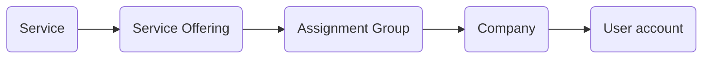

# Multi-source eBonding *--DRAFT--*

---
[[TOC]]

---
# About

_**eBonding**_ is a term used to describe the electronic passing of information for business-to-business (B2B) operations. Typically eBonding is used to keep two system of records in sync. A record on one system has the same information for a record on a different system. Each system passes information between each other as information on the record changes; hence both records contain the same information. Businesses setup and configure eBonding as a means to maintain a system of record they control automatically saving time and resources; i.e., billing, audit, automation, etc. etc..

Example: Alpha Co., is eBonded to Omega Inc.. Information between the two different companies' tickets are shared with each other digitally.  



_**Multi-source eBonding**_ is when you have three or more systems coordinating together on the same record from multiple sources. Multi-source eBonding is a mature B2B model for multi-supplier strategies, where one company coordinates with different multiple suppliers that provide various services within an organization. The advantage of a multi-supplier model is the model provides an organization the ability to right-size their enterprise needs across many suppliers that render a variety of services. Versus letting a single supplier render all operational needs within an organization. 

Example: Alpha Co., Beta Co., Gamma Co., and Delta Co., are all eBonded to Omega Inc.. Information is shared across multiple tickets and additional logic is handled by Omega Inc.; determining how that information is shared across all suppliers. 



This article is to help ServiceNow admins to setup multi-source eBonding framework for incident tickets. Incidents are normally a prime candidate to be shared across multiple suppliers. When an outage to a service is reported, there could be multiple suppliers working together to resolve the incident. Also if a supplier is utilized as an external call center, then routing incoming incident tickets to the appropriate secondary supplier needs to be performed. Given these two scenarios enterprises typically model, make incidents the first type of ticket to build a multi-source eBond framework. The same framework can be applied to other ticket types in ServiceNow with some minor adjustments.

---
## Progressive thoughts
\
Here are the progressive thoughts as multi-source eBonding is being developed to go back and refer too.
- The enterprise will eBond with suppliers, so therefore is makes sense to create company records in the core_company table for each supplier. 
- Company records need to be associated with the local ServiceNow accounts which are used by the supplier to eBond with ServiceNow. This will help you keep track what ServiceNow account is used by the supplier to make their RESTful API calls.
- eBond enabled companies only need to be associated with accounts that have the role of **eBond Account**. 
- eBonding is triggered based on the **Assignment Group** a record to assigned to. Therefore, group (sys_user_group) records need to associated with the companies that ServiceNow are eBonded with. Then in a business rule, if the assignment group company is eBonded, then continue to eBond operations. 
- Turning off/on eBonding is as simple as toggling the company record in the core_company table.

---
## Follow along
\
Each section will include an update set for those that wish to install the multi-source eBonding on their instance and the instructions to create the update set. ServiceNow offers many ways to solve a problem or configure an operational model. These instructions are _a_ way and does not represent _the_ way on creating a multi-source eBonding framework. The best way to use these instructions is to read through them and see how the framework can be adopted and modified to fit your organization.  

!!! note Update sets 
    The instructions do not cover how-to use update sets or the nuisances of update sets. You can explore on how to leverage update sets within the online ServiceNow documentation.  

!!! note Terms & Meanings
    - _Supplier:_ The legal entity that ServiceNow connects too. You can substitute supplier for vendor, partner, or the like.
    - _Company:_ A record from the core_company table in ServiceNow that represents the supplier. 

!!! danger Modifying OOTB tables
    The article focuses on creating a robust framework tied closely to the out of the box (OOTB) tables already existing in ServiceNow. There are alternative implementation solutions within ServiceNow to accomplish the same result. Your mileage may vary depending on scope defined by and practices set by your organization. This framework is meant to be as open and flexible to meet varying modifications to suit present and future requirements.

---
# Foundation setup

The foundation setup is based on the premise that when an incident is created the *Service* and *Service Offering* within an incident are mandatory fields. This is a best practice to follow with a multi-supplier strategy for the enterprise. The reason is this removes the question "who supports this" and focuses on the true issue of "what is service is not working?" Who solves the incident is not of any concern to most customers and requiring customers or fulfillers to know what assignment group to assign a ticket in large enterprise environments is unreasonable and prone to misrouted tickets. 



The *Service* within an incident helps narrow the domain scope where the problem resides.  The *Service Offering*, within an incident, should be limited to the service offerings with the *Service* and determines who the ticket is assigned to in the *Assignment group*. The *Assignment group* will be linked to a supplier (company record). This allows enterprises the ability to swap out suppliers across various services within ServiceNow quickly and easily reducing long term run and maintain costs. 

!!! note Assignment groups
    Normally an *Assignment group* will contain all the members that support the *Service Offering** within an incident. In the eBond case it is normal if their are no members of an *Assignment group*. It is also normal to have members in an *Assignment group* that is eBonded with a supplier as well; where the enterprise allows the supplier to log into the enterprise ServiceNow to fulfill tickets. Either scenario still works with eBonding.   

The supplier will have a company record that is linked to a user record that represents the eBond account the supplier will use to make inbound RESTful calls. This will become a means to quickly identify what account a company uses for eBonding and creates a "lockout" point for security.

---
## Demo data
\
This how-to provides demo data that you can use to test the multi-source eBonding framework. The scenario is your organization has hired Alpha Co., Beta Co., and Gamma Co. to supply IT services across your enterprise. Alpha Co. is your call-center where your customers call to request services and report incidents. Beta Co. supplies data center operations and Gamma Co. supplies backup and recovery operations for the data center. An incident has been reported to Alpha Co. at a data center where both Beta Co. and Gamma Co. need to work together to resolve the incident. 

---
## Update set
\
*eBond Collegiality v1.0*

---
## Add eBond account role
\
The *eBond Account* role denotes which accounts are used by suppliers to eBond with your instance of ServiceNow. Each supplier should have their own local ServiceNow account that the supplier will use to connect to your instance of ServiceNow passing inbound REST payloads. This role will be used in various ways in the multi-source eBond framework. 

1. Navigate to **User Administration** > **Roles** and click **New**.
1. Under *Role New Record*, fill in the following fields:
    - _Name:_ eBond Account
    - _Description:_ Denotes the sys_user account is to be used for eBonding activities.
1. Click **Submit**, which will create the new role.

!!! note Demo Data - User accounts
    Setting up two accounts that will be used by two suppliers Alpha Co. and Beta Co. to make RESTful calls for eBonding.

    1. Navigate to **User Administration** > **Users**, and click **New**.
    1. Under the **User New Record** section, fill in the following field:
        - _User ID:_ eBondAlpha
        - _First name:_ Alpha Co
        - _Last name:_ eBond Account
    1. In the record header, right-click and select **Save**.
    1. In the **Roles** tab, click "Edit..."
    1. Under the **Collection** list, find the *eBond Account* role and add it **>** to the **Roles List**.
    1. Click **Save**.
    1. Click **New**.
    1. Under the **User New Record** section, fill in the following field:
        - _User ID:_ eBondBeta
        - _First name:_ Beta Co
        - _Last name:_ eBond Account
    1. In the record header, right-click and select **Save**.
    1. In the **Roles** tab, click "Edit..."
    1. Under the **Collection** list, find the *eBond Account* role and add it **>** to the **Roles List**.
    1. Click **Save**.
    1. Click **New**.
    1. Under the **User New Record** section, fill in the following field:
        - _User ID:_ eBondGamma
        - _First name:_ Gamma Co
        - _Last name:_ eBond Account
    1. In the record header, right-click and select **Save**.
    1. In the **Roles** tab, click "Edit..."
    1. Under the **Collection** list, find the *eBond Account* role and add it **>** to the **Roles List**.
    1. Click **Save**.

---
## Changes to core_company table
\
We need two new columns in the core_company table; *eBond account* and *eBonded*. The *eBond account* is a reference to sys_user table that links which account the company uses to eBond with your instance. The *eBonded* is a true or false field that we can use to turn off eBonding at the company level. 

1. Navigate to **System Definition** > **Tables** and open the *core_company* table.
1. Under the **Columns** tab, click **New** to create a new column.
1. Under the **Dictionary Entry New Record** section, fill in the following fields:
    - _Type:_ Reference
    - _Column label:_ eBond account
1. Under the **Reference Specification** tab, fill in the following fields:
    - _Table to reference:_ sys_user
    - _Reference qual condition:_
        - Active is true AND
        - Roles is eBond Account
1. Click **Submit**.
1. Under the **Columns** tab, click **New** to create a new column.
1. Under the **Dictionary Entry New Record** section, fill in the following fields:
    - _Type:_ True/False
    - _Column label:_ eBonded
1. Under the **Default value** tab, fill in the following field:
    - _Default value:_ false
1. Click **Submit**.

**OPTIONAL:** Modify the view on company records to see the *eBond account* and *eBonded* fields.

1. Navigate to **Organization** > **Companies** and click on any of the company records.
1. Navigate to **Additional actions** > **Configure** > **Form Layout**, which will bring up the **Configuring Company form**.
1. Under the **Available** list, find the *eBond account* and *eBonded* fields and add them **>** to the **Selected** list.
1. Move the *eBond account* and *eBonded* fields up the **Selected** list **^** to be below the *Stock price*.
1. Click **Save**.

**OPTIONAL:** Modify the view on company records to see the *eBond account* only if the *eBonded* field is true.
1. Navigate to **System UI** > **UI Polices** and click **New**.
1. Under the **UI Policy New record** section, fill in the following fields:
    - _Table:_ core_company
    - _Short description:_ Show eBond account in company
1. Under the **When to apply** tab, fill in the following fields:
    - _Conditions:_
        - eBonded is true
1. In the record header, right-click and select **Save**.
1. In the **UI Policy Actions**, click **New**.
1. Under the **UI Policy Action New record** section, fill in the following fields:
    - _Field name:_ eBond account
    - _Mandatory:_ True
    - _Visible:_ True
1. Click **Submit**.
1. Click **Update**.

!!! note Demo Data - Company records
    Setting up two company records for the suppliers Alpha Co. and Beta Co..

    1. Navigate to **Organization** > **Companies**, and click **New**.
    1. Under the **Company New Record** section, fill in the following field:
        - _Name:_ Alpha Co.
        - _eBonded:_ True
        - _eBond account:_ Alpha Co eBond Account
    1. Click **Submit**.
    1. Click **New**.
    1. Under the **Company New Record** section, fill in the following field:
        - _Name:_ Beta Co.
        - _eBonded:_ True
        - _eBond account:_ Beta Co eBond Account
    1. Click **Submit**.

---
## Associate groups with companies
\
FILL ME IN
1. Navigate to **System Definition** > **Tables** and open the *sys_usr_group* table.
1. Under the **Columns** tab, click **New** to create a new column.
1. Under the **Dictionary Entry New Record** section, fill in the following fields:
    - _Type:_ Reference
    - _Column label:_ Company
1. Under the **Reference Specification** tab, fill in the following fields:
    - _Table to reference:_ core_company
1. Click **Submit**.
1. Click **Update**.

**OPTIONAL:** Modify the view on group records to see the *Company* field.

1. Navigate to **User Administration** > **Groups** and click on any of the group records.
1. Navigate to **Additional actions** > **Configure** > **Form Layout**, which will bring up the **Configuring Group form**.
1. Under the **Available** list, find the *Company* field and add it **>** to the **Selected** list.
1. Move the *Company* field up the **Selected** list **^** to be below the *Name*.
1. Click **Save**.

!!! note Demo Data - Assignment Groups
    Setting up two support groups; *Data Center Operations Support* and *Backup and Recovery Support*. The reason the group names are not associated with the names of the suppliers is a run and maintain operation decision. Most of the time a supplier will support multiple *Service offerings*, when an organization desires to replace a supplier, instead of updating multiple *Service offerings*, only the support group *Company* field need to be updated. This is a minor detail as many organizations choose to name the assignment groups after the supplier and that is perfectly fine.

    1. Navigate to **User Administration** > **Groups**, and click **New**.
    1. Under the **Group New Record** section, fill in the following fields:
        - _Name:_ Data Center Support
        - _Company:_ Alpha Co.
    1. Click **Submit**.
    1. Click **New**.
    1. Under the **Group New Record** section, fill in the following fields:
        - _Name:_ Backup and Recovery Support
        - _Company:_ Beta Co.
    1. Click **Submit**.

---
## Service, service offering, and assignment group alignment in incidents
\
Ticket mis-routing is problem in all services organization and surveys show that customer satisfaction reduces the more a ticket is re-routed. To reduce ticket mis-routes, the service, service offering, and assignment group need to be in alignment. It is unreasonable to expect that fulfillers know which support group supports what services. In large enterprises with hundreds of various services, internal teams, and external suppliers ticket mis-routing is common without alignment between all three fields. 

!!! note Optional setup
    This section is optional, but recommended for any ServiceNow environment; eBonded or not. For organizations that employ a multi-supplier strategy, this section is _highly_ recommended.   

1. Navigate to **System Definition** > **Dictionary**.
1. Under the list view search, fill in the the following search fields and hit enter:
    - _Table:_ task
    - _Column name:_ business_service
1. Open the *task* record.
1. Click on the **Reference Specification** tab, fill in the following field:
    - _Reference qual condition:_
         - Class is not Offering
1. Click **Update**.
1. Navigate to **System Definition** > **Business Rules** and click **New**.
1. Under the **Business Rule New Record** section, fill in the following fields:
    - _Name:_ Incident Auto-assignment Group
    - _Table:_ incident
    - _Advanced:_ True
1. Under the **When to run** tab, fill in the following fields:
    - _Insert:_ True
    - _Update:_ True
    - _Filter Conditions:_
        - Service changes OR
        - Service offering changes
1. Under the **Advanced** tab, fill in the following fields:
    - _Condition:_ gs.isInteractive()
    - _Script:_

        ```` 
        (function executeRule(current, previous /*null when async*/ ) {
        
             if (!gs.nil(current.service_offering.assignment_group))
                 current.assignment_group = current.service_offering.assignment_group;
            else
                 current.assignment_group = current.business_service.assignment_group;
        })(current, previous);
        ```` 
1. Click **Submit**.

!!! note Demo Data - Service and Service Offerings
    Setting up two services and three service offerings for Alpha Co., Beta Co., and Gamma Co.
    | Service | ServiceOffering | Support Group |
    |---------|-----------------|---------------|
    | Service Management | Call Center Operations | Call Center Support |
    | IT Infrastructure | Data Center Operations | Data Center Support |
    | IT Infrastructure | Backup & Recovery | Backup and Recovery Support |
    
    1. Navigate to **Configuration** > **Services**, and click **New**.
    1. Under the **Service New Record** section, fill in the following fields:
        - _Name:_ Service Management
        - _Service classification:_ Business Service
    1. In the record header, right-click and select **Save**.
    1. Under the **Offerings** tab, click **New**.
    1. Under the **Offering New Record** section, fill in the following fields:
        - _Name:_ Call Center Operations
        - _Support Group:_ Call Center Support
    1. Click **Submit**.
    1. Click **Update**.
    1. Click **New**.
    1. Under the **Service New Record** section, fill in the following fields:
        - _Name:_ IT Infrastructure
        - _Service classification:_ Technical Service
    1. In the record header, right-click and select **Save**.
    1. Under the **Offerings** tab, click **New**.
    1. Under the **Offering New Record** section, fill in the following fields:
        - _Name:_ Data Center Operations
        - _Support Group:_ Data Center Support
    1. Click **Submit**.
    1. Under the **Offerings** tab, click **New**.
    1. Under the **Offering New Record** section, fill in the following fields:
        - _Name:_ Backup & Recovery
        - _Support Group:_ Backup and Recovery Support
    1. Click **Submit**.
    1. Click **Update**.

---
## Associate incidents with eBond companies
\
Fulfillers will need the ability to eBond incidents with suppliers. And we have partially started the setup that a trigger point will be the *Assignment group* in an incident. Now we will start to add custom fields to the *incident* table to enhance further functionality that will support and aid in multi-source eBonding.

!!! note Assignment group
    Later on we will configure how changing the *Assignment group* will affect the *eBonded with* field. 

There are two main ways to eBond an incident to a supplier; first via the *Assignment group* and the second via a custom field called *eBonded with*. The *eBonded with* will serve a dual purpose. First, it will represent all the suppliers the ticket is eBonded with in a list. A fulfiller will then have the ability to quickly see what suppliers the ticket is eBonded too. Second, it will toggle eBonding and deBonding operations when suppliers are added or removed from the list. That way a fulfiller can initiate an eBond or deBond with a supplier without having to change the *Assignment group."

!!! note eBonded with
    This field expects the fulfiller to know which suppliers to eBond with and the service offerings the supplier provides. If the fulfiller does not know the proper supplier, then they should use the *Service* and *Service offering* fields to set the *Assignment group* field to the appropriate group.

!!! note deBonding
    deBonding is the opposite of eBonding by breaking the connection between the tickets. After a ticket has been deBonded from a company, the ticket can be re-eBonded to the company by adding the company back to the list. In the event of a re-eBonding, there is no guarantee the company ticket will be the same . 

1. Navigate to **System Definition** > **Tables** and search for the *incident* table under the **Name** field.
1. Open the *Incident* record and click **New** under the **Columns** tab.
1. Under the **Dictionary Entry New Record** section, fill in the following fields:
    - _Type:_ List 
    - _Column label:_ eBonded with
    - _Column name:_ (this should default to u_eBonded_with)
1. Under the **Reference Specification** tab, fill in the following fields:
    - _Reference:_ core_company
    - _Reference qual condition:_
        - eBonded is true AND
        - eBond Account is not empty
1. Click **Submit**.
1. Navigate to **Incident** > **All** and open any incident record.
1. Navigate to **Additional actions** > **Configure** > **Form Layout**, which will bring up the **Configuring Company form**.
1. Under the **Available** list, find the *eBonded with* field and add it **>** to the **Selected** list.
1. Move the *eBonded with* field up the **Selected** list **^** to be below the *Assigned to*.
1. Click **Save**.

---
# Custom tables

eBonding will require the creation of custom tables or the extension of existing tables. ServiceNow sets a limit on the number of custom tables an instance can have before additional costs are accrued/incurred. This how-to will create custom tables as there are no similar tables in ServiceNow that are proper candidates to extend. You however can take any of the base tables in ServiceNow and extend them adding the custom fields and it will work the same.      

---
## eBond relationships
\
The *u_eBond_relationship* table is a multi-relational table that represents a one to many record mapping for an incident ticket to be mapped to multiple supplier tickets. 

The *u_eBond_relationship* table will contain the following custom fields:
|Field|Description|
|-----|-----------|
|Table sys ID|The ServiceNow record sys_id on the instance.|
|Table name|The table the ServiceNow record resides on.|
|Status|The status of the eBond.|
|State|The state of the eBond.|
|Correlation Number|The supplier's ticket number or designation|
|Correlation ID|The supplier's ticket sys id or reference|
|Company|The ServiceNow supplier company record on the instance.|
|URL|Link to the supplier ticket.|
|Reflect|Changes made by the supplier are reflected in the ticket.|

The fields relate the ServiceNow ticket to the various suppliers the ticket is eBonded too.

1. Navigate to **System Definition** > **Tables**.
1. Click **New**.
1. Under the **Table New record** section, fill in the following fields:
    - _Label:_ eBond Relationship
    - _Name:_ u_ebond_relationship
    - _New menu name:_ eBond
1. In the record header, right-click and select **Save**.
1. In the **Columns** table, click **New**.
1. In the **Dictionary Entry New record** section, fill in the following fields:
    - _Type:_ Table Name
    - _Column label:_ Source table
    - _Column name:_ (this should default to u_source_table)
1. Click **Submit**.
1. In the **Columns** table, click **New**.
1. In the **Dictionary Entry New record** section, fill in the following fields:
    - _Type:_ Document ID
    - _Column label:_ Source
    - _Column name:_ (this should default to u_source)
1. Under **Related Links**, click **Advanced view**.
1. Under the **Dependent Field** tab, click **Use dependent field**.
1. In the **Dependent on field**, select **Source table**.
1. Click **Update**.
1. In the **Columns** table, click **New**.
1. In the **Dictionary Entry New record** section, fill in the following fields:
    - _Type:_ Choice
    - _Column label:_ Status
    - _Column name:_ (this should default to u_status)
1. In the **Choice List Specification** tab, select *Dropdown with --None--*.
1. In the record header, right-click and select **Save**.
1. In the **Choices** tab, add the following records performing these steps:
    1. Click **New**.
    1. In the **Choice New record** section, fill in the field values listed below.
    1. Click **Submit**.
    |Sequence|Label|Value|
    |--------|-----|-----|
    |100|Queued|queued|
    |200|Success|success|
    |300|Failure|failure|
1. Click *Update**.
1. In the **Dictionary Entry New record** section, fill in the following fields:
    - _Type:_ Choice
    - _Column label:_ State
    - _Column name:_ (this should default to u_state)
1. In the **Choice List Specification** tab, select *Dropdown with --None--*.
1. In the record header, right-click and select **Save**.
1. In the **Choices** tab, add the following records performing these steps:
    1. Click **New**.
    1. In the **Choice New record** section, fill in the field values listed below.
    1. Click **Submit**.
    |Sequence|Label|Value|
    |--------|-----|-----|
    |100|eBond|ebond|
    |200|eBonded|ebonded|
    |300|deBond|debond|
    |300|deBonded|debonded|
1. Click *Update**.
1. In the **Columns** table, click **New**.
1. In the **Dictionary Entry New record** section, fill in the following fields:
    - _Type:_ String
    - _Column label:_ Correlation Number
    - _Column name:_ (this should default to u_correlation_number)
    - _Max length:_ 40
1. Click **Submit**.
1. In the **Columns** table, click **New**.
1. In the **Dictionary Entry New record** section, fill in the following fields:
    - _Type:_ String
    - _Column label:_ Correlation ID
    - _Column name:_ (this should default to u_correlation_id)
    - _Max length:_ 32
1. Click **Submit**.
1. In the **Columns** table, click **New**.
1. In the **Dictionary Entry New record** section, fill in the following fields:
    - _Type:_ Reference
    - _Column label:_ Company
    - _Column name:_ (this should default to u_company)
1. In the **Reference Specification** tab, fill in the following field:
    - _Reference:_ Company
    - _Reference qual condition:_
        - eBonded is true AND
        - eBond Account is not empty
1. Click **Submit**.
1. In the **Columns** table, click **New**.
1. In the **Dictionary Entry New record** section, fill in the following fields:
    - _Type:_ URL
    - _Column label:_ URL
    - _Column name:_ (this should default to u_url)
    - _Max length:_ 4000
1. Click **Submit**.
1. In the **Columns** table, click **New**.
1. In the **Dictionary Entry New record** section, fill in the following fields:
    - _Type:_ True/False
    - _Column label:_ Reflect
    - _Column name:_ (this should default to u_reflect)
1. Under the **Default Value** tab, , fill in the following field:
    - _Default value:_ false
1. Click **Submit**.
1. Click **Update**.

---
### Relating eBonded tickets
\
Associating the supplier tickets within the incident requires the creation of a relationship between the incident and u_ebond_relationship table.

1. Navigate to **System Definition** > **Relationships** and click **New**.
1. In the **Relationship New record** section, fill in the following fields:
    - _Name:_ eBond Relationships
    - _Applies to table:_ Global [global]
    - _Queries from table:_ eBond Relationship [u_ebond_relationship]
    - _Query with:_

        ```` 
        current.addQuery('u_source_table', parent.getTableName());
        current.addQuery('u_source', parent.sys_id);
        ```` 
1. Click **Submit**.
1. Navigate to **Incident** > **All** and click on any of the incident records.
1. Navigate to **Additional actions** > **Configure** > **Related Lists**, which will bring up the **Configuring related lists on Incident form**.
1. Under the **Available** list, find the *eBond Relationships* relationship and add it **>** to the **Selected** list.
1. Click **Save**.

---
## eBond Properties
\
The *u_ebond_registry* table is similar to that of the *sys_properties* table in that it stores generic properties and values for eBonding. If you choose to use the *sys_properties* table, then make sure to look through the various scripts that reference the *u_ebond_registry* table in this how-to and change as appropriate.

The *u_ebond_registry* table will contain the following custom fields:
|Field|Description|
|-----|-----------|
|Supplier|"All" or the name of the supplier.|
|Key|The key variable name.|
|Value|The property variable value.|
|Note|Misc. information pertaining to the key/value pair.|

1. Navigate to **System Definition** > **Tables**.
1. Click **New**.
1. Under the **Table New record** section, fill in the following fields:
    - _Label:_ eBond Registry
    - _Name:_ u_ebond_registry
    - _Add module to menu:_ eBond
1. In the record header, right-click and select **Save**.
1. In the **Columns** table, click **New**.
1. In the **Dictionary Entry New record** section, fill in the following fields:
    - _Type:_ String
    - _Column label:_ Supplier
    - _Column name:_ (this should default to u_supplier)
    - _Max length:_ 40
1. Under the **Default Value** tab, fill in the following field:
    - _Default value:_ All
1. Click **Submit**.
1. In the **Columns** table, click **New**.
1. In the **Dictionary Entry New record** section, fill in the following fields:
    - _Type:_ String
    - _Column label:_ Key
    - _Column name:_ (this should default to u_key)
    - _Max length:_ 4000
1. Click **Submit**.
1. In the **Dictionary Entry New record** section, fill in the following fields:
    - _Type:_ String
    - _Column label:_ Value
    - _Column name:_ (this should default to u_value)
    - _Max length:_ 4000
1. Click **Submit**.
1. In the **Dictionary Entry New record** section, fill in the following fields:
    - _Type:_ String
    - _Column label:_ Note
    - _Column name:_ (this should default to u_note)
    - _Max length:_ 4000
1. Click **Submit**.
1. Click **Update**.

---
## eBond Logs
\
The *u_ebond_log* table is similar to that of the *syslog* table in that it stores generic log information. If you choose to use the *syslog* table, then make sure to look through the various scripts that reference the *u_ebond_log* table. The *syslog* table has a granularity of seconds and ServiceNow performs multiple operations per second. Hence the order of the logs messages become out of order. It is recommended that you use the *u_ebond_log* to help with debugging as the *Index* column is a sequential integer to aid in showing the order of operations.

!!! note Evaluator messages
The *u_ebond_log* table does not capture *Evaluator* messages from faulted JavaScript execution. Use the *syslog* table to check for failed JavaScript executions.

### eBond Log Index Script Include
\
The *eBondLog* script include is a utility function that will increment the default value in the *index* field in the *[u_ebond_log]* table. The *index* value is based on the greatest index value in the table. If no rows exist, the *index* value is reset to zero.

1. Navigate to **System Definition** > **Script Includes**.
1. Click **New**.
1. Under the **Script Include New record** section, fill in the following fields:
    - _Name:_ eBondLog
    - _API Name:_ (this should default to global.eBondLog)
    - _Script:_
    ```
    var eBondLog = Class.create();
    eBondLog.prototype = {
        initialize: function() {},

        increment: function() {
            var gr = new GlideRecord('u_ebond_log');
            gr.orderByDesc('u_index');
            gr.setLimit(1);
            gr.query();
            var index = 0;
            if (gr.next()) {
                index = gr.u_index + 1;
            }
            return index; // return the calculated value
        },

        // records the log message
        log: function (u_class, u_source, u_supplier, u_message, u_level) {
            // only log levels at or below what has been registered
            if (this.logLevel < parseInt(u_level)) {
                return;
            }
            
            var log = new GlideRecord('u_ebond_log');
            log.u_class = u_class;
            log.u_source = u_source;
            log.u_supplier = u_supplier;
            log.u_message = u_message;
            log.u_level = u_level;
            log.insert();
        },

        type: 'eBondLog'
    };
    ```
1. Click **Submit**.


### eBond Log Index Dynamic Filter Options
\
The dynamic filter option *eBond Log Index Increment* is used in the default value in the *index* field in the *[u_ebond_log]* table as a reference to the script include *eBondLog*.

1. Navigate to **System Definition** > **Dynamic Filter Options**.
1. Click **New**.
1. Under the **Dynamic Filter Options New record** section, fill in the following fields:
    - _Label:_ eBond Log Index Increment
    - _Script:_ new eBondLog().increment();
    - _Available for default:_ true
1. Click **Submit**.


The *u_ebond_log* table will contain the following custom fields:
|Field|Description|
|-----|-----------|
|Index|Auto-incrementing numeric value.|
|Supplier|Name of the supplier.|
|Class|Name of the ServiceNow component, i.e., script include, business rule, workflow, etc. etc..|
|Source|Label of the ServiceNow component.|
|Message|The log message.|
|Level|Choice value of *High*, *Medium*, *Low*, or *Info*.|

1. Navigate to **System Definition** > **Tables**.
1. Click **New**.
1. Under the **Table New record** section, fill in the following fields:
    - _Label:_ eBond Log
    - _Name:_ u_ebond_log
    - _Add module to menu:_ eBond
1. In the record header, right-click and select **Save**.
1. In the **Columns** table, click **New**.
1. In the **Dictionary Entry New record** section, fill in the following fields:
    - _Type:_ Integer
    - _Column label:_ Index
    - _Column name:_ (this should default to u_index)
    - _Read only:_ True
1. Under **Related Links**, click **Advanced view**.
1. Under the **Default Value** tab, fill in the following field:
    - _Use dynamic default:_ true
    - _Dynamic Default value:_ eBond Log Index Increment
1. Click **Submit**.
1. In the **Columns** table, click **New**.
1. In the **Dictionary Entry New record** section, fill in the following fields:
    - _Type:_ String
    - _Column label:_ Supplier
    - _Column name:_ (this should default to u_supplier)
    - _Max length:_ 40
1. Click **Submit**.
1. In the **Columns** table, click **New**.
1. In the **Dictionary Entry New record** section, fill in the following fields:
    - _Type:_ String
    - _Column label:_ Class
    - _Column name:_ (this should default to u_class)
    - _Max length:_ 40
1. Click **Submit**.
1. In the **Columns** table, click **New**.
1. In the **Dictionary Entry New record** section, fill in the following fields:
    - _Type:_ String
    - _Column label:_ Source
    - _Column name:_ (this should default to u_source)
    - _Max length:_ 80
1. Click **Submit**.
1. In the **Columns** table, click **New**.
1. In the **Dictionary Entry New record** section, fill in the following fields:
    - _Type:_ String
    - _Column label:_ Message
    - _Column name:_ (this should default to u_message)
    - _Max length:_ 4000
1. Click **Submit**.
1. In the **Columns** table, click **New**.
1. In the **Dictionary Entry New record** section, fill in the following fields:
    - _Type:_ Choice
    - _Column label:_ Level
    - _Column name:_ (this should default to u_level)
1. In the record header, right-click and select **Save**.
1. Under the **Choices** tab, add the following records performing these steps:
    1. Click **New**.
    1. In the **Choice New record** section, fill in the field values listed below.
    1. Click **Submit**.
    |Sequence|Label|Value|
    |--------|-----|-----|
    |100|High|100|
    |200|Medium|200|
    |300|Low|300|
    |400|Info|400|
1. Click **Update**.
1. Click **Update**.

Create the *[u_ebond_registry]* record used to determine the depth of logs levels to record.

1. Navigate to **eBond** > **eBond Registries**.
1. Click **New**.
1. Under the **eBond Registry New record** section, fill in the following fields:
    - _Supplier:_ All
    - _Key:_ inbound.log.level
    - _Value:_ 500
1. Click **Submit**.

Create the 

---
## eBond Data Map
\
The *u_ebond_data_map* table is a translation data table for inbound and outbound communication with suppliers.

The *u_ebond_data_map* table will contain the following custom fields:
|Field|Description|
|-----|-----------|
|Module|*All* or the name of the module.|
|Classification|Name of the classification.|
|Direction|*Inbound*, *Outbound*, or *Duplex*.|
|Supplier|*All* or the name of the supplier.|
|Source Value|The internal value for the instance.|
|Supplier Value|The supplier's value.|
|Note|Freeform to document various notes pertaining to the data map record.|

1. Navigate to **System Definition** > **Tables**.
1. Click **New**.
1. Under the **Table New record** section, fill in the following fields:
    - _Label:_ eBond Data Map
    - _Name:_ u_ebond_data_map
    - _Add module to menu:_ eBond
1. In the record header, right-click and select **Save**.
1. In the **Columns** table, click **New**.
1. In the **Dictionary Entry New record** section, fill in the following fields:
    - _Type:_ String
    - _Column label:_ Module
    - _Column name:_ (this should default to u_module)
    - _Max length:_ 40
1. Click **Submit**.
1. In the **Columns** table, click **New**.
1. In the **Dictionary Entry New record** section, fill in the following fields:
    - _Type:_ String
    - _Column label:_ Classification
    - _Column name:_ (this should default to u_classification)
    - _Max length:_ 40
1. Click **Submit**.
1. In the **Columns** table, click **New**.
1. In the **Dictionary Entry New record** section, fill in the following fields:
    - _Type:_ Choice
    - _Column label:_ Direction
    - _Column name:_ (this should default to u_direction)
    - _Max length:_ 40
1. In the record header, right-click and select **Save**.
1. Under the **Choices** tab, add the following records performing these steps:
    1. Click **New**.
    1. In the **Choice New record** section, fill in the field values listed below.
    1. Click **Submit**.
    |Sequence|Label|Value|
    |--------|-----|-----|
    |100|Inbound|inbound|
    |200|Outbound|outbound|
    |300|Duplex|duplex|
1. Click **Update**.
1. In the **Columns** table, click **New**.
1. In the **Dictionary Entry New record** section, fill in the following fields:
    - _Type:_ String
    - _Column label:_ Supplier
    - _Column name:_ (this should default to u_supplier)
    - _Max length:_ 40
1. Click **Submit**.
1. In the **Columns** table, click **New**.
1. In the **Dictionary Entry New record** section, fill in the following fields:
    - _Type:_ String
    - _Column label:_ Source value
    - _Column name:_ (this should default to u_source_value)
    - _Max length:_ 4000
1. Click **Submit**.
1. In the **Columns** table, click **New**.
1. In the **Dictionary Entry New record** section, fill in the following fields:
    - _Type:_ String
    - _Column label:_ Supplier value
    - _Column name:_ (this should default to u_supplier)
    - _Max length:_ 4000
1. Click **Submit**.
1. In the **Dictionary Entry New record** section, fill in the following fields:
    - _Type:_ String
    - _Column label:_ Note
    - _Column name:_ (this should default to u_note)
    - _Max length:_ 4000
1. Click **Submit**.
1. Click **Update**.

---
## eBond REST Payloads
\
The *u_ebond_rest_payloads* table records all outbound REST API calls and their statuses. This table is also used to retry REST calls in the event of a failure; see **eBond Scheduled Job**. 

The *u_ebond_rest_payloads* table will contain the following custom fields:
|Field|Description|
|-----|-----------|
|Supplier|The name of the supplier.|
|Retry count|The number of retries performed executing the RESTful call to the supplier.|
|Retry|True or False.|
|REST Message|ServiceNow REST message label.|
|Payload|REST data payload for the supplier.|
|Format|The format of the payload; e.g., JSON, XML, SOAP, etc. etc..|
|Number|The source ticket number.|
|HTTP Status|HTTP return code.|
|HTTP Response|Entire HTTP response payload.|
|HTTP Method|ServiceNow REST method label.|
|Endpoint|The URL endpoint for the REST call.|
|Active|True or False|

1. Navigate to **System Definition** > **Tables**.
1. Click **New**.
1. Under the **Table New record** section, fill in the following fields:
    - _Label:_ eBond REST Payload
    - _Name:_ u_ebond_rest_payload
    - _Add module to menu:_ eBond
1. In the record header, right-click and select **Save**.
1. In the **Columns** table, click **New**.
1. In the **Dictionary Entry New record** section, fill in the following fields:
    - _Type:_ String
    - _Column label:_ Supplier
    - _Column name:_ (this should default to u_supplier)
    - _Max length:_ 40
1. Click **Submit**.
1. In the **Columns** table, click **New**.
1. In the **Dictionary Entry New record** section, fill in the following fields:
    - _Type:_ Integer
    - _Column label:_ Retry count
    - _Column name:_ (this should default to u_retry_count)
1. Under the **Default Value** tab, , fill in the following field:
    - _Default value:_ 0
1. Click **Submit**.
1. In the **Columns** table, click **New**.
1. In the **Dictionary Entry New record** section, fill in the following fields:
    - _Type:_ True/False
    - _Column label:_ Retry
    - _Column name:_ (this should default to u_retry)
1. Under the **Default Value** tab, , fill in the following field:
    - _Default value:_ true
1. Click **Submit**.
1. In the **Columns** table, click **New**.
1. In the **Dictionary Entry New record** section, fill in the following fields:
    - _Type:_ String
    - _Column label:_ REST Message
    - _Column name:_ (this should default to u_rest_message)
    - _Max length:_ 40
1. Click **Submit**.
1. In the **Columns** table, click **New**.
1. In the **Dictionary Entry New record** section, fill in the following fields:
    - _Type:_ String
    - _Column label:_ Payload
    - _Column name:_ (this should default to u_payload)
    - _Max length:_ 4000
1. Click **Submit**.
1. In the **Columns** table, click **New**.
1. In the **Dictionary Entry New record** section, fill in the following fields:
    - _Type:_ String
    - _Column label:_ Format
    - _Column name:_ (this should default to u_format)
    - _Max length:_ 40
1. Click **Submit**.
1. In the **Columns** table, click **New**.
1. In the **Dictionary Entry New record** section, fill in the following fields:
    - _Type:_ String
    - _Column label:_ Number
    - _Column name:_ (this should default to u_number)
    - _Max length:_ 40
1. Click **Submit**.
1. In the **Columns** table, click **New**.
1. In the **Dictionary Entry New record** section, fill in the following fields:
    - _Type:_ Integer
    - _Column label:_ HTTP Status
    - _Column name:_ (this should default to u_http_status)
1. Click **Submit**.
1. In the **Columns** table, click **New**.
1. In the **Dictionary Entry New record** section, fill in the following fields:
    - _Type:_ String
    - _Column label:_ HTTP Response
    - _Column name:_ (this should default to u_http_response)
    - _Max length:_ 4000
1. Click **Submit**.
1. In the **Columns** table, click **New**.
1. In the **Dictionary Entry New record** section, fill in the following fields:
    - _Type:_ String
    - _Column label:_ HTTP Method
    - _Column name:_ (this should default to u_http_method)
    - _Max length:_ 40
1. Click **Submit**.
1. In the **Columns** table, click **New**.
1. In the **Dictionary Entry New record** section, fill in the following fields:
    - _Type:_ String
    - _Column label:_ Endpoint
    - _Column name:_ (this should default to u_endpoint)
    - _Max length:_ 400
1. Click **Submit**.
1. In the **Columns** table, click **New**.
1. In the **Dictionary Entry New record** section, fill in the following fields:
    - _Type:_ True/False
    - _Column label:_ Active
    - _Column name:_ (this should default to u_active)
1. Under **Related Links**, click **Advanced view**.
1. Under the **Calculated Value** tab, fill in the following fields:
    - _Calculated:_ true
    - _Calculation:_

        ````
        (function calculatedFieldValue(current) {
            var calc = current.u_retry;

            switch (current.u_http_status.toString()) {
                //1×× Informational
                case '100': // Continue
                case '101': // Switching Protocols
                case '102': // Processing
                case '200': // OK
                case '201': // Created
                case '202': // Accepted
                case '203': // Non-authoritative Information
                case '204': // No Content
                case '205': // Reset Content
                case '206': // Partial Content
                case '207': // Multi-Status
                case '208': // Already Reported
                case '226': // IM Used
                case '300': // Multiple Choices
                case '301': // Moved Permanently
                case '302': // Found
                case '303': // See Other
                case '304': // Not Modified
                case '305': // Use Proxy
                case '307': // Temporary Redirect
                case '308': // Permanent Redirect
                case '400': // Bad Request
                    calc = false;
                    break;
                case '401': // Unauthorized
                case '402': // Payment Required
                case '403': // Forbidden
                case '404': // Not Found
                case '405': // Method Not Allowed
                case '406': // Not Acceptable
                case '407': // Proxy Authentication Required
                case '408': // Request Timeout
                case '409': // Conflict
                case '410': // Gone
                case '411': // Length Required
                case '412': // Precondition Failed
                case '413': // Payload Too Large
                case '414': // Request-URI Too Long
                case '415': // Unsupported Media Type
                case '416': // Requested Range Not Satisfiable
                case '417': // Expectation Failed
                case '418': // I'm a teapot
                case '421': // Misdirected Request
                case '422': // Unprocessable Entity
                case '423': // Locked
                case '424': // Failed Dependency
                case '426': // Upgrade Required
                case '428': // Precondition Required
                case '429': // Too Many Requests
                case '431': // Request Header Fields Too Large
                case '444': // Connection Closed Without Response
                case '451': // Unavailable For Legal Reasons
                case '499': // Client Closed Request
                case '500': // Internal Server Error
                case '501': // Not Implemented
                case '502': // Bad Gateway
                case '503': // Service Unavailable
                case '504': // Gateway Timeout
                    break;
                case '505': // HTTP Version Not Supported
                case '506': // Variant Also Negotiates
                case '507': // Insufficient Storage
                case '508': // Loop Detected
                case '510': // Not Extended
                case '511': // Network Authentication Required
                case '599': // Network Connect Timeout Error
                    calc = false;
                    break;
                default:
                    break;
            }

            // after 48 hours of retrying, turn off active flag
            if (current.u_retry_count >= 48) {
                calc = false;
            }

            return calc; // return the calculated value
        })(current);
        ````
1. Click **Update**.
1. Click **Update**.

---
# Multi-source Inbound Handling

Inbound incident handling could be setup in an agnostic fashion based on a mutual push-push model setup between the enterprise and suppliers. The mutual push-push model is where the each party sets how they shall receive messages and no party performs a pull/get operation. There are major advantages for this model over one party dictating both how it will send and receive messages. 

!!! note OEM & OSP
    Original equipment manufacturers (OEM) and original service providers (OSP) rarely fit into the mutual push-push model as their clientele is vast and the reliance of the enterprise on the OEMs and OSPs do not warrant a collaborative effort between the enterprise ServiceNow developers and the OEM/OSP. In the case of true partnership between enterprise and suppliers should allow for a mutual push-push model.    

The biggest advantage to all parties is long term run and maintain of eBonding operations. If one party changes their fields or data, the other party is not forced into changing their eBonding framework to accommodate; a decision from one party should not impact or cause work for the other. Another advantage is resource utilization. Pull requests are expensive and if an enterprise is being pulled by dozens of suppliers, this places an undue burden on the enterprise. It is far more agreeable that if a change is to occur in one party's record, then that party will pass (push) the delta change to the agreed parties.

---
## Quick Rundown
\
Suppliers will write to a staging table called *[u_ebond_incident_staging]*. The table will be an extension of the *[sys_import_set_row]* and will have the ability to take advantage of the OOTB ServiceNow transform functionality. The *transform maps* will validate the incoming data and then create or update the appropriate records within the system.

---
## Incident staging table
\
Normally the REST inbound message handling aspect for eBonding is developed using *Scripted REST API*. For multi-source eBonding a different model will be developed using a staging table. Suppliers will directly write to a staging table instead of a Scripted REST API.

ServiceNow *Transform Maps* provide an elegant and efficient means to do much of what a *Scripted REST API* can do with the use of *Transform Scripts*. The **onStart** is used for preparation of global variables, *onBefore* is used for data validation, and *onAfter* for data operations. All of this efficiently designed by Servicenow in the import set framework to handle inbound REST messages.

!!! note Staging other tables
    For each type of destination ServiceNow table for multi-source eBonding will require a unique staging table. For example, if the requirement is to have a multi-source eBond with change requests, a similar staging table that that below will need to be created.

The *u_ebond_incident_staging* table holds the field values passed by the supplier for incidents.

The *u_ebond_incident_staging* table will contain the following custom fields:
|Field|Description|
|-----|-----------|
|Work Note|Support work note, customer not visible.|
|Subcategory|Subcategory for the incident.|
|State|The state of the incident.|
|Short Description|The title (or short description) of the incident.|
|Service Offering|The service offering the incident is impacting.|
|Service|The service the incident is impacting.|
|Impact|The impact the incident has on the service.|
|Urgency|The urgency to resolve the incident.|
|Sys ID|The sys_id for the local incident ticket.|
|Number|The number for the local incident ticket.|
|Hold Reason|The reason the incident ticket was placed on hold.|
|Description|The description of the incident.|
|Contact Type|How the incident was reported.|
|Comment|Customer visible comment.|
|External Reference|The supplier's incident ticket unique identifier.|
|External Number|The supplier's incident ticket number.|
|Error|Returning error information.|
|CMDB CI|The configuration item the incident is reported against.|
|Close Notes|Incident closure notes.|
|Close Code|Incident closure code.|
|Category|Category for the incident|
|Caller|The caller who reported the incident.|
|Assignment Group|The assignment group working the incident.|

1. Navigate to **System Definition** > **Tables**.
1. Click **New**.
1. Under the **Table New record** section, fill in the following fields:
    - _Label:_ eBond Incident Staging
    - _Name:_ u_ebond_incident_staging
    - _Extends table:_ Import Set Row [sys_import_set_row]
    - _Add module to menu:_ eBond
1. In the record header, right-click and select **Save**.
1. In the **Columns** table, click **New**.
1. In the **Dictionary Entry New record** section, fill in the following fields:
    - _Type:_ String
    - _Column label:_ Work Note
    - _Column name:_ (this should default to u_work_note)
    - _Max length:_ 4000
1. Click **Submit**.
1. In the **Columns** table, click **New**.
1. In the **Dictionary Entry New record** section, fill in the following fields:
    - _Type:_ String    
    - _Column label:_ Subcategory
    - _Column name:_ (this should default to u_subcategory)
    - _Max length:_ 80
1. Click **Submit**.
1. In the **Columns** table, click **New**.
1. In the **Dictionary Entry New record** section, fill in the following fields:
    - _Type:_ String   
    - _Column label:_ State
    - _Column name:_ (this should default to u_state)
    - _Max length:_ 40
1. Click **Submit**.
1. In the **Columns** table, click **New**.
1. In the **Dictionary Entry New record** section, fill in the following fields:
    - _Type:_ String    
    - _Column label:_ Short Description
    - _Column name:_ (this should default to u_short_description)
    - _Max length:_ 1000
1. Click **Submit**.
1. In the **Columns** table, click **New**.
1. In the **Dictionary Entry New record** section, fill in the following fields:
    - _Type:_ String
    - _Column label:_ Service Offering
    - _Column name:_ (this should default to u_service_offering)
    - _Max length:_ 255
1. Click **Submit**.
1. In the **Columns** table, click **New**.
1. In the **Dictionary Entry New record** section, fill in the following fields:
    - _Type:_ String
    - _Column label:_ Service
    - _Column name:_ (this should default to u_service)
    - _Max length:_ 255
1. Click **Submit**.
1. In the **Columns** table, click **New**.
1. In the **Dictionary Entry New record** section, fill in the following fields:
    - _Type:_ String
    - _Column label:_ Impact
    - _Column name:_ (this should default to u_impact)
    - _Max length:_ 40
1. Click **Submit**.
1. In the **Dictionary Entry New record** section, fill in the following fields:
    - _Type:_ String
    - _Column label:_ Urgency
    - _Column name:_ (this should default to u_urgency)
    - _Max length:_ 40
1. Click **Submit**.
1. In the **Columns** table, click **New**.
1. In the **Dictionary Entry New record** section, fill in the following fields:
    - _Type:_ String
    - _Column label:_ Sys ID
    - _Column name:_ (this should default to u_sys_id)
    - _Max length:_ 40
1. Click **Submit**.
1. In the **Columns** table, click **New**.
1. In the **Dictionary Entry New record** section, fill in the following fields:
    - _Type:_ String
    - _Column label:_ Number
    - _Column name:_ (this should default to u_number)
    - _Max length:_ 40
1. Click **Submit**.
1. In the **Columns** table, click **New**.
1. In the **Dictionary Entry New record** section, fill in the following fields:
    - _Type:_ String
    - _Column label:_ Hold Reason
    - _Column name:_ (this should default to u_hold_reason)
    - _Max length:_ 40
1. Click **Submit**.
1. In the **Columns** table, click **New**.
1. In the **Dictionary Entry New record** section, fill in the following fields:
    - _Type:_ String
    - _Column label:_ Description
    - _Column name:_ (this should default to u_description)
    - _Max length:_ 4000
1. Click **Submit**.
1. In the **Columns** table, click **New**.
1. In the **Dictionary Entry New record** section, fill in the following fields:
    - _Type:_ String
    - _Column label:_ Contact Type
    - _Column name:_ (this should default to u_contact_type)
    - _Max length:_ 40
1. Click **Submit**.
1. In the **Columns** table, click **New**.
1. In the **Dictionary Entry New record** section, fill in the following fields:
    - _Type:_ String
    - _Column label:_ Comment
    - _Column name:_ (this should default to u_comment)
    - _Max length:_ 4000
1. Click **Submit**.
1. In the **Columns** table, click **New**.
1. In the **Dictionary Entry New record** section, fill in the following fields:
    - _Type:_ String
    - _Column label:_ External Reference
    - _Column name:_ (this should default to u_external_reference)
    - _Max length:_ 40
1. Click **Submit**.
1. In the **Columns** table, click **New**.
1. In the **Dictionary Entry New record** section, fill in the following fields:
    - _Type:_ String
    - _Column label:_ External Number
    - _Column name:_ (this should default to u_external_number)
    - _Max length:_ 40
1. Click **Submit**.
1. In the **Columns** table, click **New**.
1. In the **Dictionary Entry New record** section, fill in the following fields:
    - _Type:_ String
    - _Column label:_ Error
    - _Column name:_ (this should default to u_error)
    - _Max length:_ 4000
1. Click **Submit**.
1. In the **Columns** table, click **New**.
1. In the **Dictionary Entry New record** section, fill in the following fields:
    - _Type:_ String
    - _Column label:_ CMDB CI
    - _Column name:_ (this should default to u_cmdb_ci)
    - _Max length:_ 40
1. Click **Submit**.
1. In the **Columns** table, click **New**.
1. In the **Dictionary Entry New record** section, fill in the following fields:
    - _Type:_ String
    - _Column label:_ Close Notes
    - _Column name:_ (this should default to u_close_notes)
    - _Max length:_ 1000
1. Click **Submit**.
1. In the **Columns** table, click **New**.
1. In the **Dictionary Entry New record** section, fill in the following fields:
    - _Type:_ String
    - _Column label:_ Close Code
    - _Column name:_ (this should default to u_close_code)
    - _Max length:_ 40
1. Click **Submit**.
1. In the **Columns** table, click **New**.
1. In the **Dictionary Entry New record** section, fill in the following fields:
    - _Type:_ String
    - _Column label:_ Category
    - _Column name:_ (this should default to u_category)
    - _Max length:_ 80
1. Click **Submit**.
1. In the **Columns** table, click **New**.
1. In the **Dictionary Entry New record** section, fill in the following fields:
    - _Type:_ String
    - _Column label:_ Caller
    - _Column name:_ (this should default to u_caller)
    - _Max length:_ 40
1. Click **Submit**.
1. In the **Columns** table, click **New**.
1. In the **Dictionary Entry New record** section, fill in the following fields:
    - _Type:_ String
    - _Column label:_ Assignment Group
    - _Column name:_ (this should default to u_assignment_group)
    - _Max length:_ 40
1. Click **Submit**.
1. Click **Update**.

---
## Inbound Transform
\
The inbound *transform map* uses *transform scripts* to perform various operations on the data directly passed by the supplier. The *transform scripts* can be set to *when* they are executed against the data in the transform. 

- **onStart:** Sets up the global variables used by the other transform scripts. Global variables will be capitalized for ease of development. 
- **onBefore:** Validates security and the data passed by the supplier. The order of scripts are important as pre-checks must complete before continuing the transform.  
- **on:After** Creates or updates the needed fields within the records. 
- **on:Complete** Verifies all operations and updates return information to the supplier. 

1. Navigate to **System Import Sets** > **Transform Maps**.
1. Click **New**.
1. In the **Table Transform Map New record** section, fill in the following fields:
    - _Name:_ eBond Incident Transform
    - _Source table:_ eBond Incident Staging [u_ebond_incident_staging]
    - _Target table:_ eBond Relationship [u_ebond_relationship]
1. In the record header, right-click and select **Save**.
1. In the **Field Maps** tab, click **New**.
1. In the **Field Map New record** section, fill in the following fields:
    - _Source field:_ External Number [u_external_number]
    - _Target field:_ Correlation Number [u_correlation_number]
    - _Coalesce:_ True
1. Click **Submit**.

    !!! note Coalesce field not indexed
        If a pop-up box appears titled *Coalesce field not indexed*, then click **OK**, fill in the followup contact information and click **OK**.

1. In the **Field Maps** tab, click **New**.
1. In the **Field Map New record** section, fill in the following fields:
    - _Source field:_ External reference [u_external_reference]
    - _Target field:_ Correlation ID [u_correlation_id]
    - _Coalesce:_ false
1. Click **Submit**.
1. In the **Field Maps** tab, click **New**.
1. In the **Field Map New record** section, click **Use source script** and fill in the following fields:
    - _Choice action:_ ignore
    - _Target field:_ company [core_Company]
    - _Coalesce field:_ true
    - _Script:_ 

        ````
        answer = (function transformEntry(source) {

            // coalesce script is called at various times in the transform
            // ignore the time(s) when the row is not even being evaluated
            if (source.sys_created_by == "") {
                return;
            }

            // coalesce script is called before ServiceNow global transform map
            // variables are defined
            if (error == undefined) {
                var error = "";
            }

            // once the source row is read in during the transform, the 
            // global error variable is defined by ServiceNow, and to 
            // prevent the coalesce script to be called twice on error, 
            // this check is required
            if (error == true) {
                return;
            }

            // find the company the account is associated with
            var user = new GlideRecord('sys_user');
            user.addQuery('user_name', source.sys_created_by);
            user.query();
            if (!user.next()) {
                // supplier is not eBond enabled
                var log = new GlideRecord('u_ebond_log');
                log.u_class = 'eBond Incident Transform map';
                log.u_source = '[Field Map] Company';
                log.u_supplier = 'Unknown';
                log.u_message = 'Security Violation: An account (' + source.sys_created_by + ') cannot be found. Reference: ' + source.sys_id;
                log.u_level = 'High';
                log.insert();

                error = true;
                error_message = "Security violation.";
                source.u_error = error_message;
                return "";
            }

            // find the company the account is associated with
            var company = new GlideRecord('core_company');
            company.addQuery('u_ebond_account', user.sys_id);
            company.query();
            if (company.next()) {
                // make sure the supplier is still eBond approved
                if (company.u_ebonded) {
                    return company.sys_id;
                }

                // supplier is not eBond enabled
                var log = new GlideRecord('u_ebond_log');
                log.u_class = 'eBond Incident Transform map';
                log.u_source = '[Field Map] Company';
                log.u_supplier = company.name;
                log.u_message = 'Security Violation: The supplier ' + company.name + ' is not eBond enabled. Reference: ' + source.sys_id;
                log.u_level = 'Low';
                log.insert();

                error = true;
                error_message = "Security violation.";
                source.u_error = error_message;
                return "";
            }

            // creator is not associated with a supplier
            var log = new GlideRecord('u_ebond_log');
            log.u_class = 'eBond Incident Transform map';
            log.u_source = '[Field Map] Company';
            log.u_supplier = 'Unknown';
            log.u_message = 'Security Violation: An eBond account (' + source.sys_created_by + ') has written to the u_ebond_incident_staging table with no reference to a record entry in the core_company table. Reference:       ' + source.sys_id;
            log.u_level = 'High';
            log.insert();

            error = true;
            error_message = "Security violation.";
            source.u_error = error_message;
            return ""; // return the value to be put into the target field

        })(source);
        ````
1. Click **Submit**.

    !!! note Coalesce fields
        Only the *target field* fields *u_correlation_number* and *u_company* fields are coalesce fields. The *u_company* is derived internally from the *sys_created_by* field that holds the account that wrote the record. This removes the means to supplant company information. The *u_correlation_number* by itself is not sufficient to make it unique enough with multiple eBonded suppliers. The combination of the *u_correlation_number* and *u_company* is required; as the assumption is the supplier will not duplicate their ticket numbers. However, two or more suppliers could have the same ticket numbers unrelated to each other. The reason that the *u_external_reference* is not used is it's typically not a required field. Some ticket solutions do not use reference qualifiers and the ticket number is sufficient when passing information back to the supplier. 

1. In the **Transform Scripts** tab, click **New**.
1. In the **Transform Script New record** section, fill in the following fields:
    - _When:_ onStart
    - _Order:_ 1
    - _Script:_

        ````
        // Initialize global variables
        var SUPPLIER = ""; // supplier's name
        // SUPPLIER: the string value that represents the supplier
        //   used primarily for logging and registry operations
        
        var COMPANY = ""; // supplier's company record
        // COMPANY: the sys_id of the local [core_company] table record dor the supplier
        
        var INCIDENT = ""; // incident reference
        var INCIDENT_NUMBER = ""; // incident number
        // INCIDENT: the sys_id of the local [incident] table record 
        // INCIDENT_NUMBER: the number of the local [incident] table record 
        
        var URL = ""; // URL reference back to supplier ticket
        // URL: the reference back to the supplier's ticket
        
        // action: is a OOTSB ServiceNow variable to represent the creation of a new record in the u_ebond_relationship table
        
        var OPERATION = "invalid" ;
        // OPERATION: what action to take on the [incident] table record
        //   create - create a new incident record
        //   update - update an existing incident record
        
        var EXECUTION  = "invalid";
        // EXECUTION: what the operation will do  
        //   reflect - changes from the supplier are mapped to the fields in the incident record
        //   inform - changes from the supplier are mapped to the work notes in the incident record
        //   debond - deBonds the supplier and enterprise ticket.
        
        var SUBCATEGORY = "";
        var STATE = "";
        var SERVICE_OFFERING = "";
        var SERVICE = "";
        var IMPACT = "";
        var URGENCY = "";
        var CONTACT_TYPE = "";
        var CLOSE_CODE = "";
        var CATEGORY = "";
        var CALLER = "";
        var ASSIGNMENT_GROUP = "";
        ````
1. Click **Submit**.
1. In the **Transform Script New record** section, fill in the following fields:
    - _When:_ onBefore
    - _Order:_ 5
    - _Script:_

        ````
        // SUPPLIER
        (function runTransformScript(source, map, log, target /*undefined onStart*/ ) {
        
            var registry = new GlideRecord('u_ebond_registry');
            registry.addQuery('u_key', 'inbound.account');
            registry.addQuery('u_value', source.sys_created_by);
            registry.query();
            if (registry.next()) {
                SUPPLIER = registry.u_supplier;
            } else {
                var log = new GlideRecord('u_ebond_log');
                log.u_class = 'eBond Incident Transform script';
                log.u_source = '[onBefore] SUPPLIER';
                log.u_supplier = 'Unknown';
                log.u_message = 'Registry Error: An eBond account (' + source.sys_created_by + ') is missing registry key "inbound account". Reference: ' + source.sys_id;
                log.u_level = 'Medium';
                log.insert();
        
                error = true;
                error_message = "Unregistered supplier account.";
                source.u_error = error_message;
            }
        
            return;
        })(source, map, log, target);       
        ````
1. Click **Submit**.
1. In the **Transform Script New record** section, fill in the following fields:
    - _When:_ onBefore
    - _Order:_ 10
    - _Script:_

        ````
        // check required fields
        (function runTransformScript(source, map, log, target /*undefined onStart*/ ) {
            
            var missingField = false;
            var missingFields = 'Missing the folowing required field(s): ';
            var separator = '';
        
            // supplier ticket number is mandatory in all cases
            if (source.u_external_number == '') {
                missingField = true;
                missingFields = missingFields + separator + 'u_external_number';
                separator = ', ';
            }
        
            // if new relationship, provide a short description
            if (action == 'insert' && source.u_short_description == '') {
                missingField = true;
                missingFields = missingFields + separator + 'u_short_description';
                separator = ', ';
            }
        
            // if new relationship, provide a description
            if (action == 'insert' && source.u_description == '') {
                missingField = true;
                missingFields = missingFields + separator + 'u_description';
                separator = ', ';
            }
        
            // if state is on hold, provide a hold reason
            if (source.u_state == '3' && source.u_hold_reason == '') {
                missingField = true;
                missingFields = missingFields + separator + 'u_hold_reason';
                separator = ', ';
            }
        
            // if state is resolved or closed, provide a close code
            if ((source.u_state == '6' || source.u_state == '7') && source.u_close_code == '') {
                missingField = true;
                missingFields = missingFields + separator + 'u_close_code';
                separator = ', ';
            }
        
            // if state is resolved or closed, provide a close notes
            if ((source.u_state == '6' || source.u_state == '7') && source.u_close_notes == '') {
                missingField = true;
                missingFields = missingFields + separator + 'u_close_notes';
                separator = ', ';
            }
        
            if (missingField) {
                missingFields = missingFields + '.';
                var log = new GlideRecord('u_ebond_log');
                log.u_class = 'eBond Incident Transform script';
                log.u_source = '[onBefore] check required fields';
                log.u_supplier = SUPPLIER;
                log.u_message = missingFields + ' Reference: ' + source.sys_id;
                log.u_level = 'Low';
                log.insert();
        
                error = true;
                error_message = missingFields;
                source.u_error = error_message;
            }
        
            return;
        })(source, map, log, target);
        ````
1. Click **Submit**.
1. In the **Transform Script New record** section, fill in the following fields:
    - _When:_ onBefore
    - _Order:_ 20
    - _Script:_

        ````
        // COMPANY
        (function runTransformScript(source, map, log, target /*undefined onStart*/ ) {
        
            // find the company the account is associated with
            var company = new GlideRecord('core_company');
            company.addQuery('u_ebond_account', source.sys_created_by);
            company.query();
            if (company.next()) {
                COMPANY = company.sys_id;
            }
        
        })(source);
        ````
1. Click **Submit**.
1. In the **Transform Script New record** section, fill in the following fields:
    - _When:_ onBefore
    - _Order:_ 30
    - _Script:_

        ````
        // OPERATION & EXECUTION
        (function runTransformScript(source, map, log, target /*undefined onStart*/ ) {
        
            /*
              scenario matrix
              invalid is where logically the transform cannot handle the scenario
              if OPERATION or EXECUTION found to default to invalid will log an error
              action is the operation the transform will have on the u_ebond_relationship table
        
              action  |  OPERATION  |  EXECUTION  |  SCENARIO
              ----------------------------------------------------------------------------------------------------
              insert  |  create     |  reflect    | new eBond from supplier
              insert  |  create     |  inform     |   invalid - cannot create an inform incident
              insert  |  create     |  debond     |   invalid - cannot create a debond incident
              insert  |  update     |  reflect    |   invalid - ticket would already be eBonded
              insert  |  update     |  inform     | new eBond from supplier to existing ticket
              insert  |  update     |  debond     |   invalid - cannot create a debond incident
              update  |  create     |  reflect    |   invalid - supplier cannot re-open closed incident. 
              update  |  create     |  inform     |   invalid - cannot create an inform incident
              update  |  create     |  debond     |   invalid - cannot create a debond incident
              update  |  update     |  reflect    | supplier is updating a ticket
              update  |  update     |  inform     | supplier is updating a ticket they do not own -OR-
                                                  | supplier is re-eBonding to a prior ticket
              update  |  update     |  debond     | supplier is debonding the tickets
            */
        
            //  action  |  OPERATION  |  EXECUTION  |  SCENARIO
            //  ----------------------------------------------------------------------------------------------------
            //  insert  |  create     |  reflect    | new eBond from supplier
            if (action == 'insert' && source.u_number == '' && source.u_sys_id == '') {
                OPERATION = 'create';
                EXECUTION = 'reflect';
                return;
            }
        
            //  action  |  OPERATION  |  EXECUTION  |  SCENARIO
            //  ----------------------------------------------------------------------------------------------------
            //  insert  |  update     |  inform     | new eBond from supplier to existing ticket
            if (action == 'insert' && (source.u_number != '' || source.u_sys_id != '')) {
                var incident = new GlideRecord('incident');
                if (source.u_number != '') {
                    incident.addQuery('number', source.u_number);
                } else {
                    incident.addQuery('sys_id', source.u_sys_id);
                }
                incident.query();
                if (incident.next()) {
                    OPERATION = 'update';
                    EXECUTION = 'inform';
                    return;
                } else {
                    var log = new GlideRecord('u_ebond_log');
                    log.u_class = 'eBond Incident Transform script';
                    log.u_source = '[onBefore] OPERATION & EXECUTION';
                    log.u_supplier = SUPPLIER;
                    if (source.u_number != '') {
                        log.u_message = 'Incident Not Found: Could not find incident ' + source.u_number + '. Reference: ' + source.sys_id;
                    } else {
                        log.u_message = 'Incident Not Found: Could not find the incident reference ' + source.u_sys_id + '. Reference: ' + source.sys_id;
                    }
                    log.u_level = 'Medium';
                    log.insert();
        
                    error = true;
                    error_message = "Incident not found.";
                    source.u_error = error_message;
                    return;
                }
            }
        
            //  action  |  OPERATION  |  EXECUTION  |  SCENARIO
            //  ----------------------------------------------------------------------------------------------------
            //  update  |  *          |  *          |  if the eBond relationship exists, so does the incident
            //                                      |  if the incident is closed there is nothing that can be done
            if (action == 'update') {
                var incident = new GlideRecord('incident');
                incident.addQuery('number', relationship.u_source);
                incident.query();
                if (incident.next()) {
                    if (incident.getValue('state') == 7) { // closed
                        error = true;
                        error_message = "Incident " + incident.number + "cannot be updated. The incident is closed.";
                        source.u_error = error_message;
                        return;
                    }
                }
            }
        
            //  action  |  OPERATION  |  EXECUTION  |  SCENARIO
            //  ----------------------------------------------------------------------------------------------------
            //  update  |  update     |  debond     | supplier is debonding the tickets
            if (action == 'update' && (source.u_number == '-1' || source.u_sys_id == '-1') && target.u_state.indexOf('debond') == -1) {
                OPERATION = 'update';
                EXECUTION = 'debond';
                return;
            }
        
            //  action  |  OPERATION  |  EXECUTION  |  SCENARIO
            //  ----------------------------------------------------------------------------------------------------
            //  update  |  update     |  inform     | supplier is re-eBonding to a prior ticket
            //  
            if (action == 'update' && target.u_state.indexOf('debond') != -1) {
                OPERATION = 'update';
                EXECUTION = 'inform';
                return;
            }
        
            //  action  |  OPERATION  |  EXECUTION  |  SCENARIO
            //  ----------------------------------------------------------------------------------------------------
            //  update  |  update     |  reflect    | supplier is updating a ticket
            //  update  |  update     |  inform     | supplier is updating a ticket they do not own
            if (action == 'update' && target.u_state.indexOf('debond') == -1) {
                var relationship = new GlideRecord('u_ebond_relationship');
                relationship.addQuery('u_company', COMPANY);
                relationship.addQuery('u_correlation_number', source.u_external_number);
                relationship.query();
                if (relationship.next()) {
                    if (relationship.u_reflect == true) {
                        OPERATION = update;
                        EXECUTION = reflect;
                        return;
                    } else {
                        OPERATION = update;
                        EXECUTION = inform;
                        return;
                    }
                } else {
                    var log = new GlideRecord('u_ebond_log');
                    log.u_class = 'eBond Incident Transform script';
                    log.u_source = '[onBefore] OPERATION & EXECUTION';
                    log.u_supplier = SUPPLIER;
                    log.u_message = 'Internal Error: eBond reference not found within update action. Reference: ' + source.sys_id;
                    log.u_level = 'High';
                    log.insert();
        
                    error = true;
                    error_message = "Internal error, eBond reference not found within update action.";
                    source.u_error = error_message;
                    return;
                }
            }
        
            // at this point all valid logic paths have been tested.
            var log = new GlideRecord('u_ebond_log');
            log.u_class = 'eBond Incident Transform script';
            log.u_source = '[onBefore] OPERATION & EXECUTION';
            log.u_supplier = SUPPLIER;
            log.u_message = 'Internal Error: Logic path exhaustion; OPERATION [' + OPERATION + '] EXECUTION [' + EXECUTION + '] Reference: ' + source.sys_id;
            log.u_level = 'High';
            log.insert();
        
            error = true;
            error_message = "Internal error, logic path exhaustion.";
            source.u_error = error_message;
            return;
        
        })(source, map, log, target);
        ````
1. Click **Submit**.
1. In the **Transform Script New record** section, fill in the following fields:
    - _When:_ onBefore
    - _Order:_ 40
    - _Script:_

        ````
        // INCIDENT
        (function runTransformScript(source, map, log, target /*undefined onStart*/ ) {
        
            if ((source.u_number != '' || source.u_sys_id != '') && (source.u_number != '-1' && source.u_sys_id != '-1')) {
                var incident = new GlideRecord('incident');
                if (source.u_number != '') {
                    incident.addQuery('number', source.u_number);
                } else {
                    incident.addQuery('sys_id', source.u_sys_id);
                }
                incident.query();
                if (incident.next()) {
                    INCIDENT = incident.sys_id;
                    INCIDENT_NUMBER = incident.number;
                    return;
                } else {
                    var log = new GlideRecord('u_ebond_log');
                    log.u_class = 'eBond Incident Transform script';
                    log.u_source = '[onBefore] INCIDENT';
                    log.u_supplier = SUPPLIER;
                    if (source.u_number != '') {
                        log.u_message = 'Incident Not Found: Could not find incident ' + source.u_number + '. Reference: ' + source.sys_id;
                    } else {
                        log.u_message = 'Incident Not Found: Could not find the incident reference ' + source.u_sys_id + '. Reference: ' + source.sys_id;
                    }
                    log.u_level = 'Medium';
                    log.insert();
        
                    error = true;
                    error_message = "Incident not found.";
                    source.u_error = error_message;
                    return;
                }
            // the supplier did not pass local ticket information
            } else if (action == 'update') {
                var relationship = new GlideRecord('u_ebond_relationship');
                if (source.u_external_number != '') {
                    relationship.addQuery('u_correlation_number',source.u_external_number);
                } else {
                    relationship.addQuery('u_correlation_id',source.u_external_reference);
                }
                relationship.query();
                if(relationship.next()) {
                    INCIDENT = relationship.u_source.sys_id;
                    INCIDENT_NUMBER = relationship.u_source.number;
                    return;
                } else {
                    var log = new GlideRecord('u_ebond_log');
                    log.u_class = 'eBond Incident Transform script';
                    log.u_source = '[onBefore] INCIDENT';
                    log.u_supplier = SUPPLIER;
                    if (source.u_external_number != '') {
                        log.u_message = 'Incident Not Found: Could not find external correlation number ' + source.u_external_number + ' relationship. Reference: ' + source.sys_id;
                    } else {
                        log.u_message = 'Incident Not Found: Could not find the external correlation reference ' + source.u_external_reference + ' relationship. Reference: ' + source.sys_id;
                    }
                    log.u_level = 'High';
                    log.insert();
        
                    error = true;
                    error_message = "eBond relationship not found.";
                    source.u_error = error_message;
                    return;
                }
            }
        
            return;
        })(source, map, log, target);
        ````
1. Click **Submit**.
1. In the **Transform Script New record** section, fill in the following fields:
    - _When:_ onBefore
    - _Order:_ 50
    - _Script:_

        ````
        // URL
        (function runTransformScript(source, map, log, target /*undefined onStart*/ ) {
            
            // deBond check
            if (EXECUTION == 'debond') {
                return;
            }
        
            var registry = new GlideRecord('u_ebond_registry');
            registry.addQuery('u_supplier',SUPPLIER);
            registry.addQuery('u_key', 'incident.external.url');
            registry.query();
            if (registry.next()) {
                var tRef = registry.u_value;
        
                var tRef1 = tRef.replace('CORRELATION_ID', source.u_external_reference);
                URL = tRef1.replace('CORRELATION_NUMBER', source.u_external_number);
            }
            return;
        })(source, map, log, target);
        ````
1. Click **Submit**.
1. In the **Transform Script New record** section, fill in the following fields:
    - _When:_ onBefore
    - _Order:_ 199
    - _Script:_

        ````
        // validate data
        (function runTransformScript(source, map, log, target /*undefined onStart*/ ) {
        
            var invalidData = false;
            var invalidInfo = 'Missing the folowing required field(s): ';
            var separator = '';
        
            if (source.u_sys_id != '') {
                var incident = new GlideRecord("incident");
                incident.addQuery("sys_id", source.u_sys_id);
                incident.query();
                if (incident.next()) {
                    INCIDENT = incident.sys_id;
                } else {
                    invalidData = true;
                    invalidInfo = invalidInfo + separator + 'u_sys_id';
                    separator = ', ';
                }
            }
        
            if (source.u_subcategory != '') {
                var data_map = new GlideRecord("u_ebond_data_map");
                data_map.addQuery("u_supplier", "All");
                data_map.addQuery("u_module", "incident");
                data_map.addQuery("u_classification", "subcategory");
                data_map.addQuery("u_direction", "inbound");
                data_map.addQuery("u_supplier_value", source.u_subcategory);
                data_map.query();
                if (data_map.next()) {
                    SUBCATEGORY = data_map.u_textron_value;
                } else {
                    invalidData = true;
                    invalidInfo = invalidInfo + separator + 'u_subcategory';
                    separator = ', ';
                }
            }
        
            if (source.u_state != '') {
                var data_map = new GlideRecord("u_ebond_data_map");
                data_map.addQuery("u_supplier", "All");
                data_map.addQuery("u_module", "incident");
                data_map.addQuery("u_classification", "state");
                data_map.addQuery("u_direction", "inbound");
                data_map.addQuery("u_supplier_value", source.u_state);
                data_map.query();
                if (data_map.next()) {
                    STATE = data_map.u_textron_value;
                } else {
                    invalidData = true;
                    invalidInfo = invalidInfo + separator + 'u_state';
                    separator = ', ';
                }
            }
        
            if (source.u_service_offering != '') {
                var data_map = new GlideRecord("u_ebond_data_map");
                data_map.addQuery("u_supplier", "All");
                data_map.addQuery("u_module", "incident");
                data_map.addQuery("u_classification", "service_offering");
                data_map.addQuery("u_direction", "inbound");
                data_map.addQuery("u_supplier_value", source.u_service_offering);
                data_map.query();
                if (data_map.next()) {
                    SERVICE_OFFERING = data_map.u_textron_value;
                } else {
                    invalidData = true;
                    invalidInfo = invalidInfo + separator + 'u_service_offering';
                    separator = ', ';
                }
            }
        
            if (source.u_service != '') {
                var data_map = new GlideRecord("u_ebond_data_map");
                data_map.addQuery("u_supplier", "All");
                data_map.addQuery("u_module", "incident");
                data_map.addQuery("u_classification", "service");
                data_map.addQuery("u_direction", "inbound");
                data_map.addQuery("u_supplier_value", source.u_service);
                data_map.query();
                if (data_map.next()) {
                    SERVICE = data_map.u_textron_value;
                } else {
                    invalidData = true;
                    invalidInfo = invalidInfo + separator + 'u_service';
                    separator = ', ';
                }
            }
        
            if (source.u_impact != '') {
                var data_map = new GlideRecord("u_ebond_data_map");
                data_map.addQuery("u_supplier", "All");
                data_map.addQuery("u_module", "incident");
                data_map.addQuery("u_classification", "impact");
                data_map.addQuery("u_direction", "inbound");
                data_map.addQuery("u_supplier_value", source.u_impact);
                data_map.query();
                if (data_map.next()) {
                    IMPACT> = data_map.u_textron_value;
                } else {
                    invalidData = true;
                    invalidInfo = invalidInfo + separator + 'u_impact';
                    separator = ', ';
                }
            }

            if (source.u_urgency != '') {
                var data_map = new GlideRecord("u_ebond_data_map");
                data_map.addQuery("u_supplier", "All");
                data_map.addQuery("u_module", "incident");
                data_map.addQuery("u_classification", "urgency");
                data_map.addQuery("u_direction", "inbound");
                data_map.addQuery("u_supplier_value", source.u_urgency);
                data_map.query();
                if (data_map.next()) {
                    IMPACT> = data_map.u_textron_value;
                } else {
                    invalidData = true;
                    invalidInfo = invalidInfo + separator + 'u_urgency';
                    separator = ', ';
                }
            }
        
            if (source.u_number != '') {
                var incident = new GlideRecord("incident");
                incident.addQuery("number", source.u_number);
                incident.query();
                if (incident.next()) {
                    INCIDENT = incident.sys_id;
                } else {
                    invalidData = true;
                    invalidInfo = invalidInfo + separator + 'u_number';
                    separator = ', ';
                }
            }
        
            if (source.u_hold_reason != '') {
                var data_map = new GlideRecord("u_ebond_data_map");
                data_map.addQuery("u_supplier", "All");
                data_map.addQuery("u_module", "incident");
                data_map.addQuery("u_classification", "hold_reason");
                data_map.addQuery("u_direction", "inbound");
                data_map.addQuery("u_supplier_value", source.u_hold_reason);
                data_map.query();
                if (data_map.next()) {
                    HOLD_REASON = data_map.u_textron_value;
                } else {
                    invalidData = true;
                    invalidInfo = invalidInfo + separator + 'u_hold_reason';
                    separator = ', ';
                }
            }
        
            if (source.u_contact_type != '') {
                var data_map = new GlideRecord("u_ebond_data_map");
                data_map.addQuery("u_supplier", "All");
                data_map.addQuery("u_module", "incident");
                data_map.addQuery("u_classification", "contact_type");
                data_map.addQuery("u_direction", "inbound");
                data_map.addQuery("u_supplier_value", source.u_contact_type);
                data_map.query();
                if (data_map.next()) {
                    CONTACT_TYPE = data_map.u_textron_value;
                } else {
                    invalidData = true;
                    invalidInfo = invalidInfo + separator + 'u_contact_type';
                    separator = ', ';
                }
            }
        
            if (source.u_close_code != '') {
                var data_map = new GlideRecord("u_ebond_data_map");
                data_map.addQuery("u_supplier", "All");
                data_map.addQuery("u_module", "incident");
                data_map.addQuery("u_classification", "close_code");
                data_map.addQuery("u_direction", "inbound");
                data_map.addQuery("u_supplier_value", source.u_close_code);
                data_map.query();
                if (data_map.next()) {
                    CLOSE_CODE = data_map.u_textron_value;
                } else {
                    invalidData = true;
                    invalidInfo = invalidInfo + separator + 'u_close_code';
                    separator = ', ';
                }
            }
        
            if (source.u_category != '') {
                var data_map = new GlideRecord("u_ebond_data_map");
                data_map.addQuery("u_supplier", "All");
                data_map.addQuery("u_module", "incident");
                data_map.addQuery("u_classification", "category");
                data_map.addQuery("u_direction", "inbound");
                data_map.addQuery("u_supplier_value", source.u_category);
                data_map.query();
                if (data_map.next()) {
                    CATEGORY = data_map.u_textron_value;
                } else {
                    invalidData = true;
                    invalidInfo = invalidInfo + separator + 'u_category';
                    separator = ', ';
                }
            }
        
            if (source.u_caller != '') {
                var caller = new GlideRecord("sys_user");
                caller.addQuery("email", source.u_caller);
                caller.query();
                if (caller.next()) {
                    CALLER = caller.sys_id;
                } else {
                    invalidData = true;
                    invalidInfo = invalidInfo + separator + 'u_caller';
                    separator = ', ';
                }
            }
        
            if (source.u_assignment_group != '') {
                var assignmentGroup = new GlideRecord("sys_user_group");
                assignmentGroup.addQuery("name", source.u_assignment_group);
                assignmentGroup.query();
                if (assignmentGroup.next()) {
                    ASSIGNMENT_GROUP = assignmentGroup.sys_id;
                } else {
                    invalidData = true;
                    invalidInfo = invalidInfo + separator + 'u_assignment_group';
                    separator = ', ';
                }
            }
        
            if (invalidData) {
                invalidInfo = invalidInfo + '.';
                var log = new GlideRecord('u_ebond_log');
                log.u_class = 'eBond Incident Transform script';
                log.u_source = '[onBefore] validate data';
                log.u_supplier = SUPPLIER;
                log.u_message = invalidInfo + ' Reference: ' + source.sys_id;
                log.u_level = 'Low';
                log.insert();
        
                error = true;
                error_message = invalidInfo;
                source.u_error = error_message;
            }
        
            return;
        
        })(source, map, log, target);
        ````
1. Click **Submit**.
1. In the **Transform Script New record** section, fill in the following fields:
    - _When:_ onAfter
    - _Order:_ 200
    - _Script:_

        ````
        // deBond Relationship
        (function runTransformScript(source, map, log, target /*undefined onStart*/ ) {
        
            // eBond check
            if (EXECUTION != 'debond') {
                return;
            }
        
            // deBond the relationship
            target.u_state = 'debonded';
        
            // retrieve the incident record to update
            var incident = new GlideRecord('incident');
            incident.addQuery('sys_id', INCIDENT);
            incident.query();
            incident.next();
        
            // work notes in the incident vary depending on existing relationships
            var workNotes = '';
        
            // check to see if there are any other suppliers tickets ebonded
            var relationship = new GlideRecord('u_ebond_relationship');
            var advQuery = 'u_company=' + COMPANY + '^u_source=' + INCIDENT + '^u_state=eBond^ORu_state=ebonded';
            relationship.addEncodedQuery(advQuery);
            relationship.query();
            if (relationship.next()) {
                workNotes = SUPPLIER + ' has requested to deBond their ticket ' + source.u_external_number + ' from this ticket. Look for comments or work notes for any provided reason. All other tickets from the supplier will remain eBonded.';
            } else {
                // there are no other tickets eBonded from the supplier to this ticket
                // remove the reference from the incident 'eBonded with' field
                workNotes = SUPPLIER + ' has requested to deBond their ticket ' + source.u_external_number + ' from this ticket. Look for comments or work notes for any provided reason.';
                var arr = incident.u_ebonded_with.toString().split(',');
                var pos = arr.indexOf(COMPANY);
                arr.splice(pos, 1);
                incident.u_ebonded_with = arr.toString();
            }
        
            // set the proper work notes for the incident and update the incident record
            incident.work_notes = workNotes;
            incident.update();
        
            return;
        })(source, map, log, target);
        ````
1. Click **Submit**.
1. In the **Transform Script New record** section, fill in the following fields:
    - _When:_ onAfter
    - _Order:_ 210
    - _Script:_

        ````
        // eBond Relationship
        (function runTransformScript(source, map, log, target /*undefined onStart*/ ) {
        
            // deBond check
            if (EXECUTION == 'debond') {
                return;
            }
        
            // create a new incident record
            if (OPERATION == 'create' && INCIDENT == '') {
                var grInc = new GlideRecord("incident");
                grInc.initialize();
                INCIDENT = grInc.insert();
                INCIDENT_NUMBER = grInc.number;
            }
        
            // regardless update the relationship
            // this will capture re-bond'ing incidents too
            target.u_url = URL;
            target.u_state = 'ebonded';
            target.u_status = 'success';
            target.u_source_table = 'incident';
            target.u_source = INCIDENT;
            if (EXECUTION == 'create') {
                target.u_reflect = true;
            } else {
                target.u_reflect = false;
            }
        
            return;
        })(source, map, log, target);
        ````
1. Click **Submit**.
1. In the **Transform Script New record** section, fill in the following fields:
    - _When:_ onAfter
    - _Order:_ 220
    - _Script:_

        ````
        // update incident
        (function runTransformScript(source, map, log, target /*undefined onStart*/ ) {
        
            if (EXECUTION == 'debond') {
                return;
            }
        
            // see transform script 'eBond Relationship' when OPERATION is create
            // the incident is created there so that the relationship record is populated properly
            // INCIDENT global variable shall be defined at this point in the transform
        
            // if EXECUTION is inform, then field changes are stored as work notes
            var notes = SUPPLIER + ' has updated the following fields on their ticket:';
            var noteFlag = false;
            var incidentFlag = false;
        
            var incident = new GlideRecord('incident');
            incident.addQuery('sys_id', INCIDENT);
            incident.query();
            if (incident.next()) {
                if (source.u_work_note != '') {
                    incident.work_notes = source.u_work_note;
                    incidentFlag = true;
                }
        
                if (source.u_subcategory != '') {
                    if (EXECUTION == 'reflect') {
                        incident.subcategory = SUBCATEGORY;
                        incidentFlag = true;
                    } else {
                        notes = notes + '\n\tSubcategory: ' + SUBCATEGORY;
                        noteFlag = true;
                    }
                }
        
                if (source.u_state != '') {
                    if (EXECUTION == 'reflect') {
                        incident.state = STATE;
                        incidentFlag = true;
                    } else {
                        notes = notes + '\n\tState: ' + STATE;
                        noteFlag = true;
                    }
                }
        
                if (source.u_short_description != '') {
                    if (EXECUTION == 'reflect') {
                        incident.short_description = source.u_short_description;
                        incidentFlag = true;
                    } else {
                        notes = notes + '\n\tShort description: ' + source.u_short_description;
                        noteFlag = true;
                    }
                }
        
                if (source.u_service_offering != '') {
                    if (EXECUTION == 'reflect') {
                        incident.service_offering = SERVICE_OFFERING;
                        incidentFlag = true;
                    } else {
                        notes = notes + '\n\tService offering: ' + SERVICE_OFFERING;
                        noteFlag = true;
                    }
                }
        
                if (source.u_service != '') {
                    if (EXECUTION == 'reflect') {
                        incident.service = SERVICE;
                        incidentFlag = true;
                    } else {
                        notes = notes + '\n\tService: ' + SERVICE;
                        noteFlag = true;
                    }
                }
        
                if (source.u_impact != '') {
                    if (EXECUTION == 'reflect') {
                        incident.impact = IMPACT;
                        incidentFlag = true;
                    } else {
                        notes = notes + '\n\tImpact: ' + IMPACT;
                        noteFlag = true;
                    }
                }

                if (source.u_urgency != '') {
                    if (EXECUTION == 'reflect') {
                        incident.urgency = URGENCY;
                        incidentFlag = true;
                    } else {
                        notes = notes + '\n\tUrgency: ' + URGENCY;
                        noteFlag = true;
                    }
                }
        
                if (source.u_hold_reason != '') {
                    if (EXECUTION == 'reflect') {
                        incident.hold_reason = HOLD_REASON;
                        incidentFlag = true;
                    } else {
                        notes = notes + '\n\tHold reason: ' + HOLD_REASON;
                        noteFlag = true;
                    }
                }
        
                if (source.u_description != '') {
                    if (EXECUTION == 'reflect') {
                        incident.description = source.u_description;
                        incidentFlag = true;
                    } else {
                        notes = notes + '\n\tDescription: ' + source.u_description;
                        noteFlag = true;
                    }
                }
        
                if (source.u_contact_type != '') {
                    if (EXECUTION == 'reflect') {
                        incident.contact_type = CONTACT_TYPE;
                        incidentFlag = true;
                    } else {
                        notes = notes + '\n\tContact type: ' + CONTACT_TYPE;
                        noteFlag = true;
                    }
                }
        
                if (source.u_comment != '') {
                    incident.comments = source.u_comment;
                    incidentFlag = true;
                }
        
                if (source.u_cmdb_ci != '') {
                    notes = notes + '\n\tCMDB CI: ' + source.u_cmdb_ci;
                    noteFlag = true;
                }
        
                if (source.u_close_notes != '') {
                    if (EXECUTION == 'reflect') {
                        incident.close_notes = source.u_close_notes;
                        incidentFlag = true;
                    } else {
                        notes = notes + '\n\tClose notes: ' + source.u_close_notes;
                        noteFlag = true;
                    }
                }
        
                if (source.u_close_code != '') {
                    if (EXECUTION == 'reflect') {
                        incident.close_code = CLOSE_CODE;
                        incidentFlag = true;
                    } else {
                        notes = notes + '\n\tClose code: ' + CLOSE_CODE;
                        noteFlag = true;
                    }
                }
        
                if (source.u_category != '') {
                    if (EXECUTION == 'reflect') {
                        incident.category = CATEGORY;
                        incidentFlag = true;
                    } else {
                        notes = notes + '\n\tCategory: ' + CATEGORY;
                        noteFlag = true;
                    }
                }
        
                if (source.u_caller != '') {
                    if (EXECUTION == 'reflect') {
                        incident.caller = CALLER;
                        incidentFlag = true;
                    } else {
                        notes = notes + '\n\tCaller: ' + source.u_caller;
                        noteFlag = true;
                    }
                }
        
                if (source.u_assignment_group != '') {
                    if (EXECUTION == 'reflect') {
                        incident.assignment_group = ASSIGNMENT_GROUP;
                        incidentFlag = true;
                    } else {
                        notes = notes + '\n\tAssignment group: ' + source.u_assignment_group;
                        noteFlag = true;
                    }
                }
        
                if (incidentFlag) {
                    incident.update();
                }
        
                if (noteFlag) {
                    incident.work_notes = notes;
                    incident.update();
                }
        
                // if a new incident ticket is created
                // make sure that we only add the company record to 'eBonded with' list 
                // when company is not listed
                // there is a scenario where the supplier is eBonding an additional ticket
                // to a ticket they are already eBonded with on a different ticket
                if (OPERATION == 'create') {
                    var arr = incident.u_ebonded_with.toString().split(',');
                    var pos = arr.indexOf(COMPANY);
                    if (pos != -1) {
                        arr.push(COMPANY);
                        incident.u_ebonded_with = arr.toString();
                        incident.update();
                    }
                }
        
            } else {
                // this is very bad 
                // we should never get here
                var log = new GlideRecord('u_ebond_log');
                log.u_class = 'eBond Incident Transform script';
                log.u_source = '[onAfter] update incident';
                log.u_supplier = SUPPLIER;
                log.u_message = 'Internal Error: Incident not found. Incident: ' + INCIDENT + ' Reference: ' + source.sys_id;
                log.u_level = 'High';
                log.insert();
            }
        
            return;
        })(source, map, log, target);
        ````
1. Click **Submit**.
1. In the **Transform Script New record** section, fill in the following fields:
    - _When:_ onComplete
    - _Order:_ 300
    - _Script:_

        ````
        // set number and sys_id
        (function runTransformScript(source, map, log, target /*undefined onStart*/ ) {
        
            // deBond check
            if (EXECUTION == 'debond') {
                return;
            }
        
            source.u_number = INCIDENT_NUMBER;
            source.u_sys_id = INCIDENT;
        
            return;
        })(source, map, log, target);
        ````
1. Click **Submit**.
1. Click **Update**.

---
## Data Map - Inbound
\
The data map table *[u_ebond_data_map]* is the lookup table used to validate field values for inbound messages passed in by a supplier. It is best practice to assume the data the supplier is incorrect and to validate the data the supplier has passed before inserting the data into a ticket. 

1. Navigate to **eBond** > **eBond Data Maps**.
1. Click **New**.
    1. In the **eBond Data Map New record** section, fill in the field values listed below.
    1. Click **Submit**.
    |Module|Classification|Direction|Supplier|Source value|Supplier value|Note|
    |------|--------------|---------|--------|------------|--------------|----|
    |incident|category|inbound|All|Break-fix|Break-fix||
    |incident|category|inbound|All|Managed Service|Managed Service||
    |incident|subcategory|inbound|All|Troubleshoot|Troubleshoot||
    |incident|subcategory|inbound|All|Setup/Configuration|Setup/Configuration||
    |incident|subcategory|inbound|All|Performance|Performance||
    |incident|subcategory|inbound|All|Access Control|Access Control||
    |incident|subcategory|inbound|All|Connectivity|Connectivity||
    |incident|subcategory|inbound|All|Support|Support||
    |incident|state|inbound|All|1|1|New|
    |incident|state|inbound|All|2|2|In Progress|
    |incident|state|inbound|All|3|3|On Hold|
    |incident|state|inbound|All|6|6|Resolved|
    |incident|state|inbound|All|7|7|Closed|
    |incident|state|inbound|All|8|8|Canceled|
    |incident|impact|inbound|All|1|1|1 - High|
    |incident|impact|inbound|All|2|2|2 - Medium|
    |incident|impact|inbound|All|3|3|3 - Low|
    |incident|urgency|inbound|All|1|1|1 - High|
    |incident|urgency|inbound|All|2|2|2 - Medium|
    |incident|urgency|inbound|All|3|3|3 - Low|
    |incident|hold_reason|inbound|All|1|1|Awaiting Caller|
    |incident|hold_reason|inbound|All|5|5|Awaiting Change|
    |incident|hold_reason|inbound|All|3|3|Awaiting Problem|
    |incident|hold_reason|inbound|All|4|4|Awaiting Vendor|
    |incident|contact_type|inbound|All|email|email||
    |incident|contact_type|inbound|All|monitoring|monitoring||
    |incident|contact_type|inbound|All|phone|phone||
    |incident|contact_type|inbound|All|self-service|self-service||
    |incident|contact_type|inbound|All|virtual_agent|virtual_agent||
    |incident|contact_type|inbound|All|walk-in|walk-in||
    |incident|contact_type|inbound|All|ebond|ebond||
    |incident|close_code|inbound|All|Solved (Work Around)|Solved (Work Around)||
    |incident|close_code|inbound|All|Solved (Permanently)|Solved (Permanently)||
    |incident|close_code|inbound|All|Solved Remotely (Work Around)|Solved Remotely (Work Around)||
    |incident|close_code|inbound|All|Solved Remotely (Permanently)|Solved Remotely (Permanently)||
    |incident|close_code|inbound|All|Not Solved (Not Reproducible)|Not Solved (Not Reproducible)||
    |incident|close_code|inbound|All|Not Solved (Too Costly)|Not Solved (Too Costly)||
    |incident|close_code|inbound|All|Closed/Resolved by Caller|Closed/Resolved by Caller||

!!! note Category & Subcategory 
    It is the author's opinion that the values for *category* and *subcategory* for an incident within ServiceNow is better suited to describe the type of incident reported; rather than the general topic area the incident occurred. Traditionally with ITSM solutions category and subcategory are used to describe the area where an incident occurred. Out of the box, ServiceNow provides the means to relate incident reports directly to the impacted configuration item (CI) within the CMDB; which is a clearer description of the area of interest the incident lays. This frees up the *category* and *subcategory* fields to represent the type of incident being investigated. The update set contains these new values for *category* and *subcategory*, but does not remove the out of the box values set by ServiceNow. Each enterprise will have to ascertain which behavior for the fields to use.

!!! note Contact Type
    By default the transform script *[onStart] Initialize global variables* defaults the contact type to *ebond*. This is not a mandatory field for the supplier, however if not specified the assumption is the ticket originated via an eBond action. 
    1. Navigate to **Incident** > **All**, click on any incident record.
    1. Right-click on **Contact type** and click **Configure Dictionary**.
    1. Under the **Choices** tab, click **New**.
    1. In the **Choice New record**section, fill in the following fields:
        - _Label:_ eBond
        - _Value:_ ebond
    1. Click **Submit**. 

---
# Multi-source Outbound Handling
