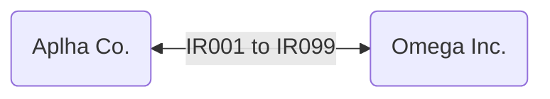
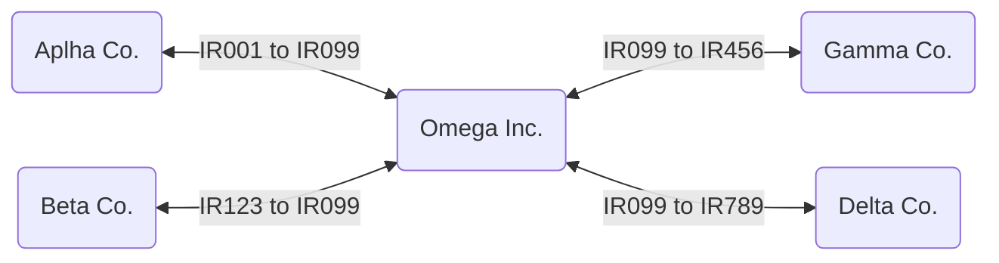
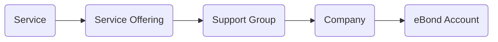

# Multi-source eBonding

---
[[TOC]]

---
# About

_**eBonding**_ is a term used to describe the electronic passing of information for business-to-business (B2B) operations. Typically eBonding is used to keep two system of records in sync; e.g., incident reports, service requests, change requests, problem reports, and CMDB configuration items. A record on one system has the same information for a record on a different system. Each system passes information between each other as information on the record changes; hence both records contain the same information. Businesses setup and configure eBonding as a means to maintain a system of record they control automatically saving time and resources; i.e., billing, audit, automation, etc. etc..

Example: Alpha Co., is eBonded to Omega Inc.. Information between the two different companies' tickets are shared with each other digitally.  



_**Multi-source eBonding**_ is when you have three or more systems coordinating together on the same system of record from multiple sources. Multi-source eBonding is a mature B2B model for multi-supplier strategies, where one company coordinates with different multiple suppliers that provide various services within an organization. The advantage of a multi-supplier model is the model provides an organization the ability to right-size their enterprise needs across many suppliers that render a variety of services. Versus letting a single supplier render all operational needs within an organization. 

Example: Omega Inc. has contracted with Alpha Co., Beta Co., Gamma Co., and Delta Co. where each supplier provides a distinct set of services. When cooperation between suppliers is required, Omega Inc. coordinates who, how, when, and what information is shared across the suppliers from a single system of record. This allows Omega Inc. to orchestrate multiple suppliers simultaneously to address an issue that spans multiple service domains supported by different suppliers. In this example Omega Inc. has one ticket (IR099) that ties together with other suppliers to address the incident. Each supplier has their own ticket which they can work independently and be kept up to date by other IT service suppliers. 



This guide is to help ServiceNow admins to setup multi-source eBonding framework for incident tickets. Incidents are a prime candidate to be shared across multiple suppliers. When an outage to a service is reported, there could be multiple suppliers working together to resolve the incident. Also if a supplier is utilized as an external call center, then routing incoming incident tickets to the appropriate secondary supplier needs to be performed. Given these two scenarios enterprises typically model, this make incidents the first type of system of record to build a multi-source eBond framework for. The same framework can be applied to other ticket types in ServiceNow with some minor adjustments.

Even if you do not think you will be using multi-source eBonding, this framework performs just as well for direct eBonding and reduce development overhead.

---
## eBonding versus integration
\
Inbound incident handling could be setup in an agnostic fashion based on a mutual push-push model setup between the enterprise and suppliers. The mutual push-push model is where the each party sets how they shall receive messages and no party performs a pull/get operation. There are major advantages for this model over one party dictating both how it will send and receive messages. 

!!! note OEM & OSP
    Original equipment manufacturers (OEM) and original service providers (OSP) rarely fit into the mutual push-push model as their clientele is vast and the reliance of the enterprise on the OEMs and OSPs do not warrant a collaborative effort between the enterprise ServiceNow developers and the OEM/OSP developers. In the case of true partnership between enterprise and suppliers should allow for a mutual push-push model.    

The biggest advantage to all parties is long term run and maintain of eBonding operations. If one party changes their fields or data, the other party is not forced into changing their eBonding framework to accommodate; a decision from one party should not impact or cause work for the other. Another advantage is resource utilization. Pull requests are expensive and if an enterprise is being pulled by dozens of suppliers, this places an undue burden on the enterprise. It is far more agreeable that if a change is to occur in one party's system of record, then that party will pass (push) the delta change to the agreed parties.

The difference between eBonding and integration is partnership and cooperation. Where the greater the partnership and cooperation from the supplier yields to an eBond model. The less partnership and cooperation from the supplier yields to an integration model.

---
## Follow along
\
ServiceNow offers many ways to solve a problem or configure an operational business model. These instructions are _a_ way and does not represent _the_ way on creating a multi-source eBonding framework. The best way to use these instructions is to read through them and see how the framework can be adopted and modified to fit your organization requirements. 

Each section will include the manual instructions setting up the framework and an update set for those that wish to install the multi-source eBonding on their instance. Some of the update sets will have dependencies on other update sets as the functions are shared across functions within the multi-source eBonding. 

!!! note Update sets 
    The instructions do not cover how-to use update sets or the nuisances of update sets. You can explore on how to leverage update sets within the online ServiceNow documentation.  

!!! note Terms & Meanings
    - _Supplier:_ The legal entity that ServiceNow connects too. You can substitute supplier for vendor, partner, or the like.
    - _Company:_ A record from the [core_company] table in ServiceNow that represents the supplier. 

!!! danger Modifying OOTB Tables
    This guide focuses on creating a robust framework tied closely to the out of the box (OOTB) tables already existing in ServiceNow. There are alternative implementation solutions within ServiceNow to accomplish the same result. Your mileage may vary depending on scope defined by and practices set by your organization and/or development team. This framework is meant to be as open and flexible to meet varying modifications to suit present and future requirements.

!!! note Cost Impact
    Custom tables are created in this framework and there could be a financial impact creating custom tables. ServiceNow allots a set amount of custom tables within an instance that a customer can create free of charge. After the set amount of custom tables are created, ServiceNow charges for custom tables. Talk with your ServiceNow Enterprise Account Executive to learn more.

!!! note Reduce Cost Impact
    To reduce any cost impact to your organization, you can extend OOTB tables free of charge. This guide leaves it to the implementation team to determine the best course of action.

---
## Demo data
\
The guide provides demo data that you can use to test the multi-source eBonding framework. The scenario is your organization has hired Alpha Co., Beta Co., and Gamma Co. to supply IT services across your enterprise. Alpha Co. is your call-center where your customers call to request services and report incidents. Beta Co. supplies data center operations and Gamma Co. supplies backup and recovery operations for the data center. An incident has been reported to Alpha Co. at a data center where both Beta Co. and Gamma Co. need to work together to resolve the incident.

---
# Setting a foundation of how things work

The foundation for incident handling is based on the premise that when an incident is created the *Service* and *Service Offering* within an incident are mandatory fields. This is a best practice to follow with a multi-supplier strategy for the enterprise. The reason is this removes the question "who supports this" in coordination with the assigned to field and focuses on the true issue of "what is service is not working?" Who solves the incident is not of any concern to most customers and requiring customers or fulfillers to know what assignment group to assign a ticket in large enterprise environments is unreasonable and prone to misrouted tickets. 



The *Service* within an incident helps narrow the domain scope where the problem resides.  The *Service Offering*, within an incident, should be limited to the service offerings with the *Service* and determines who the ticket is assigned to in the *Assignment group*. The *Assignment group* will be linked to a supplier (company record). This allows enterprises the ability to swap out suppliers across various services within ServiceNow quickly and easily reducing long term run and maintain costs. 

!!! note Assignment groups
    Normally an *Assignment group* will contain all the members that support the *Service Offering** within an incident. In the eBonding case it is normal if their are no members of an *Assignment group*. It is also normal to have members in an *Assignment group* that is eBonded with a supplier as well; where the enterprise allows the supplier to log into the enterprise ServiceNow to fulfill tickets. Either scenario still works within this framework.   

The supplier will have a company record that is linked to a user record that represents the eBond account the supplier will use to make inbound RESTful calls. This will become a means to quickly identify what account a company uses for eBonding and creates a "lockout" point for security when removed from the company record. 

---
## Add eBond account role
\
The *eBond Account* role denotes which accounts are used by suppliers to eBond with your instance of ServiceNow. Each supplier should have their own local ServiceNow account that the supplier will use to connect to your instance of ServiceNow passing inbound REST payloads. This role will be used in various ways in the multi-source eBond framework. 

_Instructions:_

1. Navigate to **User Administration** > **Roles**, click **New**.
1. Under *Role New Record*, fill in the following fields:
    - _Name:_ eBond Account
    - _Description:_ Denotes the sys_user account is to be used for eBonding activities.
1. Click **Submit**, which will create the new role.

!!! note Demo Data - User accounts
    Setting up the supplier accounts that will be used by Alpha Co., Beta Co., and Gamma Co. to make RESTful calls for eBonding. Repeat these steps for each supplier. It is suggested that all eBond accounts start with "eBond" to make it easier to filter on.

    1. Navigate to **User Administration** > **Users**, click **New**.
    1. Under the **User New Record** section, fill in the following field:
        - _User ID:_ eBondAlpha
        - _First name:_ Alpha Co
        - _Last name:_ eBond Account
    1. In the record header, right-click and select **Save**.
    1. In the **Roles** tab, click "Edit..."
    1. Under the **Collection** list, find the *eBond Account* role and add it **>** to the **Roles List**.
    1. Click **Save**.

---
## Changes to core_company table
\
We need two new columns in the [core_company] table; *eBond account* and *eBonded*. The *eBond account* is a reference to [sys_user] table that links which account the company uses to eBond with your instance. The *eBonded* is a true or false field that we can use to turn off eBonding at the company level. 

_Instructions:_

1. Navigate to **System Definition** > **Tables** and open the *core_company* record.
1. Under the **Columns** tab, click **New** to create a new column.
1. Under the **Dictionary Entry New Record** section, fill in the following fields:
    - _Type:_ Reference
    - _Column label:_ eBond account
1. Under the **Reference Specification** tab, fill in the following fields:
    - _Table to reference:_ User [sys_user]
    - _Reference qual condition:_
        - Active is true AND
        - Roles is eBond Account
1. Click **Submit**.
1. Under the **Columns** tab, click **New** to create a new column.
1. Under the **Dictionary Entry New Record** section, fill in the following fields:
    - _Type:_ True/False
    - _Column label:_ eBonded
1. Under the **Default value** tab, fill in the following field:
    - _Default value:_ false
1. Click **Submit**.

_Optional Instructions:_ Modify the view on company records to see the *eBond account* and *eBonded* fields.

1. Navigate to **Organization** > **Companies**, click on any of the company records.
1. Navigate to **Additional actions** > **Configure** > **Form Layout**, which will bring up the **Configuring Company form**.
1. Under the **Available** list, find the *eBond account* and *eBonded* fields and add them **>** to the **Selected** list.
1. Move the *eBond account* and *eBonded* fields up the **Selected** list **^** to be below the *Stock price*.
1. Click **Save**.

_Optional Instructions:_ Modify the view on company records to see the *eBond account* only if the *eBonded* field is true.

1. Navigate to **System UI** > **UI Polices**, click **New**.
1. Under the **UI Policy New record** section, fill in the following fields:
    - _Table:_ core_company
    - _Short description:_ Show eBond account in company
1. Under the **When to apply** tab, fill in the following fields:
    - _Conditions:_
        - eBonded is true
1. In the record header, right-click and select **Save**.
1. In the **UI Policy Actions**, click **New**.
1. Under the **UI Policy Action New record** section, fill in the following fields:
    - _Field name:_ eBond account
    - _Mandatory:_ True
    - _Visible:_ True
1. Click **Submit**.
1. Click **Update**.

!!! note Demo Data - Company records
    Setting up the company records that will represent Alpha Co., Beta Co., and Gamma Co. to make RESTful calls for eBonding. Repeat these steps for each supplier.

    1. Navigate to **Organization** > **Companies**, click **New**.
    1. Under the **Company New Record** section, fill in the following field:
        - _Name:_ Alpha Co.
        - _Stock symbol:_ AlphaCo
        - _eBonded:_ True
        - _eBond account:_ Alpha Co eBond Account
    1. Click **Submit**.

---
## Associate suppliers with groups
\
Associating a supplier with an assignment group helps automation know to whom the ticket should be eBonded with. All IT service management tickets (Service Requests, Change Requests, Incidents, Problem Reports) extend the [task] table. The Task table contains two fields of note; Service and Service Offering. The Service narrows down which Service Offerings to choose from and the Service Offering has a field of what group supports the offering. The group could be internal or external to your organization. If external, in the case of most eBonds, then you want to associate that support group with the supplier's company record. 

_Instructions:_

1. Navigate to **System Definition** > **Tables** and open the *[sys_usr_group]* table.
1. Under the **Columns** tab, click **New** to create a new column.
1. Under the **Dictionary Entry New Record** section, fill in the following fields:
    - _Type:_ Reference
    - _Column label:_ Company
1. Under the **Reference Specification** tab, fill in the following fields:
    - _Table to reference:_ core_company
1. Click **Submit**.
1. Click **Update**.

_Optional Instructions:_ Modify the view on group records to see the *Company* field.

1. Navigate to **User Administration** > **Groups**, click on any of the group records.
1. Navigate to **Additional actions** > **Configure** > **Form Layout**, which will bring up the **Configuring Group form**.
1. Under the **Available** list, find the *Company* field and add it **>** to the **Selected** list.
1. Move the *Company* field up the **Selected** list **^** to be below the *Name*.
1. Click **Save**.

!!! note Demo Data - Assignment Groups
    Setting up two support groups; *Data Center Operations Support* and *Backup and Recovery Support*. The reason the group names are not associated with the names of the suppliers is a run and maintain operation decision. Most of the time a supplier will support multiple *Service offerings*, when an organization desires to replace a supplier, instead of updating multiple *Service offerings*, only the support group *Company* field need to be updated. This is a minor detail as many organizations choose to name the assignment groups after the supplier and that is perfectly fine.

    1. Navigate to **User Administration** > **Groups**, click **New**.
    1. Under the **Group New Record** section, fill in the following fields:
        - _Name:_ Call Center Operations
        - _Company:_ Alpha Co.
    1. Click **Submit**.
    1. Click **New**.
    1. Under the **Group New Record** section, fill in the following fields:
        - _Name:_ Data Center Support
        - _Company:_ Beta Co.
    1. Click **New**.
    1. Under the **Group New Record** section, fill in the following fields:
        - _Name:_ Backup and Recovery Support
        - _Company:_ Gamma Co.
    1. Click **Submit**.

---
## Service, service offering, and assignment group alignment in incidents
\
Ticket mis-routing is problem in all services organizations and surveys have shown negative user experience impacts the more a ticket is re-routed. To reduce ticket mis-routes, the service, service offering, and assignment group need to be in alignment. It is unreasonable to expect that fulfillers know which support group supports what services. In large enterprises with hundreds of various services, internal teams, and external suppliers ticket mis-routing is common without alignment between all three fields. 

!!! note Optional setup
    This section is optional, but recommended for any ServiceNow environment; eBonded or not. For organizations that employ a multi-supplier strategy, this section is _highly_ recommended.   

_Instructions:_

1. Navigate to **System Definition** > **Dictionary**.
1. Under the list view search, fill in the the following search fields and hit enter:
    - _Table:_ task
    - _Column name:_ business_service
1. Open the *task* record.
1. Click on the **Reference Specification** tab, fill in the following field:
    - _Reference qual condition:_
         - Class is not Offering
1. Click **Update**.
1. Navigate to **System Definition** > **Business Rules**, click **New**.
1. Under the **Business Rule New Record** section, fill in the following fields:
    - _Name:_ Incident Auto-assignment Group
    - _Table:_ incident
    - _Advanced:_ True
1. Under the **When to run** tab, fill in the following fields:
    - _Insert:_ True
    - _Update:_ True
    - _Filter Conditions:_
        - Service changes OR
        - Service offering changes
1. Under the **Advanced** tab, fill in the following fields:
    - _Condition:_ gs.isInteractive()
    - _Script:_

        ```` 
        (function executeRule(current, previous /*null when async*/ ) {
        
             if (!gs.nil(current.service_offering.assignment_group))
                 current.assignment_group = current.service_offering.assignment_group;
            else
                 current.assignment_group = current.business_service.assignment_group;
        })(current, previous);
        ```` 
1. Click **Submit**.

!!! note Demo Data - Service and Service Offerings
    Setting up two services and three service offerings for Alpha Co., Beta Co., and Gamma Co.
    | Service | ServiceOffering | Support Group |
    |---------|-----------------|---------------|
    | Service Management | Call Center | Call Center Operations |
    | IT Infrastructure | Data Center Operations | Data Center Support |
    | IT Infrastructure | Backup & Recovery | Backup and Recovery Support |
    
    1. Navigate to **Configuration** > **Services**, click **New**.
    1. Under the **Service New Record** section, fill in the following fields:
        - _Name:_ Service Management
        - _Service classification:_ Business Service
    1. In the record header, right-click and select **Save**.
    1. Under the **Offerings** tab, click **New**.
    1. Under the **Offering New Record** section, fill in the following fields:
        - _Name:_ Call Center
        - _Support Group:_ Call Center Operations
    1. Click **Submit**.
    1. Click **Update**.
    1. Click **New**.
    1. Under the **Service New Record** section, fill in the following fields:
        - _Name:_ IT Infrastructure
        - _Service classification:_ Technical Service
    1. In the record header, right-click and select **Save**.
    1. Under the **Offerings** tab, click **New**.
    1. Under the **Offering New Record** section, fill in the following fields:
        - _Name:_ Data Center Operations
        - _Support Group:_ Data Center Support
    1. Click **Submit**.
    1. Under the **Offerings** tab, click **New**.
    1. Under the **Offering New Record** section, fill in the following fields:
        - _Name:_ Backup & Recovery
        - _Support Group:_ Backup and Recovery Support
    1. Click **Submit**.
    1. Click **Update**.

---
## Associate incidents with eBond companies
\
ServiceNow fulfillers (typically accounts with the itil role) will need the ability to eBond incidents with suppliers. There are two main ways to eBond an incident to a supplier; first via the *Assignment group* and the second via a custom field called *eBonded with*. The *eBonded with* will serve a dual purpose. First, it will represent all the suppliers the ticket is eBonded with in a list. A fulfiller will then have the ability to quickly see what suppliers the ticket is eBonded too. Second, it will toggle eBonding and deBonding operations when suppliers are added or removed from the list. That way a fulfiller can initiate an eBond or deBond with a supplier without having to change the *Assignment group."

!!! note Assignment group
    Later on we will configure how changing the *Assignment group* will affect the *eBonded with* field. 

!!! note eBonded with
    The custom field *eBonded with* expects the fulfiller to know which suppliers to eBond with and the service offerings the supplier provides. If the fulfiller does not know the proper supplier, then they should use the *Service* and *Service offering* fields to set the *Assignment group* field to the appropriate group.

!!! note deBonding
    deBonding is the opposite of eBonding by breaking the connection between the tickets. After a ticket has been deBonded from a company, the ticket can be re-eBonded to the company by adding the company back to the list. In the event of a re-eBonding, there is no guarantee the company ticket will be the same. You will have to work with the supplier on if and how re-eBonding works. 

_Instructions:_

1. Navigate to **System Definition** > **Tables** and search for the *[incident]* table under the **Name** field.
1. Open the *Incident* record and click **New** under the **Columns** tab.
1. Under the **Dictionary Entry New Record** section, fill in the following fields:
    - _Type:_ List 
    - _Column label:_ eBonded with
    - _Column name:_ (this should default to u_eBonded_with)
1. Under the **Reference Specification** tab, fill in the following fields:
    - _Reference:_ Company [core_company]
    - _Reference qual condition:_
        - eBonded is true AND
        - eBond Account is not empty
1. Click **Submit**.
1. Navigate to **Incident** > **All** and open any incident record.
1. Navigate to **Additional actions** > **Configure** > **Form Layout**, which will bring up the **Configuring Company form**.
1. Under the **Available** list, find the *eBonded with* field and add it **>** to the **Selected** list.
1. Move the *eBonded with* field up the **Selected** list **^** to be below the *Assigned to*.
1. Click **Save**.

---
# Custom tables

eBonding will require the creation of custom tables or the extension of existing tables. ServiceNow sets a limit on the number of custom tables an instance can have before additional costs are accrued/incurred. This how-to will create custom tables as there are no similar tables in ServiceNow that are proper candidates to extend. You however can take any of the base tables in ServiceNow and extend them adding the custom fields and it will work the same.

---
## eBond relationships
\
The [u_eBond_relationship] table is a multi-relational table that represents a one to many record mapping for a ticket to be mapped to multiple supplier tickets. The fields relate the ServiceNow ticket to the various suppliers the ticket is eBonded too.

The [u_eBond_relationship] table will contain the following custom fields:
|Field|Description|
|-----|-----------|
|Source|The ServiceNow record sys_id on the instance.|
|Source table|The table the ServiceNow record resides on.|
|Status|The status of the eBond.|
|State|The state of the eBond.|
|In|Inbound communication status from supplier.|
|Out|Outbound communication status to supplier.|
|Correlation Number|The supplier's ticket number or designation|
|Correlation ID|The supplier's ticket sys id or reference|
|Company|The ServiceNow supplier company record on the instance.|
|URL|Link to the supplier ticket.|
|Reflect|Changes made by the supplier are reflected in the ticket.|

_Instructions:_

1. Navigate to **System Definition** > **Tables**.
1. Click **New**.
1. Under the **Table New record** section, fill in the following fields:
    - _Label:_ eBond Relationship
    - _Name:_ u_ebond_relationship
    - _New menu name:_ eBond
1. In the record header, right-click and select **Save**.
1. In the **Columns** table, click **New**.
1. In the **Dictionary Entry New record** section, fill in the following fields:
    - _Type:_ Table Name
    - _Column label:_ Source table
    - _Column name:_ (this should default to u_source_table)
1. Click **Submit**.
1. In the **Columns** table, click **New**.
1. In the **Dictionary Entry New record** section, fill in the following fields:
    - _Type:_ Document ID
    - _Column label:_ Source
    - _Column name:_ (this should default to u_source)
1. Under **Related Links**, click **Advanced view**.
1. Under the **Dependent Field** tab, click **Use dependent field**.
1. In the **Dependent on field**, select **Source table**.
1. Click **Update**.
1. In the **Columns** table, click **New**.
1. In the **Dictionary Entry New record** section, fill in the following fields:
    - _Type:_ Choice
    - _Column label:_ Status
    - _Column name:_ (this should default to u_status)
1. In the **Choice List Specification** tab, select *Dropdown with --None--*.
1. In the record header, right-click and select **Save**.
1. In the **Choices** tab, add the following records performing these steps:
    1. Click **New**.
    1. In the **Choice New record** section, fill in the field values listed below.
    1. Click **Submit**.
    |Sequence|Label|Value|
    |--------|-----|-----|
    |100|eBonded|eBonded|
    |200|deBonded|deBonded|
1. Click *Update**.
1. In the **Columns** table, click **New**.
1. In the **Dictionary Entry New record** section, fill in the following fields:
    - _Type:_ Choice
    - _Column label:_ State
    - _Column name:_ (this should default to u_state)
1. In the **Choice List Specification** tab, select *Dropdown with --None--*.
1. In the record header, right-click and select **Save**.
1. In the **Choices** tab, add the following records performing these steps:
    1. Click **New**.
    1. In the **Choice New record** section, fill in the field values listed below.
    1. Click **Submit**.
    |Sequence|Label|Value|
    |--------|-----|-----|
    |100|New|1|
    |200|In Progress|2|
    |300|On Hold|3|
    |400|Resolved|6|
    |500|Closed|7|
    |600|Canceled|8|
1. Click *Update**.
1. In the **Columns** table, click **New**.
1. In the **Dictionary Entry New record** section, fill in the following fields:
    - _Type:_ Choice
    - _Column label:_ In
    - _Column name:_ (this should default to u_in)
1. In the **Choice List Specification** tab, select *Dropdown with --None--*.
1. In the record header, right-click and select **Save**.
1. In the **Choices** tab, add the following records performing these steps:
    1. Click **New**.
    1. In the **Choice New record** section, fill in the field values listed below.
    1. Click **Submit**.
    |Sequence|Label|Value|
    |--------|-----|-----|
    |100|Up|up|
    |200|Down|down|
    |300|Wait|wait|
1. Click *Update**.
1. In the **Columns** table, click **New**.
1. In the **Dictionary Entry New record** section, fill in the following fields:
    - _Type:_ Choice
    - _Column label:_ Out
    - _Column name:_ (this should default to u_out)
1. In the **Choice List Specification** tab, select *Dropdown with --None--*.
1. In the record header, right-click and select **Save**.
1. In the **Choices** tab, add the following records performing these steps:
    1. Click **New**.
    1. In the **Choice New record** section, fill in the field values listed below.
    1. Click **Submit**.
    |Sequence|Label|Value|
    |--------|-----|-----|
    |100|Up|up|
    |200|Down|down|
    |300|Wait|wait|
1. Click *Update**.
1. In the **Columns** table, click **New**.
1. In the **Dictionary Entry New record** section, fill in the following fields:
    - _Type:_ String
    - _Column label:_ Correlation Number
    - _Column name:_ (this should default to u_correlation_number)
    - _Max length:_ 40
1. Click **Submit**.
1. In the **Columns** table, click **New**.
1. In the **Dictionary Entry New record** section, fill in the following fields:
    - _Type:_ String
    - _Column label:_ Correlation ID
    - _Column name:_ (this should default to u_correlation_id)
    - _Max length:_ 32
1. Click **Submit**.
1. In the **Columns** table, click **New**.
1. In the **Dictionary Entry New record** section, fill in the following fields:
    - _Type:_ Reference
    - _Column label:_ Company
    - _Column name:_ (this should default to u_company)
1. In the **Reference Specification** tab, fill in the following field:
    - _Reference:_ Company [core_company]
    - _Reference qual condition:_
        - eBonded is true AND
        - eBond Account is not empty
1. Click **Submit**.
1. In the **Columns** table, click **New**.
1. In the **Dictionary Entry New record** section, fill in the following fields:
    - _Type:_ URL
    - _Column label:_ URL
    - _Column name:_ (this should default to u_url)
    - _Max length:_ 4000
1. Click **Submit**.
1. In the **Columns** table, click **New**.
1. In the **Dictionary Entry New record** section, fill in the following fields:
    - _Type:_ True/False
    - _Column label:_ Reflect
    - _Column name:_ (this should default to u_reflect)
1. Under the **Default Value** tab, , fill in the following field:
    - _Default value:_ false
1. Click **Submit**.
1. Click **Update**.

---
### Relationship Support Script
\
Helper function that updates the u_ebond_relationship fields.

_Instructions:_

1. Navigate to **System Definition** > **Script Includes**, click **New**.
1. In the **Script Include New record**section, fill in the following fields:
    - _Name:_ eBondRelationship
    - _API Name:_ (this should default to global.eBondRelationship)
    - _Description:_ Utility function that updates the u_ebond_relationship fields.
    - _Script:_
    ```
    var eBondRelationship = Class.create();
    eBondRelationship.prototype = {
        initialize: function() {
        
    	},

    	// changes the state of the In field 
        updateIn: function(relationship, value) {
            var gr = new GlideRecord('u_ebond_relationship');
            gr.addQuery('sys_id',relationship);
            gr.query();
            if (gr.next()) {
                gr.u_in = value;
    			gr.update();
            }
            return;
        },
    
    	// changes the state of the Out field 
        updateOut: function(relationship, value) {
            var gr = new GlideRecord('u_ebond_relationship');
            gr.addQuery('sys_id',relationship);
            gr.query();
            if (gr.next()) {
                gr.u_out = value;
    			gr.update();
            }
            return;
        },

        type: 'eBondRelationship'
    };
    ```
1. Click **Submit**. 

---
### Stylize Relationship In/Out
\
Adding color to the **In** and **Out** fields for the [u_ebond_relationship] table. This is a quick visual aid in identifying the inbound and outbound state of the incident.

_Instructions:_

1. Navigate to **System UI** > **Field Styles**, click **New**.
1. In the **Style New record** section, fill in the following fields:
    - _Table:_ eBond Relationship [u_ebond_relationship]
    - _Field name:_ In
    - _Value:_ up
    - _Style:_ background-color:green;color:green
1. Click **Submit**.
1. Click **New**.
1. In the **Style New record** section, fill in the following fields:
    - _Table:_ u_ebond_relationship
    - _Field name:_ In
    - _Value:_ down
    - _Style:_ background-color:tomato;color:tomato
1. Click **Submit**.
1. Click **New**.
1. In the **Style New record** section, fill in the following fields:
    - _Table:_ u_ebond_relationship
    - _Field name:_ In
    - _Value:_ wait
    - _Style:_ background-color:DarkGoldenrod;color:DarkGoldenrod
1. Click **Submit**.
1. Click **New**.
1. In the **Style New record** section, fill in the following fields:
    - _Table:_ u_ebond_relationship
    - _Field name:_ Out
    - _Value:_ up
    - _Style:_ background-color:green;color:green
1. Click **Submit**.
1. Click **New**.
1. In the **Style New record** section, fill in the following fields:
    - _Table:_ u_ebond_relationship
    - _Field name:_ Out
    - _Value:_ down
    - _Style:_ background-color:tomato;color:tomato
1. Click **Submit**.
1. In the **Style New record** section, fill in the following fields:
    - _Table:_ u_ebond_relationship
    - _Field name:_ Out
    - _Value:_ wait
    - _Style:_ background-color:DarkGoldenrod;color:DarkGoldenrod
1. Click **Submit**.

---
### Relating eBonded tickets
\
ServiceNow fulfillers (typically accounts with the itil role) will want to see what supplier tickets are eBonded with the incident ticket they have open. Here we will create a related list that will show the supplier tickets eBonded to an incident.

Associating the supplier tickets within the incident requires the creation of a relationship between the [incident] and [u_ebond_relationship] tables.

_Instructions:_

1. Navigate to **System Definition** > **Relationships**, click **New**.
1. In the **Relationship New record** section, fill in the following fields:
    - _Name:_ eBond Relationships
    - _Applies to table:_ Global [global]
    - _Queries from table:_ eBond Relationship [u_ebond_relationship]
    - _Query with:_

        ```` 
        current.addQuery('u_source_table', parent.getTableName());
        current.addQuery('u_source', parent.sys_id);
        ```` 
1. Click **Submit**.
1. Navigate to **Incident** > **All**, click on any of the incident records.
1. Navigate to **Additional actions** > **Configure** > **Related Lists**, which will bring up the **Configuring related lists on Incident form**.
1. Under the **Available** list, find the *eBond Relationships* relationship and add it **>** to the **Selected** list.
1. Click **Save**.

---
## eBond Properties
\
The [u_ebond_registry] table is similar to that of the [sys_properties] table in that it stores generic properties and values for eBonding. If you choose to use the [sys_properties] table to reduce custom table creation, then make sure to look through the various scripts that reference the [u_ebond_registry] table in this guide and change as appropriate.

The [u_ebond_registry] table will contain the following custom fields:
|Field|Description|
|-----|-----------|
|Supplier|"All" or the name of the supplier.|
|Key|The key variable name.|
|Value|The property variable value.|
|Note|Misc. information pertaining to the key/value pair.|

_Instructions:_

1. Navigate to **System Definition** > **Tables**.
1. Click **New**.
1. Under the **Table New record** section, fill in the following fields:
    - _Label:_ eBond Registry
    - _Name:_ u_ebond_registry
    - _Add module to menu:_ eBond
1. In the record header, right-click and select **Save**.
1. In the **Columns** table, click **New**.
1. In the **Dictionary Entry New record** section, fill in the following fields:
    - _Type:_ String
    - _Column label:_ Supplier
    - _Column name:_ (this should default to u_supplier)
    - _Max length:_ 40
1. Under the **Default Value** tab, fill in the following field:
    - _Default value:_ All
1. Click **Submit**.
1. In the **Columns** table, click **New**.
1. In the **Dictionary Entry New record** section, fill in the following fields:
    - _Type:_ String
    - _Column label:_ Key
    - _Column name:_ (this should default to u_key)
    - _Max length:_ 4000
1. Click **Submit**.
1. In the **Dictionary Entry New record** section, fill in the following fields:
    - _Type:_ String
    - _Column label:_ Value
    - _Column name:_ (this should default to u_value)
    - _Max length:_ 4000
1. Click **Submit**.
1. In the **Dictionary Entry New record** section, fill in the following fields:
    - _Type:_ String
    - _Column label:_ Note
    - _Column name:_ (this should default to u_note)
    - _Max length:_ 4000
1. Click **Submit**.
1. Click **Update**.

---
## eBond Logs
\
The [u_ebond_log] table is similar to that of the [syslog] table in that it stores generic log information. If you choose to use the [syslog] table, then make sure to look through the various scripts in this guide that reference the [u_ebond_log] table and change accordingly. The [syslog] table has a granularity of seconds and ServiceNow performs multiple operations per second. Hence the order of the log messages are not guaranteed to be in order. It is recommended that you use the [u_ebond_log] table to help with debugging as the *Index* column is a sequential integer to aid in showing the order of operations.

!!! note Evaluator messages
The [u_ebond_log] table does not capture *Evaluator* messages from faulted JavaScript execution. Use the [syslog] table to check for failed JavaScript executions.

### eBond Log Index Script Include
\
The *eBondLog* script include is a utility function that will increment the default value in the *index* field in the [u_ebond_log] table. The *index* value is based on the greatest index value in the table. If no rows exist, the *index* value is reset to zero. This needs to be setup first because this will be referenced later on when creating the [u_ebond_log] table.

_Instructions:_

1. Navigate to **System Definition** > **Script Includes**.
1. Click **New**.
1. Under the **Script Include New record** section, fill in the following fields:
    - _Name:_ eBondLog
    - _API Name:_ (this should default to global.eBondLog)
    - _Description:_ Utility function that updates the u_ebond_log fields.
    - _Script:_
    ```
    var eBondLog = Class.create();
    eBondLog.prototype = {
        initialize: function() {
            this.u_direction = 'not set';
            this.u_location = 'not set';
            this.u_name = 'not set';
            this.u_source = 'not set';
            this.u_supplier = 'not set';
            this.u_message = 'not set';
            this.u_level = 500; // debug
            this.u_correlate_id = 'not set';
            this.u_correlate_class_name = 'not set';

            var reg = new GlideRecord('u_ebond_registry');
            reg.addQuery('u_supplier', 'All');
            reg.addQuery('u_key', 'inbound.log.level');
            reg.query();
            if (reg.next()) {
                this.logLevel = parseInt(reg.value);
            } else {
    			this.logLevel = 1000;
    		}
        },

        // returns the next default index value
        increment: function() {
            var gr = new GlideRecord('u_ebond_log');
            gr.orderByDesc('u_index');
            gr.setLimit(1);
            gr.query();
            var index = 0;
            if (gr.next()) {
                index = gr.u_index + 1;
            }
            return index; // return the calculated value
        },

        // converts the string level to numeric value
        pitch: function(level) {
    		var eval = level.toLowerCase();
            var val = 1000;
    		switch(eval) {
    			case 'high':
    				val = 100;
    				break;
    			case 'medium':
    				val = 200;
    				break;
    			case 'low':
    				val = 300;
    				break;
    			case 'info':
    				val = 400;
    				break;
    			case 'debug':
    				val = 500;
    				break;
    			default:
    				val = 1000;
    		}
            return val;
        },

        // records the log message
        write: function(level, message) {
            // only log levels at or below what has been registered
            if (this.logLevel < pitch(level)) {
                return;
            }

            var log = new GlideRecord('u_ebond_log');
            log.u_direction = this.u_direction;
            log.u_location = this.u_location;
            log.u_name = this.u_name;
            log.u_source = this.u_source;
            log.u_supplier = this.u_supplier;
            log.u_message = message;
            log.u_level = level;
            log.u_correlate_id = this.u_correlate_id;
            log.u_correlate_class_name = this.u_correlate_class_name;
            log.insert();
            return;
        },

        type: 'eBondLog'
    };
    ```
1. Click **Submit**.


### eBond Log Index Dynamic Filter Options
\
The dynamic filter option *eBond Log Index Increment* is used in the default value in the *index* field in the [u_ebond_log] table as a reference to the script include *eBondLog*.

_Instructions:_

1. Navigate to **System Definition** > **Dynamic Filter Options**.
1. Click **New**.
1. Under the **Dynamic Filter Options New record** section, fill in the following fields:
    - _Label:_ eBond Log Index Increment
    - _Script:_ new eBondLog().increment();
    - _Available for default:_ true
1. Click **Submit**.

### eBond Log
\
The [u_ebond_log] table will contain the following custom fields:

|Field|Description|
|-----|-----------|
|Index|Auto-incrementing numeric value.|
|Direction|Choice value of *Inbound* or *Outbound*.|
|Supplier|Name of the supplier.|
|Location|Name of the ServiceNow component, i.e., script include, business rule, workflow, etc. etc..|
|Name|Label name of the record.|
|Source|Where within the record.|
|Message|The log message.|
|Level|Choice value of *High*, *Medium*, *Low*, or *Info*.|
|Correlate ID|Corresponding tag for workload tracing.|
|Correlate class name|The ServiceNow class name.|

_Instructions:_

1. Navigate to **System Definition** > **Tables**.
1. Click **New**.
1. Under the **Table New record** section, fill in the following fields:
    - _Label:_ eBond Log
    - _Name:_ u_ebond_log
    - _Add module to menu:_ eBond
1. In the record header, right-click and select **Save**.
1. In the **Columns** table, click **New**.
1. In the **Dictionary Entry New record** section, fill in the following fields:
    - _Type:_ Choice
    - _Column label:_ Direction
    - _Column name:_ (this should default to u_direction)
1. In the record header, right-click and select **Save**.
1. Under the **Choices** tab, add the following records performing these steps:
    1. Click **New**.
    1. In the **Choice New record** section, fill in the field values listed below.
    1. Click **Submit**.
    |Sequence|Label|Value|
    |--------|-----|-----|
    |100|Inbound|inbound|
    |200|Outbound|outbound|
1. Click **Update**.
1. In the **Columns** table, click **New**.
1. In the **Dictionary Entry New record** section, fill in the following fields:
    - _Type:_ Integer
    - _Column label:_ Index
    - _Column name:_ (this should default to u_index)
    - _Read only:_ True
1. Under **Related Links**, click **Advanced view**.
1. Under the **Default Value** tab, fill in the following field:
    - _Use dynamic default:_ true
    - _Dynamic Default value:_ eBond Log Index Increment
1. Click **Update**.
1. In the **Columns** table, click **New**.
1. In the **Dictionary Entry New record** section, fill in the following fields:
    - _Type:_ String
    - _Column label:_ Supplier
    - _Column name:_ (this should default to u_supplier)
    - _Max length:_ 40
1. Click **Submit**.
1. In the **Columns** table, click **New**.
1. In the **Dictionary Entry New record** section, fill in the following fields:
    - _Type:_ String
    - _Column label:_ Location
    - _Column name:_ (this should default to u_location)
    - _Max length:_ 40
1. Click **Submit**.
1. In the **Columns** table, click **New**.
1. In the **Dictionary Entry New record** section, fill in the following fields:
    - _Type:_ String
    - _Column label:_ Name
    - _Column name:_ (this should default to u_name)
    - _Max length:_ 40
1. Click **Submit**.
1. In the **Columns** table, click **New**.
1. In the **Dictionary Entry New record** section, fill in the following fields:
    - _Type:_ String
    - _Column label:_ Source
    - _Column name:_ (this should default to u_source)
    - _Max length:_ 80
1. Click **Submit**.
1. In the **Columns** table, click **New**.
1. In the **Dictionary Entry New record** section, fill in the following fields:
    - _Type:_ String
    - _Column label:_ Message
    - _Column name:_ (this should default to u_message)
    - _Max length:_ 4000
1. Click **Submit**.
1. In the **Columns** table, click **New**.
1. In the **Dictionary Entry New record** section, fill in the following fields:
    - _Type:_ Choice
    - _Column label:_ Level
    - _Column name:_ (this should default to u_level)
1. In the record header, right-click and select **Save**.
1. Under the **Choices** tab, add the following records performing these steps:
    1. Click **New**.
    1. In the **Choice New record** section, fill in the field values listed below.
    1. Click **Submit**.
    |Sequence|Label|Value|
    |--------|-----|-----|
    |100|High|100|
    |200|Medium|200|
    |300|Low|300|
    |400|Info|400|
    |500|Debug|500|
1. Click **Update**.
1. In the **Columns** table, click **New**.
1. In the **Dictionary Entry New record** section, fill in the following fields:
    - _Type:_ String
    - _Column label:_ Correlate ID
    - _Column name:_ (this should default to u_correlate_id)
    - _Max length:_ 40
1. Click **Submit**.
1. In the **Columns** table, click **New**.
1. In the **Dictionary Entry New record** section, fill in the following fields:
    - _Type:_ String
    - _Column label:_ Correlate class name
    - _Column name:_ (this should default to u_correlate_class_name)
    - _Max length:_ 100
1. Click **Submit**.
1. Click **Update**.

_Optional Instructions:_
Create the [u_ebond_registry] record used to determine the depth of logs levels to record; else, by default no eBond logs will be written to the [u_ebond_log] table.

1. Navigate to **eBond** > **eBond Registries**.
1. Click **New**.
1. Under the **eBond Registry New record** section, fill in the following fields:
    - _Supplier:_ All
    - _Key:_ inbound.log.level
    - _Value:_ 500
1. Click **Submit**.

---
## eBond Data Map
\
The [u_ebond_data_map] table is a translation data table for inbound and outbound communication with suppliers. Use this table to map and verify incoming and outgoing data with suppliers. 

The [u_ebond_data_map] table will contain the following custom fields:
|Field|Description|
|-----|-----------|
|Module|*All* or the name of the module.|
|Classification|Name of the classification.|
|Direction|*Inbound*, *Outbound*, or *Duplex*.|
|Supplier|*All* or the name of the supplier.|
|Source Value|The internal value for the instance.|
|Supplier Value|The supplier's value.|
|Note|Freeform to document various notes pertaining to the data map record.|

_Instructions:_

1. Navigate to **System Definition** > **Tables**.
1. Click **New**.
1. Under the **Table New record** section, fill in the following fields:
    - _Label:_ eBond Data Map
    - _Name:_ u_ebond_data_map
    - _Add module to menu:_ eBond
1. In the record header, right-click and select **Save**.
1. In the **Columns** table, click **New**.
1. In the **Dictionary Entry New record** section, fill in the following fields:
    - _Type:_ String
    - _Column label:_ Module
    - _Column name:_ (this should default to u_module)
    - _Max length:_ 40
1. Click **Submit**.
1. In the **Columns** table, click **New**.
1. In the **Dictionary Entry New record** section, fill in the following fields:
    - _Type:_ String
    - _Column label:_ Classification
    - _Column name:_ (this should default to u_classification)
    - _Max length:_ 40
1. Click **Submit**.
1. In the **Columns** table, click **New**.
1. In the **Dictionary Entry New record** section, fill in the following fields:
    - _Type:_ Choice
    - _Column label:_ Direction
    - _Column name:_ (this should default to u_direction)
    - _Max length:_ 40
1. In the record header, right-click and select **Save**.
1. Under the **Choices** tab, add the following records performing these steps:
    1. Click **New**.
    1. In the **Choice New record** section, fill in the field values listed below.
    1. Click **Submit**.
    |Sequence|Label|Value|
    |--------|-----|-----|
    |100|Inbound|inbound|
    |200|Outbound|outbound|
    |300|Duplex|duplex|
1. Click **Update**.
1. In the **Columns** table, click **New**.
1. In the **Dictionary Entry New record** section, fill in the following fields:
    - _Type:_ String
    - _Column label:_ Supplier
    - _Column name:_ (this should default to u_supplier)
    - _Max length:_ 40
1. Click **Submit**.
1. In the **Columns** table, click **New**.
1. In the **Dictionary Entry New record** section, fill in the following fields:
    - _Type:_ String
    - _Column label:_ Source value
    - _Column name:_ (this should default to u_source_value)
    - _Max length:_ 4000
1. Click **Submit**.
1. In the **Columns** table, click **New**.
1. In the **Dictionary Entry New record** section, fill in the following fields:
    - _Type:_ String
    - _Column label:_ Supplier value
    - _Column name:_ (this should default to u_supplier)
    - _Max length:_ 4000
1. Click **Submit**.
1. In the **Dictionary Entry New record** section, fill in the following fields:
    - _Type:_ String
    - _Column label:_ Note
    - _Column name:_ (this should default to u_note)
    - _Max length:_ 4000
1. Click **Submit**.
1. Click **Update**.
---
### eBond Data Map Script Include
\
Utility script used to retrieve data from the [u_ebond_data_map] table.

_Instructions:_

1. Navigate to **System Definition** > **Script Includes**, click **New**.
1. In the **Script Include New record** section, fill in the following fields:
    - _Name:_ eBondDataMap
    - _API Name:_ (this should default to global.eBondDataMap)
    - _Script:_
    ```
    var eBondDataMap = Class.create();
    eBondDataMap.prototype = {
        // func: initialize
        // desc: initializes the JavaScript object
        // parm: n/a
        // retn: true or false
        initialize: function() {
            // static 
            this.eLog = new eBondLog();
            this.eLog.u_direction = 'outbound';
            this.eLog.u_location = 'Script Includes';
            this.eLog.u_name = 'eBondDataMap';
            this.eLog.u_source = 'initialize';
            this.eLog.u_supplier = 'Unknown';
    		this.eLog.u_correlate_id = current.sys_id;
    		this.eLog.u_correlate_class_name = current.sys_class_name;
            this.eLog.write('Debug', 'Entering.');

            this.eLog.write('Debug', 'Exiting.');
        },

    	// func: getSupplierValue
    	// desc: retrieves the supplier's value from the u_ebond_mapping table.
    	// parm: supplier - supplier name
        //       module - module value to query against
    	//       classification - classification value to query against
        //       source_value - source value to query against
    	//       default_value - if not found return this supplier value
        // retn: supplier value. 
        getSupplierValue: function(supplier, direction, module, classification, source_value, default_value) {
            this.eLog.u_source = 'getSupplierValue';
            this.eLog.u_supplier = supplier;
            this.eLog.write('Debug', 'Entering.');
    		this.eLog.write('Debug', 'Parms:\n supplier = ' + supplier + '\ndirection = ' + direction + '\nmodule = ' + module +    '\nclassification = ' + classification + '\nsource_value = ' + source_value + ' \ndefault_value = ' + default_value);
    
    		dataMap = {};

            var supplierValue = new GlideRecord("u_ebond_data_map");
            supplierValue.addQuery("u_supplier", supplier);
            supplierValue.addQuery("u_direction", direction);
            supplierValue.addQuery("u_module", module);
            supplierValue.addQuery("u_classification", classification);
            supplierValue.addQuery("u_source_value", source_value);
            supplierValue.query();

            if (supplierValue.next()) {
                dataMap.value = supplierValue.u_supplier_value.toString();
    			if (supplierValue.u_note != undefined && supplierValue.u_note != '') {
    				dataMap.note = supplierValue.u_note.toString();
    			}
            } else {
                dataMap.value = default_value;
            }
    
    		var dataMapStr = JSON.stringify(dataMap);
    		this.eLog.write('Debug', 'Exiting. Return: ' + dataMapStr);
            return dataMap;
        },
    
        type: 'eBondDataMap'
    };
    ```
1. Click **Submit**.

---
## eBond REST Payloads
\
The [u_ebond_rest_payloads] table records all outbound REST API calls and their statuses. This table is also used to retry REST calls in the event of a failure; see **eBond Scheduled Job**. 

### eBond REST Payloads
\
The dynamic filter option *eBond REST Payload Index Increment* is used in the default value in the *index* field in the [u_ebond_rest_payload] table as a reference to the script include *eBondRestPayload*.

_Instructions:_

1. Navigate to **System Definition** > **Dynamic Filter Options**.
1. Click **New**.
1. Under the **Dynamic Filter Options New record** section, fill in the following fields:
    - _Label:_ eBond REST Payload Index Increment
    - _Script:_ new eBondRestPayload().increment();
    - _Available for default:_ true
1. Click **Submit**.

The [u_ebond_rest_payload] table will contain the following custom fields:

|Field|Description|
|-----|-----------|
|Active|True or False|
|ECC topic|Reference to the relationship table.|
|Endpoint|The URL endpoint for the REST call.|
|Format|The format of the payload; e.g., JSON, XML, SOAP, etc. etc..|
|History|Historical retry information.|
|HTTP Method|ServiceNow REST method label.|
|HTTP Response|Entire HTTP response payload.|
|HTTP Status|HTTP status description.|
|HTTP Status Code|HTTP status code.|
|Index|Auto-incrementing numeric value.|
|Payload|REST data payload for the supplier.|
|REST Message|ServiceNow REST message label.|
|Retry cap|The maximum number of retries executing the RESTful call to the supplier.|
|Retry count|The number of retries performed executing the RESTful call to the supplier.|
|Source|The ServiceNow record sys_id on the instance.|
|Source table|The table the ServiceNow record resides on.|
|Status|The current operational status of the REST call.|
|Supplier|Reference to the supplier.|

_Instructions:_

1. Navigate to **System Definition** > **Tables**.
1. Click **New**.
1. Under the **Table New record** section, fill in the following fields:
    - _Label:_ eBond REST Payload
    - _Name:_ u_ebond_rest_payload
    - _Add module to menu:_ eBond
1. In the record header, right-click and select **Save**.
1. In the **Columns** table, click **New**.
1. In the **Dictionary Entry New record** section, fill in the following fields:
    - _Type:_ True/False
    - _Column label:_ Active
    - _Column name:_ (this should default to u_active)
1. Under **Related Links**, click **Advanced view**.
1. Under the **Calculated Value** tab, fill in the following fields:
    - _Calculated:_ true
    - _Calculation:_

        ````
        (function calculatedFieldValue(current) {
            var calc = current.u_retry;

            if (current.u_retry_count > current.u_retry_cap) {
                calc = false;
            } else if (current.u_http_status_code == 401 ||
                current.u_http_status_code == 404 ||
                current.u_http_status_code == 408 ||
                (current.u_http_status_code >= 500 &&
                    current.u_http_status_code <= 599)) {
        		calc = true;
            } else {
        		calc = false;
        	}

            return calc; // return the calculated value
        })(current);
        ````
1. Click **Update**.
1. In the **Columns** table, click **New**.
1. In the **Dictionary Entry New record** section, fill in the following fields:
    - _Type:_ String
    - _Column label:_ ECC topic
    - _Column name:_ (this should default to u_ecc_topic)
    - _Max length:_ 40
1. Click **Submit**.
1. In the **Columns** table, click **New**.
1. In the **Dictionary Entry New record** section, fill in the following fields:
    - _Type:_ String
    - _Column label:_ Endpoint
    - _Column name:_ (this should default to u_endpoint)
    - _Max length:_ 400
1. Click **Submit**.
1. In the **Columns** table, click **New**.
1. In the **Dictionary Entry New record** section, fill in the following fields:
    - _Type:_ String
    - _Column label:_ Format
    - _Column name:_ (this should default to u_format)
    - _Max length:_ 40
1. Click **Submit**.
1. In the **Columns** table, click **New**.
1. In the **Dictionary Entry New record** section, fill in the following fields:
    - _Type:_ Journal Input
    - _Column label:_ History
    - _Column name:_ (this should default to u_history)
1. Click **Submit**.
1. In the **Columns** table, click **New**.
1. In the **Dictionary Entry New record** section, fill in the following fields:
    - _Type:_ String
    - _Column label:_ HTTP Method
    - _Column name:_ (this should default to u_http_method)
    - _Max length:_ 40
1. Click **Submit**.
1. In the **Columns** table, click **New**.
1. In the **Dictionary Entry New record** section, fill in the following fields:
    - _Type:_ String
    - _Column label:_ HTTP Response
    - _Column name:_ (this should default to u_http_response)
    - _Max length:_ 4000
1. Click **Submit**.
1. In the **Columns** table, click **New**.
1. In the **Dictionary Entry New record** section, fill in the following fields:
    - _Type:_ String
    - _Column label:_ HTTP Status
    - _Column name:_ (this should default to u_http_status)
    - _Max length:_ 100
1. Under **Related Links**, click **Advanced view**.
1. Under the **Calculated Value** tab, fill in the following fields:
    - _Calculated:_ true
    - _Calculation:_
        ````
        (function calculatedFieldValue(current) {

        	var response = '';

        	if (current.u_http_status_code == undefined || current.u_http_status_code <= 0) {
        		return response;
        	} 

        	var httpStatusCode = current.u_http_status_code.toString();
        	var key = httpStatusCode.substring(0,1);
        	switch (key) {
        		case '1':
        			if (httpStatusCode == '100') {
        				response = 'Continue';
        			} else if (httpStatusCode == '101') {
        				response = 'Switching Protocols';
        			} else if (httpStatusCode == '102') {
        				response = 'Processing';
        			} else if (httpStatusCode == '103') {
        				response = 'Early Hints';
        			} else {
        				response = 'Unassigned';
        			}
        			break;
        		case '2':
        			if (httpStatusCode == '200') {
        				response = 'OK';
        			} else if (httpStatusCode == '201') {
        				response = ' Created';
        			} else if (httpStatusCode == '202') {
        				response = 'Accepted';
        			} else if (httpStatusCode == '203') {
        				response = 'Non-Authoritative Information';
        			} else if (httpStatusCode == '204') {
        				response = 'No Content';
        			} else if (httpStatusCode == '205') {
        				response = 'Reset Content';
        			} else if (httpStatusCode == '206') {
        				response = 'Partial Content';
        			} else if (httpStatusCode == '207') {
        				response = 'Multi-Status';
        			} else if (httpStatusCode == '208') {
        				response = 'Already Reported';
        			} else if (httpStatusCode == '226') {
        				response = 'IM Used';
        			} else {
        				response = 'Unassigned';
        			}
        			break;
        		case '3':
        			if (httpStatusCode == '300') {
        				response = 'Multiple Choices';
        			} else if (httpStatusCode == '301') {
        				response = 'Moved Permanently';
        			} else if (httpStatusCode == '302') {
        				response = 'Found';
        			} else if (httpStatusCode == '303') {
        				response = 'See Other';
        			} else if (httpStatusCode == '304') {
        				response = 'Not Modified';
        			} else if (httpStatusCode == '305') {
        				response = 'Use Proxy';
        			} else if (httpStatusCode == '306') {
        				response = '(Unused)';
        			} else if (httpStatusCode == '307') {
        				response = 'Temporary Redirect';
        			} else if (httpStatusCode == '308') {
        				response = 'Permanent Redirect';
        			} else {
        				response = 'Unassigned';
        			}
        			break;
        		case '4':
        			if (httpStatusCode == '400') {
        				response = 'Bad Request';
        			} else if (httpStatusCode == '401') {
        				response = 'Unauthorized';
        			} else if (httpStatusCode == '402') {
        				response = 'Payment Required';
        			} else if (httpStatusCode == '403') {
        				response = 'Forbidden';
        			} else if (httpStatusCode == '404') {
        				response = 'Not Found';
        			} else if (httpStatusCode == '405') {
        				response = 'Method Not Allowed';
        			} else if (httpStatusCode == '406') {
        				response = 'Not Acceptable';
        			} else if (httpStatusCode == '407') {
        				response = 'Proxy Authentication Required';
        			} else if (httpStatusCode == '408') {
        				response = 'Request Timeout';
        			} else if (httpStatusCode == '409') {
        				response = 'Conflict';
        			} else if (httpStatusCode == '410') {
        				response = 'Gone';
        			} else if (httpStatusCode == '411') {
        				response = 'Length Required';
        			} else if (httpStatusCode == '412') {
        				response = 'Precondition Failed';
        			} else if (httpStatusCode == '413') {
        				response = 'Payload Too Large';
        			} else if (httpStatusCode == '414') {
        				response = 'URI Too Long';
        			} else if (httpStatusCode == '415') {
        				response = 'Unsupported Media Type';
        			} else if (httpStatusCode == '416') {
        				response = 'Range Not Satisfiable';
        			} else if (httpStatusCode == '417') {
        				response = 'Expectation Failed';
        			} else if (httpStatusCode == '421') {
        				response = 'Misdirected Request';
        			} else if (httpStatusCode == '422') {
        				response = 'Unprocessable Entity';
        			} else if (httpStatusCode == '423') {
        				response = 'Locked';
        			} else if (httpStatusCode == '424') {
        				response = 'Failed Dependency';
        			} else if (httpStatusCode == '425') {
        				response = 'Too Early';
        			} else if (httpStatusCode == '426') {
        				response = 'Upgrade Required';
        			} else if (httpStatusCode == '427') {
        				response = 'Unassigned';
        			} else if (httpStatusCode == '428') {
        				response = 'Precondition Required';
        			} else if (httpStatusCode == '429') {
        				response = 'Too Many Requests';
        			} else if (httpStatusCode == '430') {
        				response = 'Unassigned';
        			} else if (httpStatusCode == '431') {
        				response = 'Request Header Fields Too Large';
        			} else if (httpStatusCode == '451') {
        				response = 'Unavailable For Legal Reasons';
        			} else {
        				response = 'Unassigned';
        			}
        			break;
        		case '5':
        			if (httpStatusCode == '500') {
        				response = 'Internal Server Error';
        			} else if (httpStatusCode == '501') {
        				response = 'Not Implemented';
        			} else if (httpStatusCode == '502') {
        				response = 'Bad Gateway';
        			} else if (httpStatusCode == '503') {
        				response = 'Service Unavailable';
        			} else if (httpStatusCode == '504') {
        				response = 'Gateway Timeout';
        			} else if (httpStatusCode == '505') {
        				response = 'HTTP Version Not Supported';
        			} else if (httpStatusCode == '506') {
        				response = 'Variant Also Negotiates';
        			} else if (httpStatusCode == '507') {
        				response = 'Insufficient Storage';
        			} else if (httpStatusCode == '508') {
        				response = 'Loop Detected';
        			} else if (httpStatusCode == '509') {
        				response = 'Unassigned';
        			} else if (httpStatusCode == '510') {
        				response = 'Not Extended';
        			} else if (httpStatusCode == '511') {
        				response = 'Network Authentication Required';
        			} else {
        				response = 'Unassigned';
        			}
        			break;
        		default:
        			response = 'Unknown';
        			break;
        	}
        	return response;  // return the calculated value

        })(current);
        ````
1. Click **Update**.
1. In the **Columns** table, click **New**.
1. In the **Dictionary Entry New record** section, fill in the following fields:
    - _Type:_ Integer
    - _Column label:_ HTTP Status Code
    - _Column name:_ (this should default to u_http_status_code)
1. Click **Submit**.
1. In the **Columns** table, click **New**.
1. In the **Dictionary Entry New record** section, fill in the following fields:
    - _Type:_ Integer
    - _Column label:_ Index
    - _Column name:_ (this should default to u_index)
    - _Read only:_ True
1. Under **Related Links**, click **Advanced view**.
1. Under the **Default Value** tab, fill in the following field:
    - _Use dynamic default:_ true
    - _Dynamic Default value:_ eBond REST Payload Index Increment
1. Click **Update**.
1. In the **Columns** table, click **New**.
1. In the **Dictionary Entry New record** section, fill in the following fields:
    - _Type:_ String
    - _Column label:_ Payload
    - _Column name:_ (this should default to u_payload)
    - _Max length:_ 4000
1. Click **Submit**.
1. In the **Columns** table, click **New**.
1. In the **Dictionary Entry New record** section, fill in the following fields:
    - _Type:_ String
    - _Column label:_ REST Message
    - _Column name:_ (this should default to u_rest_message)
    - _Max length:_ 40
1. Click **Submit**.
1. In the **Columns** table, click **New**.
1. In the **Dictionary Entry New record** section, fill in the following fields:
    - _Type:_ Integer
    - _Column label:_ Retry cap
    - _Column name:_ (this should default to u_retry_cap)
1. Under the **Default Value** tab, , fill in the following field:
    - _Default value:_ 24
1. Click **Submit**.
1. In the **Columns** table, click **New**.
1. In the **Dictionary Entry New record** section, fill in the following fields:
    - _Type:_ Integer
    - _Column label:_ Retry count
    - _Column name:_ (this should default to u_retry_count)
1. Under the **Default Value** tab, , fill in the following field:
    - _Default value:_ 0
1. Click **Submit**.
1. In the **Columns** table, click **New**.
1. In the **Dictionary Entry New record** section, fill in the following fields:
    - _Type:_ Table Name
    - _Column label:_ Source table
    - _Column name:_ (this should default to u_source_table)
1. Click **Submit**.
1. In the **Columns** table, click **New**.
1. In the **Dictionary Entry New record** section, fill in the following fields:
    - _Type:_ Document ID
    - _Column label:_ Source
    - _Column name:_ (this should default to u_source)
1. Under **Related Links**, click **Advanced view**.
1. Under the **Dependent Field** tab, click **Use dependent field**.
1. In the **Dependent on field**, select **Source table**.
1. Click **Update**.
1. In the **Columns** table, click **New**.
1. In the **Dictionary Entry New record** section, fill in the following fields:
    - _Type:_ Choice
    - _Column label:_ Status
    - _Column name:_ (this should default to u_status)
    - _Max length:_ 40
1. In the record header, right-click and select **Save**.
1. Under the **Choices** tab, add the following records performing these steps:
    1. Click **New**.
    1. In the **Choice New record** section, fill in the field values listed below.
    1. Click **Submit**.
    |Sequence|Label|Value|
    |--------|-----|-----|
    |100|Queued|queued|
    |200|Active|active|
    |300|Processed|processed|
1. Click **Update**.
1. In the **Columns** table, click **New**.
1. In the **Dictionary Entry New record** section, fill in the following fields:
    - _Type:_ Reference
    - _Column label:_ Supplier
    - _Column name:_ (this should default to u_supplier)
1. In the **Reference Specification** tab, fill in the following fields:
    - _Reference:_ Company [core_company]
    - _Reference qual condition:_
        - eBonded is true AND
        - eBond account is not empty
1. Click **Submit**.
1. Click **Update**.

---
# Multi-source Inbound Handling
\
If you are employing the push-push model as suggested by the guide for eBonding, then once the inbound handling framework is setup there is no maintenance or further development is needed. The only exceptions is when you want to add additional functionality to your ServiceNow instance. As you onboard new suppliers, there is no new development work needed for inbound data processing as it will remain the same across the suppliers.

---
## Quick Rundown
\
Suppliers will write to a [u_ebond_incident_staging] table. The table will be an extension of the [sys_import_set_row] and will have the ability to take advantage of the OOTB ServiceNow transform functionality. The *transform maps* will validate the incoming data and then create or update the appropriate records within the system.

---
## Incident staging table
\
Normally the REST inbound message handling aspect for eBonding is developed using *Scripted REST API*. For multi-source eBonding a different model will be developed using a staging table. Suppliers will directly write to a staging table instead of a Scripted REST API, this will save you development effort.

ServiceNow *Transform Maps* provide an elegant and efficient means to do much of what a *Scripted REST API* can do with the use of *Transform Scripts*. The **onStart** is used for preparation of global variables, *onBefore* is used for data validation, and *onAfter* for data operations. All of this has been efficiently designed by Servicenow in the import set framework to handle inbound REST messages.

!!! note Staging other tables
    For each type of destination ServiceNow table for multi-source eBonding will require a unique staging table. For example, if the requirement is to have a multi-source eBond with change requests, a similar staging table that that below will need to be created for change request handling.

The [u_ebond_incident_staging] table holds the field values passed by the supplier for incidents and will contain the following custom fields:
|Field|Description|
|-----|-----------|
|Assignment Group|The assignment group working the incident.|
|Caller|The caller who reported the incident.|
|Category|Category for the incident|
|Close Code|Incident closure code.|
|Close Notes|Incident closure notes.|
|CMDB CI|The configuration item the incident is reported against.|
|Comment|Customer visible comment.|
|Contact Type|How the incident was reported.|
|Description|The description of the incident.|
|Error|Returning error information.|
|External Number|The supplier's incident ticket number.|
|External Reference|The supplier's incident ticket unique identifier.|
|Hold Reason|The reason the incident ticket was placed on hold.|
|Impact|The impact the incident has on the service.|
|Number|The number for the local incident ticket.|
|Service|The service the incident is impacting.|
|Service Offering|The service offering the incident is impacting.|
|Short Description|The title (or short description) of the incident.|
|State|The state of the incident.|
|Subcategory|Subcategory for the incident.|
|Sys ID|The sys_id for the local incident ticket.|
|Urgency|The urgency to resolve the incident.|
|Work Note|Support work note, customer not visible.|

_Instructions:_

1. Navigate to **System Definition** > **Tables**.
1. Click **New**.
1. Under the **Table New record** section, fill in the following fields:
    - _Label:_ eBond Incident Staging
    - _Name:_ u_ebond_incident_staging
    - _Extends table:_ Import Set Row [sys_import_set_row]
    - _Add module to menu:_ eBond
1. In the record header, right-click and select **Save**.
1. In the **Columns** table, click **New**.
1. In the **Dictionary Entry New record** section, fill in the following fields:
    - _Type:_ String
    - _Column label:_ Assignment Group
    - _Column name:_ (this should default to u_assignment_group)
    - _Max length:_ 40
1. Click **Submit**.
1. In the **Columns** table, click **New**.
1. In the **Dictionary Entry New record** section, fill in the following fields:
    - _Type:_ String
    - _Column label:_ Caller
    - _Column name:_ (this should default to u_caller)
    - _Max length:_ 40
1. Click **Submit**.
1. In the **Columns** table, click **New**.
1. In the **Dictionary Entry New record** section, fill in the following fields:
    - _Type:_ String
    - _Column label:_ Category
    - _Column name:_ (this should default to u_category)
    - _Max length:_ 80
1. Click **Submit**.
1. In the **Columns** table, click **New**.
1. In the **Dictionary Entry New record** section, fill in the following fields:
    - _Type:_ String
    - _Column label:_ Close Code
    - _Column name:_ (this should default to u_close_code)
    - _Max length:_ 40
1. Click **Submit**.
1. In the **Columns** table, click **New**.
1. In the **Dictionary Entry New record** section, fill in the following fields:
    - _Type:_ String
    - _Column label:_ Close Notes
    - _Column name:_ (this should default to u_close_notes)
    - _Max length:_ 1000
1. Click **Submit**.
1. In the **Columns** table, click **New**.
1. In the **Dictionary Entry New record** section, fill in the following fields:
    - _Type:_ String
    - _Column label:_ CMDB CI
    - _Column name:_ (this should default to u_cmdb_ci)
    - _Max length:_ 40
1. Click **Submit**.
1. In the **Columns** table, click **New**.
1. In the **Dictionary Entry New record** section, fill in the following fields:
    - _Type:_ String
    - _Column label:_ Comment
    - _Column name:_ (this should default to u_comment)
    - _Max length:_ 4000
1. Click **Submit**.
1. In the **Columns** table, click **New**.
1. In the **Dictionary Entry New record** section, fill in the following fields:
    - _Type:_ String
    - _Column label:_ Contact Type
    - _Column name:_ (this should default to u_contact_type)
    - _Max length:_ 40
1. Click **Submit**.
1. In the **Columns** table, click **New**.
1. In the **Dictionary Entry New record** section, fill in the following fields:
    - _Type:_ String
    - _Column label:_ Description
    - _Column name:_ (this should default to u_description)
    - _Max length:_ 4000
1. Click **Submit**.
1. In the **Columns** table, click **New**.
1. In the **Dictionary Entry New record** section, fill in the following fields:
    - _Type:_ String
    - _Column label:_ Error
    - _Column name:_ (this should default to u_error)
    - _Max length:_ 4000
1. Click **Submit**.
1. In the **Columns** table, click **New**.
1. In the **Dictionary Entry New record** section, fill in the following fields:
    - _Type:_ String
    - _Column label:_ External Number
    - _Column name:_ (this should default to u_external_number)
    - _Max length:_ 40
1. Click **Submit**.
1. In the **Columns** table, click **New**.
1. In the **Dictionary Entry New record** section, fill in the following fields:
    - _Type:_ String
    - _Column label:_ External Reference
    - _Column name:_ (this should default to u_external_reference)
    - _Max length:_ 40
1. Click **Submit**.
1. In the **Columns** table, click **New**.
1. In the **Dictionary Entry New record** section, fill in the following fields:
    - _Type:_ String
    - _Column label:_ Hold Reason
    - _Column name:_ (this should default to u_hold_reason)
    - _Max length:_ 40
1. Click **Submit**.
1. In the **Columns** table, click **New**.
1. In the **Dictionary Entry New record** section, fill in the following fields:
    - _Type:_ String
    - _Column label:_ Impact
    - _Column name:_ (this should default to u_impact)
    - _Max length:_ 40
1. Click **Submit**.
1. In the **Columns** table, click **New**.
1. In the **Dictionary Entry New record** section, fill in the following fields:
    - _Type:_ String
    - _Column label:_ Number
    - _Column name:_ (this should default to u_number)
    - _Max length:_ 40
1. Click **Submit**.
1. In the **Columns** table, click **New**.
1. In the **Dictionary Entry New record** section, fill in the following fields:
    - _Type:_ String
    - _Column label:_ Service
    - _Column name:_ (this should default to u_service)
    - _Max length:_ 255
1. Click **Submit**.
1. In the **Columns** table, click **New**.
1. In the **Dictionary Entry New record** section, fill in the following fields:
    - _Type:_ String
    - _Column label:_ Service Offering
    - _Column name:_ (this should default to u_service_offering)
    - _Max length:_ 255
1. Click **Submit**.
1. In the **Columns** table, click **New**.
1. In the **Dictionary Entry New record** section, fill in the following fields:
    - _Type:_ String    
    - _Column label:_ Short Description
    - _Column name:_ (this should default to u_short_description)
    - _Max length:_ 1000
1. Click **Submit**.
1. In the **Columns** table, click **New**.
1. In the **Dictionary Entry New record** section, fill in the following fields:
    - _Type:_ String   
    - _Column label:_ State
    - _Column name:_ (this should default to u_state)
    - _Max length:_ 40
1. Click **Submit**.
1. In the **Columns** table, click **New**.
1. In the **Dictionary Entry New record** section, fill in the following fields:
    - _Type:_ String    
    - _Column label:_ Subcategory
    - _Column name:_ (this should default to u_subcategory)
    - _Max length:_ 80
1. Click **Submit**.
1. In the **Columns** table, click **New**.
1. In the **Dictionary Entry New record** section, fill in the following fields:
    - _Type:_ String
    - _Column label:_ Sys ID
    - _Column name:_ (this should default to u_sys_id)
    - _Max length:_ 40
1. Click **Submit**.
1. In the **Dictionary Entry New record** section, fill in the following fields:
    - _Type:_ String
    - _Column label:_ Urgency
    - _Column name:_ (this should default to u_urgency)
    - _Max length:_ 40
1. Click **Submit**.
1. In the **Columns** table, click **New**.
1. In the **Dictionary Entry New record** section, fill in the following fields:
    - _Type:_ String
    - _Column label:_ Work Note
    - _Column name:_ (this should default to u_work_note)
    - _Max length:_ 4000
1. Click **Submit**.
1. Click **Update**.

---
## Inbound Transform
\
The inbound *transform map* uses *transform scripts* to perform various operations on the data directly passed by the supplier. The *transform scripts* can be set to _when_ they are executed against the data in the transform. 

- **onStart:** Sets up the global variables used by the other transform scripts. Global variables will be capitalized for ease of development. 
- **onBefore:** Validates security and the data passed by the supplier. The order of scripts are important as pre-checks must complete before continuing the transform.  
- **on:After** Creates or updates the needed fields within the records. 
- **on:Complete** Verifies all operations and updates return information to the supplier. 

This transform takes what the supplier has passed and directly targets the [u_ebond_relationship] table and indirectly targets the [incident] table. For a transform to work, ServiceNow needs to know if it will create or update an existing record. Typically with single source eBonding there is no need for a relationship table and you can use the correlation_display or correlation_id fields in [incident] records to find unique records to coalesce on. Because these fields are string fields, makes it a bit difficult for multi-source eBonding to work well. That would require the transform to try to find the right ticket record. It can be done, but then a lot of functionality is lost not using a eBond relationship table. So instead of transforming supplier data to an [incident] record, the transform will map the data to a [u_ebond_relationship] record and update or create an incident depending on a few scenarios.   

_Instructions:_

1. Navigate to **System Import Sets** > **Transform Maps**.
1. Click **New**.
1. In the **Table Transform Map New record** section, fill in the following fields:
    - _Name:_ eBond Incident Transform
    - _Source table:_ eBond Incident Staging [u_ebond_incident_staging]
    - _Target table:_ eBond Relationship [u_ebond_relationship]
1. In the record header, right-click and select **Save**.
1. In the **Field Maps** tab, click **New**.
1. In the **Field Map New record** section, fill in the following fields:
    - _Source field:_ External Number [u_external_number]
    - _Target field:_ Correlation Number [u_correlation_number]
    - _Coalesce:_ True
1. Click **Submit**.

    !!! note Coalesce field not indexed
        If a pop-up box appears titled *Coalesce field not indexed*, then click **OK**, fill in the followup contact information and click **OK**.

1. In the **Field Maps** tab, click **New**.
1. In the **Field Map New record** section, fill in the following fields:
    - _Source field:_ External reference [u_external_reference]
    - _Target field:_ Correlation ID [u_correlation_id]
    - _Coalesce:_ false
1. Click **Submit**.
1. In the **Field Maps** tab, click **New**.
1. In the **Field Map New record** section, click **Use source script** and fill in the following fields:
    - _Choice action:_ ignore
    - _Target field:_ Company [u_company]
    - _Coalesce:_ True
    - _User source script:_ True
    - _Script:_ 

        ````
        answer = (function transformEntry(source) {

            // coalesce script is called at various times in the transform
            // ignore the time(s) when the row is not even being evaluated
            if (source.sys_created_by === undefined || source.sys_created_by == "") {
        		return;
            }

        	var eLog = new eBondLog();
        	eLog.u_direction = 'inbound';
            eLog.u_location = 'Transform Maps';
        	eLog.u_name = 'eBond Incident Transform';
            eLog.u_source = '[Field Map] Company';
        	if (SUPPLIER == undefined || SUPPLIER == null || SUPPLIER == "" ) {
        		var SUPPLIER = 'unknown';
        	}
        	eLog.u_supplier = SUPPLIER;
        	eLog.u_correlate_id = source.sys_id;
        	eLog.u_correlate_class_name = source.sys_class_name;
        	eLog.write('Debug', 'Entering.');

            // coalesce script is called before ServiceNow global transform map
            // variables are defined
            if (error == undefined) {
                var error = "";
            }

            // once the source row is read in during the transform, the 
            // global error variable is defined by ServiceNow, and to 
            // prevent the coalesce script to be called twice on error, 
            // this check is required
            if (error == true) {
        		eLog.write('Debug', 'Exiting.');
                return;
            }

            // find the company the account is associated with
            var user = new GlideRecord('sys_user');
            user.addQuery('user_name', source.sys_created_by);
            user.query();
            if (!user.next()) {
                // supplier is not eBond enabled
                eLog.write('High', 'Security Violation: An account (' + source.sys_created_by + ') cannot be found. Reference: ' + source.sys_id);

                error = true;
                error_message = "Security violation.";
                source.u_error = error_message;

        		eLog.write('Debug', 'Exiting.');
        		return "";
            }

            // find the company the account is associated with
            var company = new GlideRecord('core_company');
            company.addQuery('u_ebond_account', user.sys_id);
            company.query();
            if (company.next()) {
                // make sure the supplier is still eBond approved
                if (company.u_ebonded) {
        			eLog.write('Debug', 'Exiting.');
                    return company.sys_id;
                }

                // supplier is not eBond enabled
                eLog.write('Low', 'Security Violation: The supplier ' + company.name + ' is not eBond enabled. Reference: ' + source.sys_id);

                error = true;
                error_message = "Security violation.";
                source.u_error = error_message;

        		eLog.write('Debug', 'Exiting.');
        		return "";
            }

            // creator is not associated with a supplier
            eLog.write('High', 'Security Violation: An eBond account (' + source.sys_created_by + ') has written to the u_ebond_incident_staging table with no reference to a record entry in the core_company table. Reference: ' + source.sys_id);

            error = true;
            error_message = "Security violation.";
            source.u_error = error_message;

        	eLog.write('Debug', 'Exiting.');
            return ""; // return the value to be put into the target field

        })(source);
        ````
1. Click **Submit**.

    !!! note Coalesce fields
        Only the *target field* fields *u_correlation_number* and *u_company* fields are coalesce fields. The *u_company* is derived internally from the *sys_created_by* field that holds the account that wrote the record. This removes the means to supplant company information. The *u_correlation_number* by itself is not sufficient to make it unique enough with multiple eBonded suppliers. The combination of the *u_correlation_number* and *u_company* is required; as the assumption is the supplier will not duplicate their ticket numbers. However, two or more suppliers could have the same ticket numbers unrelated to each other. The reason that the *u_external_reference* is not used is it's typically not a required field. Some ticket solutions do not use reference qualifiers and the ticket number is sufficient when passing information back to the supplier. 

1. In the **Transform Scripts** tab, click **New**.
1. In the **Transform Script New record** section, fill in the following fields:
    - _When:_ onStart
    - _Order:_ 1
    - _Script:_

        ````
        // Initialize global variables
        var eLog = new eBondLog();
        eLog.u_direction = 'inbound';
        eLog.u_location = 'Transform Maps';
        eLog.u_name = 'eBond Incident Transform';
        eLog.u_source = '[Transform Script] Initialize global variables';
        eLog.u_supplier = 'Unknown';
        eLog.write('Debug', 'Entering.');


        var SUPPLIER = ""; // supplier's name
        // SUPPLIER: the string value that represents the supplier
        //   used primarily for logging and registry operations

        var COMPANY = ""; // supplier's company record
        // COMPANY: the sys_id of the local [core_company] table record dor the supplier

        var INCIDENT = ""; // incident reference
        var INCIDENT_NUMBER = ""; // incident number
        // INCIDENT: the sys_id of the local [incident] table record 
        // INCIDENT_NUMBER: the number of the local [incident] table record 

        var URL = ""; // URL reference back to supplier ticket
        // URL: the reference back to the supplier's ticket

        // action: is a OOTSB ServiceNow variable to represent the creation of a new record in the u_ebond_relationship table

        var OPERATION = "invalid";
        // OPERATION: what action to take on the [incident] table record
        //   create - create a new incident record
        //   update - update an existing incident record

        var EXECUTION = "invalid";
        // EXECUTION: what the operation will do  
        //   reflect - changes from the supplier are mapped to the fields in the incident record
        //   inform - changes from the supplier are mapped to the work notes in the incident record
        //   debond - deBonds the supplier and enterprise ticket.

        var RELATIONSHIP = "";

        var SUBCATEGORY = "Support";
        var STATE = "1";
        var STATE_STR = "New";
        var SERVICE_OFFERING = "";
        var SERVICE = "";
        var IMPACT = "3";
        var IMPACT_STR = "3 - Low";
        var URGENCY = "3";
        var URGENCY_STR = "3 - Low";
        var HOLD_REASON = "";
        var HOLD_REASON_STR = "";
        var CONTACT_TYPE = "ebond";
        var CLOSE_CODE = "";
        var CATEGORY = "Managed Service";
        var CALLER = "";
        var ASSIGNMENT_GROUP = "";

        eLog.write('Debug', 'Exiting.');
        ````
1. Click **Submit**.
1. In the **Transform Scripts** tab, click **New**.
1. In the **Transform Script New record** section, fill in the following fields:
    - _When:_ onBefore
    - _Order:_ 5
    - _Script:_

        ````
        // SUPPLIER
        (function runTransformScript(source, map, log, target /*undefined onStart*/ ) {
        
            var eLog = new eBondLog();
        	eLog.u_direction = 'inbound';
            eLog.u_location = 'Transform Maps';
            eLog.u_name = 'eBond Incident Transform';
            eLog.u_source = '[Transform Script] SUPPLIER';
            eLog.u_supplier = 'Unknown';
        	eLog.u_correlate_id = source.sys_id;
        	eLog.u_correlate_class_name = source.sys_class_name;
            eLog.write('Debug', 'Entering.');

            var registry = new GlideRecord('u_ebond_registry');
            registry.addQuery('u_key', 'inbound.account');
            registry.addQuery('u_value', source.sys_created_by);
            registry.query();
            if (registry.next()) {
                SUPPLIER = registry.u_supplier;

                eLog.u_supplier = SUPPLIER;
                eLog.write('Debug', 'SUPPLIER = ' + SUPPLIER);
            } else {
                eLog.u_supplier = 'Unknown';
                eLog.write('Medium', 'Registry Error: An eBond account (' + source.sys_created_by + ') is missing registry key "inbound account". Reference: ' + source.sys_id);

                error = true;
                error_message = "Unregistered supplier account.";
                source.u_error = error_message;
            }

        	eLog.write('Debug', 'Exiting.');
            return;
        })(source, map, log, target);
        ````
1. Click **Submit**.
1. In the **Transform Scripts** tab, click **New**.
1. In the **Transform Script New record** section, fill in the following fields:
    - _When:_ onBefore
    - _Order:_ 10
    - _Script:_

        ````
        // COMPANY
        (function runTransformScript(source, map, log, target /*undefined onStart*/ ) {
        
            var eLog = new eBondLog();
        	eLog.u_direction = 'inbound';
            eLog.u_location = 'Transform Maps';
            eLog.u_name = 'eBond Incident Transform';
            eLog.u_source = '[Transform Script] COMPANY';
            eLog.u_supplier = SUPPLIER;
        	eLog.u_correlate_id = source.sys_id;
        	eLog.u_correlate_class_name = source.sys_class_name;
            eLog.write('Debug', 'Entering.');

        	// find the user account that created the record
            var user = new GlideRecord('sys_user');
            user.addQuery('user_name', source.sys_created_by);
        	user.query();
        	if( user.next() ) {
        		CALLER = user.sys_id;
        		eLog.write('Debug', 'CALLER = ' + CALLER);
        	}

            // find the company the account is associated with
            var company = new GlideRecord('core_company');
            company.addQuery('u_ebond_account', user.sys_id);
            company.query();
            if (company.next()) {
                COMPANY = company.sys_id;
                eLog.write('Debug', 'COMPANY = ' + COMPANY);
            }

            eLog.write('Debug', 'Exiting.');
        })(source);
        ````
1. Click **Submit**.
1. In the **Transform Scripts** tab, click **New**.
1. In the **Transform Script New record** section, fill in the following fields:
    - _When:_ onBefore
    - _Order:_ 20
    - _Script:_

        ````
        // RELATIONSHIP
        (function runTransformScript(source, map, log, target /*undefined onStart*/ ) {
        
        	var eLog = new eBondLog();
        	eLog.u_direction = 'inbound';
            eLog.u_location = 'Transform Maps';
            eLog.u_name = 'eBond Incident Transform';
            eLog.u_source = '[Transform Script] RELATIONSHIP';
            eLog.u_supplier = SUPPLIER;
        	eLog.u_correlate_id = source.sys_id;
        	eLog.u_correlate_class_name = source.sys_class_name;
            eLog.write('Debug', 'Entering.');

        	if (action == 'insert') {
        		eLog.write('Debug', 'Exiting.');
        		return;
        	}

        	var relationship = new GlideRecord('u_ebond_relationship');
        	relationship.addQuery('u_correlation_number',source.u_external_number);
        	relationship.addQuery('u_company', COMPANY);
        	relationship.query();
        	if (relationship.next()) {
        		RELATIONSHIP = relationship.sys_id;
        		eLog.write('Debug', 'RELATIONSHIP = ' + RELATIONSHIP);
        		if (relationship.u_status == 'debonded') {
        			eLog.write('Low', 'Supplier is passing information on a debonded relationship. Reference: ' + source.sys_id);
        			error = true;
        			error_message = "The incident has been debonded. Updates are no longer accepted.";
        			source.u_error = error_message;
        		}
        	} else {
        		eLog.write('High', 'Transform action is update, but cannot find eBond relationship. Reference: ' + source.sys_id);
                error = true;
                error_message = "Cannot find eBond relationship.";
                source.u_error = error_message;
        	}

        	eLog.write('Debug', 'Exiting.');
            return;
        })(source, map, log, target);
        ````
1. Click **Submit**.
1. In the **Transform Scripts** tab, click **New**.
1. In the **Transform Script New record** section, fill in the following fields:
    - _When:_ onBefore
    - _Order:_ 30
    - _Script:_

        ````
        // OPERATION & EXECUTION
        (function runTransformScript(source, map, log, target /*undefined onStart*/) {
        
            var eLog = new eBondLog();
            eLog.u_direction = 'inbound';
            eLog.u_location = 'Transform Maps';
            eLog.u_name = 'eBond Incident Transform';
            eLog.u_source = '[Transform Script] OPERATION & EXECUTION';
            eLog.u_supplier = SUPPLIER;
            eLog.u_correlate_id = source.sys_id;
            eLog.u_correlate_class_name = source.sys_class_name;
            eLog.write('Debug', 'Entering.');

            /*
              scenario combination matrix

              invalid is where logically the transform cannot handle the scenario
              if OPERATION or EXECUTION found to default to invalid will log an error

              action is set by ServiceNow's operation on the u_ebond_relationship table
              if action is insert, then this is a new relationship
              if action is update, an existing relationship with the supplier on the same ticket already exists

              OPERATION is wether to create a new incident or update an existing incident in ServiceNow

              EXECUTION is wether to directly reflect the changes made by the supplier to the incident ticket,
              inform the ticket of changes made by the supplier, or debond the tickets  
              action  |  OPERATION  |  EXECUTION  |  SCENARIO
              ----------------------------------------------------------------------------------------------------
              insert  |  create     |  reflect    | new eBond from supplier
              insert  |  create     |  inform     |   invalid - cannot create an inform incident
              insert  |  create     |  debond     |   invalid - cannot create a debond incident
              insert  |  update     |  reflect    |   invalid - ticket would already be eBonded
              insert  |  update     |  inform     | new eBond from supplier to existing ticket
              insert  |  update     |  debond     |   invalid - cannot create a debond incident
              update  |  create     |  reflect    |   invalid - supplier cannot re-open closed incident. 
              update  |  create     |  inform     |   invalid - cannot create an inform incident
              update  |  create     |  debond     |   invalid - cannot create a debond incident
              update  |  update     |  reflect    | supplier is updating a ticket
              update  |  update     |  inform     | supplier is updating a ticket they do not own -OR-
                                                  | supplier is re-eBonding to a prior ticket
              update  |  update     |  debond     | supplier is debonding the tickets
            */

            //  action  |  OPERATION  |  EXECUTION  |  SCENARIO
            //  ----------------------------------------------------------------------------------------------------
            //  insert  |  create     |  reflect    | new eBond from supplier
            if (action == 'insert' && source.u_number == '' && source.u_sys_id == '') {
                OPERATION = 'create';
                EXECUTION = 'reflect';

                eLog.write('Debug', 'OPERATION = ' + OPERATION + '\nEXECUTION = ' + EXECUTION);
                eLog.write('Debug', 'Exiting.');
                return;
            }

            //  action  |  OPERATION  |  EXECUTION  |  SCENARIO
            //  ----------------------------------------------------------------------------------------------------
            //  insert  |  update     |  inform     | new eBond from supplier to existing ticket
            if (action == 'insert' && (source.u_number != '' || source.u_sys_id != '')) {
                var incident = new GlideRecord('incident');
                if (source.u_number != '') {
                    incident.addQuery('number', source.u_number);
                } else {
                    incident.addQuery('sys_id', source.u_sys_id);
                }
                incident.query();
                if (incident.next()) {
                    OPERATION = 'update';
                    EXECUTION = 'inform';
                    eLog.write('Debug', 'OPERATION = ' + OPERATION + '\nEXECUTION = ' + EXECUTION);
                    eLog.write('Debug', 'Exiting.');
                    return;
                } else {
                    if (source.u_number != '') {
                        eLog.write('Medium', 'Could not find incident ' + source.u_number + '. Reference: ' + source.sys_id);
                    } else {
                        eLog.write('Medium', 'Could not find the incident reference ' + source.u_sys_id + '. Reference: ' + source.sys_id);
                    }

                    var relationship = new eBondRelationship();
                    relationship.updateIn(RELATIONSHIP, 'down');

                    error = true;
                    error_message = "Incident not found.";
                    source.u_error = error_message;

                    eLog.write('Debug', 'Exiting.');
                    return;
                }
            }

            //  action  |  OPERATION  |  EXECUTION  |  SCENARIO
            //  ----------------------------------------------------------------------------------------------------
            //  update  |  *          |  *          |  if the eBond relationship exists, so does the incident
            //                                      |  if the incident is closed there is nothing that can be done
            if (action == 'update') {
                var incident = new GlideRecord('incident');
                incident.addQuery('number', relationship.u_source);
                incident.query();
                if (incident.next()) {
                    if (incident.getValue('state') == 7) { // closed
                        error = true;
                        error_message = "Incident " + incident.number + "cannot be updated. The incident is closed.";
                        source.u_error = error_message;

                        eLog.write('Debug', error_mnessage);
                        eLog.write('Debug', 'Exiting');
                        return;
                    }
                }
            }

            //  action  |  OPERATION  |  EXECUTION  |  SCENARIO
            //  ----------------------------------------------------------------------------------------------------
            //  update  |  update     |  debond     | supplier is debonding the tickets
            if (action == 'update' && (source.u_number == '-1' || source.u_sys_id == '-1') && target.u_status.indexOf('debonded') == -1) {
                OPERATION = 'update';
                EXECUTION = 'debond';

                eLog.write('Debug', 'OPERATION = ' + OPERATION + '\nEXECUTION = ' + EXECUTION);
                eLog.write('Debug', 'Exiting.');
                return;
            }

            //  action  |  OPERATION  |  EXECUTION  |  SCENARIO
            //  ----------------------------------------------------------------------------------------------------
            //  update  |  update     |  inform     | supplier is re-eBonding to a prior ticket
            //  
            if (action == 'update' && target.u_status.indexOf('debonded') != -1) {
                OPERATION = 'update';
                EXECUTION = 'inform';

                eLog.write('Debug', 'OPERATION = ' + OPERATION + '\nEXECUTION = ' + EXECUTION);
                eLog.write('Debug', 'Exiting.');
                return;
            }

            //  action  |  OPERATION  |  EXECUTION  |  SCENARIO
            //  ----------------------------------------------------------------------------------------------------
            //  update  |  update     |  reflect    | supplier is updating a ticket
            //  update  |  update     |  inform     | supplier is updating a ticket they do not own
            if (action == 'update' && target.u_status.indexOf('debonded') == -1) {
                var relationship = new GlideRecord('u_ebond_relationship');
                relationship.addQuery('u_company', COMPANY);
                relationship.addQuery('u_correlation_number', source.u_external_number);
                relationship.query();
                if (relationship.next()) {
                    if (relationship.u_reflect == true) {
                        OPERATION = 'update';
                        EXECUTION = 'reflect';

                        eLog.write('Debug', 'OPERATION = ' + OPERATION + '\nEXECUTION = ' + EXECUTION);
                        eLog.write('Debug', 'Exiting.');
                        return;
                    } else {
                        OPERATION = 'update';
                        EXECUTION = 'inform';

                        eLog.write('Debug', 'OPERATION = ' + OPERATION + '\nEXECUTION = ' + EXECUTION);
                        eLog.write('Debug', 'Exiting.');
                        return;
                    }
                } else {
                    error = true;
                    error_message = "Internal error, eBond reference not found within update action.";
                    source.u_error = error_message;

                    eLog.write('High', 'Internal Error: eBond reference not found within update action. Reference: ' + source.sys_id);
                    eLog.write('info', 'Exiting.');
                    return;
                }
            }

            // at this point all valid logic paths have been tested.
            var relationship = new eBondRelationship();
            relationship.updateIn(RELATIONSHIP, 'down');

            error = true;
            error_message = "Internal error, logic path exhaustion.";
            source.u_error = error_message;

            eLog.write('High', 'Internal Error: Logic path exhaustion; OPERATION [' + OPERATION + '] EXECUTION [' + EXECUTION + '] Reference: ' + source.sys_id);
            eLog.write('Debug', 'Exiting.');
            return;

        })(source, map, log, target);
        ````
1. Click **Submit**.
1. In the **Transform Scripts** tab, click **New**.
1. In the **Transform Script New record** section, fill in the following fields:
    - _When:_ onBefore
    - _Order:_ 40
    - _Script:_

        ````
        // check required fields
        (function runTransformScript(source, map, log, target /*undefined onStart*/ ) {
        
        	var eLog = new eBondLog();
        	eLog.u_direction = 'inbound';
            eLog.u_location = 'Transform Maps';
            eLog.u_name = 'eBond Incident Transform';
            eLog.u_source = '[Transform Script] check required fields';
            eLog.u_supplier = SUPPLIER;
        	eLog.u_correlate_id = source.sys_id;
        	eLog.u_correlate_class_name = source.sys_class_name;
            eLog.write('Debug', 'Entering.');

            var missingField = false;
            var missingFields = 'Missing the folowing required field(s): ';
            var separator = '';

            // supplier ticket number is mandatory in all cases
            if (source.u_external_number == '') {
                missingField = true;
                missingFields = missingFields + separator + 'u_external_number';
                separator = ', ';
            }

            // if new relationship, provide a short description
            if (action == 'insert' && OPERATION == 'create' && source.u_short_description == '') {
                missingField = true;
                missingFields = missingFields + separator + 'u_short_description';
                separator = ', ';
            }

            // if new relationship, provide a description
            if (action == 'insert' && OPERATION == 'create' && source.u_description == '') {
                missingField = true;
                missingFields = missingFields + separator + 'u_description';
                separator = ', ';
            }

            // if state is on hold, provide a hold reason
            if (source.u_state == '3' && source.u_hold_reason == '') {
                missingField = true;
                missingFields = missingFields + separator + 'u_hold_reason';
                separator = ', ';
            }

            // if state is resolved or closed, provide a close code
            if ((source.u_state == '6' || source.u_state == '7') && source.u_close_code == '') {
                missingField = true;
                missingFields = missingFields + separator + 'u_close_code';
                separator = ', ';
            }

            // if state is resolved or closed, provide a close notes
            if ((source.u_state == '6' || source.u_state == '7') && source.u_close_notes == '') {
                missingField = true;
                missingFields = missingFields + separator + 'u_close_notes';
                separator = ', ';
            }

            if (missingField) {
                missingFields = missingFields + '.';
                eLog.write('Low',missingFields + ' Reference: ' + source.sys_id);

        		var relationship = new eBondRelationship();
        		relationship.updateIn(RELATIONSHIP,'down');
                error = true;
                error_message = missingFields;
        		source.u_error = error_message;
            }

        	eLog.write('Debug', 'Exiting.');
            return;
        })(source, map, log, target);
        ````
1. Click **Submit**.
1. In the **Transform Scripts** tab, click **New**.
1. In the **Transform Script New record** section, fill in the following fields:
    - _When:_ onBefore
    - _Order:_ 50
    - _Script:_

        ````
        // INCIDENT
        (function runTransformScript(source, map, log, target /*undefined onStart*/) {
        
            var eLog = new eBondLog();
            eLog.u_direction = 'inbound';
            eLog.u_location = 'Transform Maps';
            eLog.u_name = 'eBond Incident Transform';
            eLog.u_source = '[Transform Script] INCIDENT';
            eLog.u_supplier = SUPPLIER;
            eLog.u_correlate_id = source.sys_id;
            eLog.u_correlate_class_name = source.sys_class_name;
            eLog.write('Debug', 'Entering.');

            if ((source.u_number != '' || source.u_sys_id != '') && (source.u_number != '-1' && source.u_sys_id != '-1')) {
                var incident = new GlideRecord('incident');
                if (source.u_number != '') {
                    incident.addQuery('number', source.u_number);
                } else {
                    incident.addQuery('sys_id', source.u_sys_id);
                }
                incident.query();
                if (incident.next()) {
                    INCIDENT = incident.sys_id;
                    INCIDENT_NUMBER = incident.number;
                    eLog.write('Debug', 'INCIDENT_NUMBER = ' + INCIDENT_NUMBER + '\nINCIDENT = ' + INCIDENT);
                    eLog.write('Debug', 'Exiting.');
                    return;
                } else {
                    if (source.u_number != '') {
                        eLog.write('Medium', 'Could not find incident ' + source.u_number + '. Reference: ' + source.sys_id);
                    } else {
                        eLog.write('Medium', 'Could not find the incident reference ' + source.u_sys_id + '. Reference: ' + source.sys_id);
                    }

                    var relationship = new eBondRelationship();
                    relationship.updateIn(RELATIONSHIP, 'down');

                    error = true;
                    error_message = "Incident not found.";
                    source.u_error = error_message;

                    eLog.write('Debug', 'Exiting.');
                    return;
                }
                // the supplier did not pass local ticket information
            } else if (action == 'update') {
                var relationship = new GlideRecord('u_ebond_relationship');
                if (source.u_external_number != '') {
                    relationship.addQuery('u_correlation_number', source.u_external_number);
                } else {
                    relationship.addQuery('u_correlation_id', source.u_external_reference);
                }
                relationship.query();
                if (relationship.next()) {
                    INCIDENT = relationship.u_source.sys_id;
                    INCIDENT_NUMBER = relationship.u_source.number;
                    eLog.write('Debug', 'INCIDENT_NUMBER = ' + INCIDENT_NUMBER + '\nINCIDENT = ' + INCIDENT);
                    eLog.write('Debug', 'Exiting');
                    return;
                } else {
                    if (source.u_external_number != '') {
                        eLog.write('High', 'Could not find external correlation number ' + source.u_external_number + ' relationship. Reference: ' + source.sys_id);
                    } else {
                        eLog.write('High', 'Could not find the external correlation reference ' + source.u_external_reference + ' relationship. Reference: ' + source.sys_id);
                    }

                    error = true;
                    error_message = "eBond relationship not found.";
                    source.u_error = error_message;

                    eLog.write('Debug', 'Exiting');
                    return;
                }
            }

            eLog.write('Debug', 'INCIDENT_NUMBER = ' + INCIDENT_NUMBER + '\nINCIDENT = ' + INCIDENT);
            eLog.write('Debug', 'Exiting.');
            return;
        })(source, map, log, target);
        ````
1. Click **Submit**.
1. In the **Transform Scripts** tab, click **New**.
1. In the **Transform Script New record** section, fill in the following fields:
    - _When:_ onBefore
    - _Order:_ 60
    - _Script:_

        ````
        // URL
        (function runTransformScript(source, map, log, target /*undefined onStart*/ ) {
        
            var eLog = new eBondLog();
        	eLog.u_direction = 'inbound';
            eLog.u_location = 'Transform Maps';
            eLog.u_name = 'eBond Incident Transform';
            eLog.u_source = '[Transform Script] URL';
            eLog.u_supplier = SUPPLIER;
        	eLog.u_correlate_id = source.sys_id;
        	eLog.u_correlate_class_name = source.sys_class_name;
            eLog.write('Debug', 'Entering.');

            // deBond check
            if (EXECUTION == 'debond') {
                eLog.write('Debug', 'Exiting.');
                return;
            }

            var registry = new GlideRecord('u_ebond_registry');
            registry.addQuery('u_supplier', SUPPLIER);
            registry.addQuery('u_key', 'incident.external.url');
            registry.query();
            if (registry.next()) {
                var tRef = registry.u_value;

                var tRef1 = tRef.replace('CORRELATION_ID', source.u_external_reference);
                URL = tRef1.replace('CORRELATION_NUMBER', source.u_external_number);

                eLog.write('Debug', 'URL = ' + URL);
            }

            eLog.write('Debug', 'Exiting.');
            return;
        })(source, map, log, target);
        ````
1. Click **Submit**.
1. In the **Transform Scripts** tab, click **New**.
1. In the **Transform Script New record** section, fill in the following fields:
    - _When:_ onBefore
    - _Order:_ 200
    - _Script:_

        ````
        // validate data
        (function runTransformScript(source, map, log, target /*undefined onStart*/) {
        
            var eLog = new eBondLog();
            eLog.u_direction = 'inbound';
            eLog.u_location = 'Transform Maps';
            eLog.u_name = 'eBond Incident Transform';
            eLog.u_source = '[Transform Script] validate data';
            eLog.u_supplier = SUPPLIER;
            eLog.u_correlate_id = source.sys_id;
            eLog.u_correlate_class_name = source.sys_class_name;
            eLog.write('Debug', 'Entering.');

            var invalidData = false;
            var invalidInfo = 'Invalid values for the field(s): ';
            var separator = '';

            if (source.u_sys_id != '' && source.u_sys_id != '-1') {
                var incident = new GlideRecord("incident");
                incident.addQuery("sys_id", source.u_sys_id);
                incident.query();
                if (incident.next()) {
                    INCIDENT = incident.sys_id;
                    eLog.write('Debug', 'INCIDENT = ' + INCIDENT);
                } else {
                    invalidData = true;
                    invalidInfo = invalidInfo + separator + 'u_sys_id';
                    separator = ', ';
                }
            }

            if (source.u_subcategory != '') {
                var data_map = new GlideRecord("u_ebond_data_map");
                data_map.addQuery("u_supplier", "All");
                data_map.addQuery("u_module", "incident");
                data_map.addQuery("u_classification", "subcategory");
                data_map.addQuery("u_direction", "inbound");
                data_map.addQuery("u_supplier_value", source.u_subcategory);
                data_map.query();
                if (data_map.next()) {
                    SUBCATEGORY = data_map.u_source_value;
                    eLog.write('Debug', 'SUBCATEGORY = ' + SUBCATEGORY);
                } else {
                    invalidData = true;
                    invalidInfo = invalidInfo + separator + 'u_subcategory';
                    separator = ', ';
                }
            }

            if (source.u_state != '') {
                var data_map = new GlideRecord("u_ebond_data_map");
                data_map.addQuery("u_supplier", "All");
                data_map.addQuery("u_module", "incident");
                data_map.addQuery("u_classification", "state");
                data_map.addQuery("u_direction", "inbound");
                data_map.addQuery("u_supplier_value", source.u_state);
                data_map.query();
                if (data_map.next()) {
                    STATE = data_map.u_source_value;
                    STATE_STR = data_map.u_note;
                    eLog.write('Debug', 'STATE = ' + STATE + ' (' + STATE_STR + ')');
                } else {
                    invalidData = true;
                    invalidInfo = invalidInfo + separator + 'u_state';
                    separator = ', ';
                }
            }

            if (source.u_service_offering != '') {
                var data_map = new GlideRecord("u_ebond_data_map");
                data_map.addQuery("u_supplier", "All");
                data_map.addQuery("u_module", "incident");
                data_map.addQuery("u_classification", "service_offering");
                data_map.addQuery("u_direction", "inbound");
                data_map.addQuery("u_supplier_value", source.u_service_offering);
                data_map.query();
                if (data_map.next()) {
                    SERVICE_OFFERING = data_map.u_source_value;
                    eLog.write('Debug', 'SERVICE_OFFERING = ' + SERVICE_OFFERING);
                } else {
                    invalidData = true;
                    invalidInfo = invalidInfo + separator + 'u_service_offering';
                    separator = ', ';
                }
            } else if (OPERATION == 'create') {
                var eRegistry = new GlideRecord("u_ebond_registry");
                eRegistry.addQuery("u_supplier", SUPPLIER);
                eRegistry.addQuery("u_key", "inbound.service.offering");
                eRegistry.query();
                if (eRegistry.next()) {
                    SERVICE_OFFERING = eRegistry.u_value;
                    eLog.write('Debug', 'SERVICE_OFFERING = ' + SERVICE_OFFERING);
                } else {
                    var relationship = new eBondRelationship();
                    relationship.updateIn(RELATIONSHIP, 'down');

                    error = true;
                    error_message = "Internal error, missing registry key inbound.service.offering.";
                    source.u_error = error_message;

                    eLog.write('High', 'Internal Error: Missing registry key inbound.service.offering default for supplier. Reference: ' + source. sys_id);
                    eLog.write('Debug', 'Exiting.');
                    return;
                }
            }

            if (source.u_service != '') {
                var data_map = new GlideRecord("u_ebond_data_map");
                data_map.addQuery("u_supplier", "All");
                data_map.addQuery("u_module", "incident");
                data_map.addQuery("u_classification", "service");
                data_map.addQuery("u_direction", "inbound");
                data_map.addQuery("u_supplier_value", source.u_service);
                data_map.query();
                if (data_map.next()) {
                    SERVICE = data_map.u_source_value;
                    eLog.write('Debug', 'SERVICE = ' + SERVICE);
                } else {
                    invalidData = true;
                    invalidInfo = invalidInfo + separator + 'u_service';
                    separator = ', ';
                }
            } else if (OPERATION == 'create') {
                var eRegistry = new GlideRecord("u_ebond_registry");
                eRegistry.addQuery("u_supplier", SUPPLIER);
                eRegistry.addQuery("u_key", "inbound.service");
                eRegistry.query();
                if (eRegistry.next()) {
                    SERVICE = eRegistry.u_value;
                    eLog.write('Debug', 'SERVICE = ' + SERVICE);
                } else {
                    eLog.write('High', 'Exiting. Missing inbound.service registry key default for supplier. Reference: ' + source.sys_id);

                    var relationship = new eBondRelationship();
                    relationship.updateIn(RELATIONSHIP, 'down');

                    error = true;
                    error_message = "Internal error, missing registry key inbound.service.offering.";
                    source.u_error = error_message;

                    wLog.write('Info', 'Exiting.');
                    return;
                }
            }

            if (source.u_impact != '') {
                var data_map = new GlideRecord("u_ebond_data_map");
                data_map.addQuery("u_supplier", "All");
                data_map.addQuery("u_module", "incident");
                data_map.addQuery("u_classification", "impact");
                data_map.addQuery("u_direction", "inbound");
                data_map.addQuery("u_supplier_value", source.u_impact);
                data_map.query();
                if (data_map.next()) {
                    IMPACT = data_map.u_source_value;
                    IMPACT_STR = data_map.u_note;
                    eLog.write('Debug', 'IMPACT = ' + IMPACT + ' (' + IMPACT_STR + ')');
                } else {
                    invalidData = true;
                    invalidInfo = invalidInfo + separator + 'u_impact';
                    separator = ', ';
                }
            }

            if (source.u_urgency != '') {
                var data_map = new GlideRecord("u_ebond_data_map");
                data_map.addQuery("u_supplier", "All");
                data_map.addQuery("u_module", "incident");
                data_map.addQuery("u_classification", "urgency");
                data_map.addQuery("u_direction", "inbound");
                data_map.addQuery("u_supplier_value", source.u_urgency);
                data_map.query();
                if (data_map.next()) {
                    URGENCY = data_map.u_source_value;
                    URGENCY_STR = data_map.u_note;
                    eLog.write('Debug', 'URGENCY = ' + URGENCY + ' (' + URGENCY_STR + ')');
                } else {
                    invalidData = true;
                    invalidInfo = invalidInfo + separator + 'u_urgency';
                    separator = ', ';
                }
            }

            if (source.u_number != '' && source.u_number != '-1') {
                var incident = new GlideRecord("incident");
                incident.addQuery("number", source.u_number);
                incident.query();
                if (incident.next()) {
                    INCIDENT = incident.sys_id;
                    eLog.write('Debug', 'INCIDENT = ' + INCIDENT);
                } else {
                    invalidData = true;
                    invalidInfo = invalidInfo + separator + 'u_number';
                    separator = ', ';
                }
            }

            if (source.u_hold_reason != '') {
                var data_map = new GlideRecord("u_ebond_data_map");
                data_map.addQuery("u_supplier", "All");
                data_map.addQuery("u_module", "incident");
                data_map.addQuery("u_classification", "hold_reason");
                data_map.addQuery("u_direction", "inbound");
                data_map.addQuery("u_supplier_value", source.u_hold_reason);
                data_map.query();
                if (data_map.next()) {
                    HOLD_REASON = data_map.u_source_value;
                    HOLD_REASON_STR = data_map.u_note;
                    eLog.write('Debug', 'HOLD_REASON = ' + HOLD_REASON + ' (' + HOLD_REASON_STR + ')');
                } else {
                    invalidData = true;
                    invalidInfo = invalidInfo + separator + 'u_hold_reason';
                    separator = ', ';
                }
            }

            if (source.u_contact_type != '') {
                var data_map = new GlideRecord("u_ebond_data_map");
                data_map.addQuery("u_supplier", "All");
                data_map.addQuery("u_module", "incident");
                data_map.addQuery("u_classification", "contact_type");
                data_map.addQuery("u_direction", "inbound");
                data_map.addQuery("u_supplier_value", source.u_contact_type);
                data_map.query();
                if (data_map.next()) {
                    CONTACT_TYPE = data_map.u_source_value;
                    eLog.write('Debug', 'CONTACT_TYPE = ' + CONTACT_TYPE);
                } else {
                    invalidData = true;
                    invalidInfo = invalidInfo + separator + 'u_contact_type';
                    separator = ', ';
                }
            }

            if (source.u_close_code != '') {
                var data_map = new GlideRecord("u_ebond_data_map");
                data_map.addQuery("u_supplier", "All");
                data_map.addQuery("u_module", "incident");
                data_map.addQuery("u_classification", "close_code");
                data_map.addQuery("u_direction", "inbound");
                data_map.addQuery("u_supplier_value", source.u_close_code);
                data_map.query();
                if (data_map.next()) {
                    CLOSE_CODE = data_map.u_source_value;
                    eLog.write('Debug', 'CLOSE_CODE = ' + CLOSE_CODE);
                } else {
                    invalidData = true;
                    invalidInfo = invalidInfo + separator + 'u_close_code';
                    separator = ', ';
                }
            }

            if (source.u_category != '') {
                var data_map = new GlideRecord("u_ebond_data_map");
                data_map.addQuery("u_supplier", "All");
                data_map.addQuery("u_module", "incident");
                data_map.addQuery("u_classification", "category");
                data_map.addQuery("u_direction", "inbound");
                data_map.addQuery("u_supplier_value", source.u_category);
                data_map.query();
                if (data_map.next()) {
                    CATEGORY = data_map.u_source_value;
                    eLog.write('Debug', 'CATEGORY = ' + CATEGORY);
                } else {
                    invalidData = true;
                    invalidInfo = invalidInfo + separator + 'u_category';
                    separator = ', ';
                }
            }

            if (source.u_caller != '') {
                var caller = new GlideRecord("sys_user");
                caller.addQuery("email", source.u_caller);
                caller.query();
                if (caller.next()) {
                    CALLER = caller.sys_id;
                    eLog.write('Debug', 'CALLER = ' + CALLER);
                } else {
                    invalidData = true;
                    invalidInfo = invalidInfo + separator + 'u_caller';
                    separator = ', ';
                }
            }

            if (source.u_assignment_group != '') {
                var assignmentGroup = new GlideRecord("sys_user_group");
                assignmentGroup.addQuery("name", source.u_assignment_group);
                assignmentGroup.query();
                if (assignmentGroup.next()) {
                    ASSIGNMENT_GROUP = assignmentGroup.sys_id;
                    eLog.write('Debug', 'ASSIGNMENT_GROUP = ' + ASSIGNMENT_GROUP);
                } else {
                    invalidData = true;
                    invalidInfo = invalidInfo + separator + 'u_assignment_group';
                    separator = ', ';
                }
            } else if (OPERATION == 'create') {
                var eRegistry = new GlideRecord("u_ebond_registry");
                eRegistry.addQuery("u_supplier", SUPPLIER);
                eRegistry.addQuery("u_key", "inbound.assignment.group");
                eRegistry.query();
                if (eRegistry.next()) {
                    ASSIGNMENT_GROUP = eRegistry.u_value;
                    eLog.write('Debug', 'ASSIGNMENT_GROUP = ' + ASSIGNMENT_GROUP);
                } else {
                    eLog.write('High', 'Missing inbound.assignment.group default for supplier. Reference: ' + source.sys_id);

                    var relationship = new eBondRelationship();
                    relationship.updateIn(RELATIONSHIP, 'down');

                    error = true;
                    error_message = "Internal error, missing registry value inbound.assignment.group.";
                    source.u_error = error_message;

                    eLog.write('Debug', 'Exiting');
                    return;
                }
            }

            if (invalidData) {
                invalidInfo = invalidInfo + '.';
                eLog.write('Low', invalidInfo + ' Reference: ' + source.sys_id);

                var relationship = new eBondRelationship();
                relationship.updateIn(RELATIONSHIP, 'down');

                error = true;
                error_message = invalidInfo;
                source.u_error = error_message;
            }

            eLog.write('Debug', 'Exiting.');
            return;
        })(source, map, log, target);
        ````
1. Click **Submit**.
1. In the **Transform Scripts** tab, click **New**.
1. In the **Transform Script New record** section, fill in the following fields:
    - _When:_ onBefore
    - _Order:_ 210
    - _Script:_

        ````
        // deBond Relationship
        (function runTransformScript(source, map, log, target /*undefined onStart*/) {
        
            var eLog = new eBondLog();
            eLog.u_direction = 'inbound';
            eLog.u_location = 'Transform Maps';
            eLog.u_name = 'eBond Incident Transform';
            eLog.u_source = '[Transform Script] deBond Relationship';
            eLog.u_supplier = SUPPLIER;
            eLog.u_correlate_id = source.sys_id;
            eLog.u_correlate_class_name = source.sys_class_name;
            eLog.write('Debug', 'Entering.');

            // eBond check
            if (EXECUTION != 'debond') {
                eLog.write('Debug', 'Exiting.');
                return;
            }

            // deBond the relationship
            target.u_status = 'debonded';
            target.u_in = 'up';

            // retrieve the incident record to update
            var incident = new GlideRecord('incident');
            incident.addQuery('sys_id', INCIDENT);
            incident.query();
            incident.next();

            // work notes in the incident vary depending on existing relationships
            var workNotes = '';

            // check to see if there are any other suppliers tickets ebonded
            var relationship = new GlideRecord('u_ebond_relationship');
            var advQuery = 'u_company=' + COMPANY + '^u_source=' + INCIDENT + '^u_status=ebonded^u_correlation_number!=' + source.u_external_number;
            relationship.addEncodedQuery(advQuery);
            relationship.query();
            // there are other supplier tickets eBonded to this
            if (relationship.next()) {
                workNotes = SUPPLIER + ' has requested to deBond their ticket ' + source.u_external_number + ' from this ticket. Look for comments or work notes for any provided reason. All other tickets from the supplier will remain eBonded.';

                eLog.write('Debug', 'deBond TBD - NOT COMPLETED.');
            } else {
                // there are no other tickets eBonded from the supplier to this ticket
                // remove the reference from the incident 'eBonded with' field
                workNotes = SUPPLIER + ' has requested to deBond their ticket ' + source.u_external_number + ' from this ticket. Look for comments or work notes for any provided reason.';

                var arrUtil = new ArrayUtil();
                var arr = incident.u_ebonded_with.toString().split(',');
                var pos = arrUtil.indexOf(arr, COMPANY);
                if (pos >= 0) {
                    arr.splice(pos, 1);
                    incident.u_ebonded_with = arr.toString();
                    incident.update();
                    eLog.write('Debug', 'Removed company record ' + COMPANY + ' from "eBonded with" groups.');
                }

                eLog.write('Debug', 'deBond TBD - NOT COMPLETED.');
            }

            // set the proper work notes for the incident and update the incident record
            incident.work_notes = workNotes;
            incident.update();

            eLog.write('Debug', 'Exiting.');
            return;
        })(source, map, log, target);
        ````
1. Click **Submit**.
1. In the **Transform Scripts** tab, click **New**.
1. In the **Transform Script New record** section, fill in the following fields:
    - _When:_ onBefore
    - _Order:_ 220
    - _Script:_

        ````
        // eBond Relationship
        (function runTransformScript(source, map, log, target /*undefined onStart*/) {
        
            var eLog = new eBondLog();
            eLog.u_direction = 'inbound';
            eLog.u_location = 'Transform Maps';
            eLog.u_name = 'eBond Incident Transform';
            eLog.u_source = '[Transform Script] eBond Relationship';
            eLog.u_supplier = SUPPLIER;
            eLog.u_correlate_id = source.sys_id;
            eLog.u_correlate_class_name = source.sys_class_name;
            eLog.write('Debug', 'Entering.');

            // deBond check
            if (EXECUTION == 'debond') {
                eLog.write('Debug', 'Exiting.');
                return;
            }

            // create a new incident record
            if (OPERATION == 'create' && INCIDENT == '') {
                var grInc = new GlideRecord("incident");
                grInc.initialize();
                grInc.setWorkflow(false); // supress business rules
                grInc.insert();
                INCIDENT_NUMBER = grInc.number;
                INCIDENT = grInc.sys_id.toString();
                eLog.write('Debug', 'INCIDENT_NUMBER = ' + INCIDENT_NUMBER + ' INCIDENT = ' + INCIDENT);
            }

            // regardless update the relationship
            // this will capture re-bond'ing incidents too
            target.u_url = URL;
            target.u_status = 'ebonded';
            target.u_state = STATE;
            target.u_in = 'up';
            target.u_source_table = 'incident';
            target.u_source = INCIDENT;
            if (EXECUTION == 'reflect') {
                target.u_reflect = true;
            } else {
                target.u_reflect = false;
            }

            eLog.write('Debug', 'Exiting.');
            return;
        })(source, map, log, target);
        ````
1. Click **Submit**.
1. In the **Transform Scripts** tab, click **New**.
1. In the **Transform Script New record** section, fill in the following fields:
    - _When:_ onBefore
    - _Order:_ 230
    - _Script:_

        ````
        // update incident
        (function runTransformScript(source, map, log, target /*undefined onStart*/) {
        
            var eLog = new eBondLog();
            eLog.u_direction = 'inbound';
            eLog.u_location = 'Transform Maps';
            eLog.u_name = 'eBond Incident Transform';
            eLog.u_source = '[Transform Script] update incident';
            eLog.u_supplier = SUPPLIER;
            eLog.u_correlate_id = source.sys_id;
            eLog.u_correlate_class_name = source.sys_class_name;
            eLog.write('Debug', 'Entering');

            if (EXECUTION == 'debond') {
                eLog.write('Debug', 'Exiting.');
                return;
            }

            // see transform script 'eBond Relationship' when OPERATION is create
            // the incident is created there so that the relationship record is populated properly
            // INCIDENT global variable shall be defined at this point in the transform

            // if EXECUTION is inform, then field changes are stored as work notes
            var notes = SUPPLIER + ' has updated the following fields on their ticket (' + source.u_external_number + '):';
            var noteFlag = false;
            var incidentFlag = false;

            var incident = new GlideRecord('incident');
            incident.addQuery('sys_id', INCIDENT);
            //incident.addQuery('number', INCIDENT_NUMBER);
            incident.query();
            if (incident.next()) {
            
                // create a new incident record
                // some of these variables might not have been set from the supplier
                // but are needed for the creation of the ticket
                if (OPERATION == 'create') {
                    incident.subcategory = SUBCATEGORY;
                    incident.state = STATE;
                    incident.service_offering = SERVICE_OFFERING;
                    incident.business_service = SERVICE;
                    incident.impact = IMPACT;
                    incident.urgency = URGENCY;
                    incident.contact_type = CONTACT_TYPE;
                    incident.category = CATEGORY;
                    incident.caller = CALLER;
                    incident.assignment_group = ASSIGNMENT_GROUP;
                }

                if (source.u_work_note != '') {
                    incident['work_notes'].setJournalEntry(source.u_work_note);
                    incidentFlag = true;
                    eLog.write('Debug', 'Added work notes. ' + source.u_work_note);
                }

                if (source.u_subcategory != '') {
                    if (EXECUTION == 'reflect') {
                        incident.subcategory = SUBCATEGORY;
                        incidentFlag = true;
                        eLog.write('Debug', 'Set subcategory.');
                    } else {
                        notes = notes + '\nSubcategory: ' + SUBCATEGORY;
                        noteFlag = true;
                        eLog.write('Debug', 'Added subcategory to work notes.');
                    }
                }

                if (source.u_state != '') {
                    if (EXECUTION == 'reflect') {
                        incident.state = STATE;
                        incidentFlag = true;
                        eLog.write('Debug', 'Set state.');
                    } else {
                        notes = notes + '\nState: ' + STATE_STR;
                        noteFlag = true;
                        eLog.write('Debug', 'Added state to work notes.');
                    }
                }

                if (source.u_short_description != '') {
                    if (EXECUTION == 'reflect') {
                        incident.short_description = source.u_short_description;
                        incidentFlag = true;
                        eLog.write('Debug', 'Set short description.');
                    } else {
                        notes = notes + '\nShort description: ' + source.u_short_description;
                        noteFlag = true;
                        eLog.write('Debug', 'Added short description to work notes.');
                    }
                }

                if (source.u_service_offering != '') {
                    if (EXECUTION == 'reflect') {
                        incident.service_offering = SERVICE_OFFERING;
                        incidentFlag = true;
                        eLog.write('Debug', 'Set service offering.');
                    } else {
                        notes = notes + '\nService offering: ' + SERVICE_OFFERING;
                        noteFlag = true;
                        eLog.write('Debug', 'Added service offering to work notes.');
                    }
                }

                if (source.u_service != '') {
                    if (EXECUTION == 'reflect') {
                        incident.service = SERVICE;
                        incidentFlag = true;
                        eLog.write('Debug', 'Set service.');
                    } else {
                        notes = notes + '\nService: ' + SERVICE;
                        noteFlag = true;
                        eLog.write('Debug', 'Added service to work notes.');
                    }
                }

                if (source.u_impact != '') {
                    if (EXECUTION == 'reflect') {
                        incident.impact = IMPACT;
                        incidentFlag = true;
                        eLog.write('Debug', 'Set impact.');
                    } else {
                        notes = notes + '\nImpact: ' + IMPACT_STR;
                        noteFlag = true;
                        eLog.write('Debug', 'Added impact to work notes.');
                    }
                }

                if (source.u_urgency != '') {
                    if (EXECUTION == 'reflect') {
                        incident.urgency = URGENCY;
                        incidentFlag = true;
                        eLog.write('Debug', 'Set urgency.');
                    } else {
                        notes = notes + '\nUrgency: ' + URGENCY_STR;
                        noteFlag = true;
                        eLog.write('Debug', 'Added urgency to work notes.');
                    }
                }

                if (source.u_hold_reason != '') {
                    if (EXECUTION == 'reflect') {
                        incident.hold_reason = HOLD_REASON;
                        incidentFlag = true;
                        eLog.write('Debug', 'Set hold reason.');
                    } else {
                        notes = notes + '\nHold reason: ' + HOLD_REASON_STR;
                        noteFlag = true;
                        eLog.write('Debug', 'Added hold reason to work notes.');
                    }
                }

                if (source.u_description != '') {
                    if (EXECUTION == 'reflect') {
                        incident.description = source.u_description;
                        incidentFlag = true;
                        eLog.write('Debug', 'Set description.');
                    } else {
                        notes = notes + '\nDescription: ' + source.u_description;
                        noteFlag = true;
                        eLog.write('Debug', 'Added description to work notes.');
                    }
                }

                if (source.u_contact_type != '') {
                    if (EXECUTION == 'reflect') {
                        incident.contact_type = CONTACT_TYPE;
                        incidentFlag = true;
                        eLog.write('Debug', 'Set contact type.');
                    } else {
                        notes = notes + '\nContact type: ' + CONTACT_TYPE;
                        noteFlag = true;
                        eLog.write('Debug', 'Added contact type to work notes.');
                    }
                }

                if (source.u_comment != '') {
                    incident['comments'].setJournalEntry(source.u_comment);
                    incidentFlag = true;
                    eLog.write('Debug', 'Added comment.');
                }

                if (source.u_cmdb_ci != '') {
                    notes = notes + '\n\tCMDB CI: ' + source.u_cmdb_ci;
                    noteFlag = true;
                    eLog.write('Debug', 'Added CMDB CI to work notes.');
                }

                if (source.u_close_notes != '') {
                    if (EXECUTION == 'reflect') {
                        incident.close_notes = source.u_close_notes;
                        incidentFlag = true;
                        eLog.write('Debug', 'Set close notes.');
                    } else {
                        notes = notes + '\nClose notes: ' + source.u_close_notes;
                        noteFlag = true;
                        eLog.write('Debug', 'Added close notes to work notes.');
                    }
                }

                if (source.u_close_code != '') {
                    if (EXECUTION == 'reflect') {
                        incident.close_code = CLOSE_CODE;
                        incidentFlag = true;
                        eLog.write('Debug', 'Set close code.');
                    } else {
                        notes = notes + '\nClose code: ' + CLOSE_CODE;
                        noteFlag = true;
                        eLog.write('Debug', 'Added close code to work notes.');
                    }
                }

                if (source.u_category != '') {
                    if (EXECUTION == 'reflect') {
                        incident.category = CATEGORY;
                        incidentFlag = true;
                        eLog.write('Debug', 'Set category.');
                    } else {
                        notes = notes + '\nCategory: ' + CATEGORY;
                        noteFlag = true;
                        eLog.write('Debug', 'Added category to work notes.');
                    }
                }

                if (source.u_caller != '') {
                    if (EXECUTION == 'reflect') {
                        incident.caller = CALLER;
                        incidentFlag = true;
                        eLog.write('Debug', 'Set caller.');
                    } else {
                        notes = notes + '\nCaller: ' + source.u_caller;
                        noteFlag = true;
                        eLog.write('Debug', 'Added caller to work notes.');
                    }
                }

                if (source.u_assignment_group != '') {
                    if (EXECUTION == 'reflect') {
                        incident.assignment_group = ASSIGNMENT_GROUP;
                        incidentFlag = true;
                        eLog.write('Debug', 'Set assignment group.');
                    } else {
                        notes = notes + '\nAssignment group: ' + source.u_assignment_group;
                        noteFlag = true;
                        eLog.write('Debug', 'Added assignment group to work notes.');
                    }
                }

                if (incidentFlag) {
                    incident.update();
                    eLog.write('Debug', 'Updated incident.');
                }

                if (noteFlag) {
                    incident['work_notes'].setJournalEntry(notes);
                    incident.update();
                    eLog.write('Debug', 'Updated work notes.\nNotes:\n' + notes);
                }

                // make sure that we only add the company record to 'eBonded with' list 
                // when company is not listed
                // there is a scenario where the supplier is eBonding an additional ticket
                // to a ticket they are already eBonded with on a different ticket
                var arrUtil = new ArrayUtil();
                var arr = incident.u_ebonded_with.toString().split(',');
                var pos = arrUtil.indexOf(arr, COMPANY);
                if (pos < 0) {
                    arr.push(COMPANY);
                    incident.u_ebonded_with = arr.toString();
                    incident.update();
                    eLog.write('Debug', 'Added company record ' + COMPANY + ' to "eBonded with" groups.');
                }

            } else {
                // this is very bad 
                // we should never get here
                eLog.write('High', 'Internal Error: Incident not found. Incident: ' + INCIDENT + ' Reference: ' + source.sys_id);
            }

            eLog.write('Debug', 'Exiting.');
            return;
        })(source, map, log, target);
        ````
1. Click **Submit**.
1. In the **Transform Scripts** tab, click **New**.
1. In the **Transform Script New record** section, fill in the following fields:
    - _When:_ onBefore
    - _Order:_ 300
    - _Script:_

        ````
        // set number and sys_id
        (function runTransformScript(source, map, log, target /*undefined onStart*/) {
        
            var eLog = new eBondLog();
            eLog.u_direction = 'inbound';
            eLog.u_location = 'Transform Maps';
            eLog.u_name = 'eBond Incident Transform';
            eLog.u_source = '[Transform Script] set number and sys_id';
            eLog.u_supplier = SUPPLIER;
            eLog.u_correlate_id = source.sys_id;
            eLog.u_correlate_class_name = source.sys_class_name;
            eLog.write('Debug', 'Entering.');

            // deBond check
            if (EXECUTION == 'debond') {
                eLog.write('Debug', 'Exiting.');
                return;
            }

            source.u_number = INCIDENT_NUMBER;
            source.u_sys_id = INCIDENT;

            eLog.write('Debug', 'Exiting.');
            return;
        })(source, map, log, target);
        ````
1. Click **Submit**.
1. Click **Update**.

---
## Data Map - Inbound
\
The [u_ebond_data_map] table is the lookup table used to validate field values for inbound messages passed in by a supplier. It is best practice to assume the data the supplier is incorrect and to validate the data the supplier has passed before inserting the data into a ticket. 

1. Navigate to **eBond** > **eBond Data Maps**.
1. Click **New**.
    1. In the **eBond Data Map New record** section, fill in the field values listed below and repeat for each.
    1. Click **Submit**.
    |Module|Classification|Direction|Supplier|Source value|Supplier value|Note|
    |------|--------------|---------|--------|------------|--------------|----|
    |incident|category|inbound|All|Break-fix|Break-fix||
    |incident|category|inbound|All|Managed Service|Managed Service||
    |incident|subcategory|inbound|All|Troubleshoot|Troubleshoot||
    |incident|subcategory|inbound|All|Setup/Configuration|Setup/Configuration||
    |incident|subcategory|inbound|All|Performance|Performance||
    |incident|subcategory|inbound|All|Access Control|Access Control||
    |incident|subcategory|inbound|All|Connectivity|Connectivity||
    |incident|subcategory|inbound|All|Support|Support||
    |incident|state|inbound|All|1|1|New|
    |incident|state|inbound|All|2|2|In Progress|
    |incident|state|inbound|All|3|3|On Hold|
    |incident|state|inbound|All|6|6|Resolved|
    |incident|state|inbound|All|7|7|Closed|
    |incident|state|inbound|All|8|8|Canceled|
    |incident|impact|inbound|All|1|1|1 - High|
    |incident|impact|inbound|All|2|2|2 - Medium|
    |incident|impact|inbound|All|3|3|3 - Low|
    |incident|urgency|inbound|All|1|1|1 - High|
    |incident|urgency|inbound|All|2|2|2 - Medium|
    |incident|urgency|inbound|All|3|3|3 - Low|
    |incident|hold_reason|inbound|All|1|1|Awaiting Caller|
    |incident|hold_reason|inbound|All|5|5|Awaiting Change|
    |incident|hold_reason|inbound|All|3|3|Awaiting Problem|
    |incident|hold_reason|inbound|All|4|4|Awaiting Vendor|
    |incident|contact_type|inbound|All|email|email||
    |incident|contact_type|inbound|All|monitoring|monitoring||
    |incident|contact_type|inbound|All|phone|phone||
    |incident|contact_type|inbound|All|self-service|self-service||
    |incident|contact_type|inbound|All|virtual_agent|virtual_agent||
    |incident|contact_type|inbound|All|walk-in|walk-in||
    |incident|contact_type|inbound|All|ebond|ebond||
    |incident|close_code|inbound|All|Solved (Work Around)|Solved (Work Around)||
    |incident|close_code|inbound|All|Solved (Permanently)|Solved (Permanently)||
    |incident|close_code|inbound|All|Solved Remotely (Work Around)|Solved Remotely (Work Around)||
    |incident|close_code|inbound|All|Solved Remotely (Permanently)|Solved Remotely (Permanently)||
    |incident|close_code|inbound|All|Not Solved (Not Reproducible)|Not Solved (Not Reproducible)||
    |incident|close_code|inbound|All|Not Solved (Too Costly)|Not Solved (Too Costly)||
    |incident|close_code|inbound|All|Closed/Resolved by Caller|Closed/Resolved by Caller||

!!! note Category & Subcategory 
    It is the author's opinion that the values for *category* and *subcategory* for an incident within ServiceNow is better suited to describe the type of incident reported; rather than the general topic area the incident occurred. Traditionally with ITSM solutions category and subcategory are used to describe the area where an incident occurred. Out of the box, ServiceNow provides the means to relate incident reports directly to the impacted configuration item (CI) within the CMDB; which is a clearer description of the area of interest the incident lays. This frees up the *category* and *subcategory* fields to _represent the type of incident_ being investigated and the being done to resolve the incident. The update set contains these new values for *category* and *subcategory*, but does not remove the out of the box values set by ServiceNow. Each enterprise will have to ascertain which behavior for the fields to use.

!!! note Contact Type
    By default the transform script *[onStart] Initialize global variables* defaults the contact type to *ebond*. This is not a mandatory field for the supplier, however if not specified the assumption is the ticket originated via an eBond action.

    1. Navigate to **Incident** > **All**, click on any incident record.
    1. Right-click on **Contact type**, click **Configure Dictionary**.
    1. Under the **Choices** tab, click **New**.
    1. In the **Choice New record**section, fill in the following fields:
        - _Label:_ eBond
        - _Value:_ ebond
    1. Click **Submit**. 

---
# Multi-source Outbound Handling
\
If you are employing the push-push model as suggested by the guide for eBonding, then there will be a level of development work required for each supplier you onboard. This framework tries to minimize the amount of work required, but because your ServiceNow instance will be "talking" to a supplier's solution you will need some level of customization.

The standard components that make up the outbound framework is similar to that of the inbound framework setup earlier in that no changes need to be made as you onboard suppliers. These components should be static and never change.

The custom components that make up the outbound framework will be unique to each supplier you onboard. Each custom component will have a standard operation that it will need to perform, but how it processes the operation will be unique to each supplier. This guide creates a drop-in framework for suppliers; meaning you should not have to edit existing components to add a new supplier. Rather you add net new components per supplier. This is the same design principles as plugins for software applications.

Each section will inform you if what you are about to setup is a standard component or a custom component at the start of each section.

---
## Business Rule
\
_Component Type:_ Standard

When an incident is updated, that update needs to be passed to all of the suppliers that ticket is eBonded with. A Business Rule is the trigger that looks for changes on the table records and then takes action.

This business rule is triggered for any incidents that are or shall be eBonded with one or more suppliers. The business rule gathers all the needed data and then creates a custom event for each supplier that eBonded with the incident. The event handler is a custom component needed for each supplier and will be described below on how those events are handled. 

_Instructions:_

1. Navigate to **System Definition** > **Business Rules**, click **New**.
1. In the **Business Rule New record** section, fill in the following fields:
    - _Name:_ eBond Incident Outbound
    - _Table:_ Incident [incident]
    - _Advanced:_ true
1. In the record header, right-click and select **Save**.
1. In the **When to run** tab, fill in the following fields:
    - _When:_ after
    - _Insert:_ true
    - _Update:_ true
    - _Delete:_ true
1. In the record header, right-click and select **Save**.
1. In the **When to run** tab, fill in the following fields:
    - _Condition:_ new eBondIncident().checkCondition();
    - _Script:_ 
    ```
    (function executeRule(current, previous /*null when async*/) {
        var eLog = new eBondLog();
        eLog.u_direction = 'outbound';
        eLog.u_location = 'Business Rules';
        eLog.u_name = 'eBond Incident Outbound';
        eLog.u_source = 'executeRule';
        eLog.u_supplier = 'Unknown';
        eLog.u_correlate_id = current.sys_id;
        eLog.u_correlate_class_name = current.sys_class_name;
        eLog.write('Debug', 'Entering.');

        var dataSet = {};

        if (current.operation() == 'insert') {
            dataSet.comment = current.comments.getJournalEntry(1);
            dataSet.work_note = current.work_notes.getJournalEntry(1);
            dataSet.description = current.getValue('description');
            dataSet.short_description = current.getValue('short_description');
            dataSet.state = current.getValue('state');
            dataSet.impact = current.getValue('impact');
            dataSet.urgency = current.getValue('urgency');
            dataSet.caller = current.getValue('caller_id');
            dataSet.assignment_group = current.getValue('assignment_group');
            dataSet.ci = current.getValue('cmdb_ci');
            dataSet.contact_type = current.getValue('contact_type');
            dataSet.close_notes = current.getValue('close_notes');
            dataSet.close_code = current.getValue('close_code');
            dataSet.business_service = current.getValue('business_service');
            dataSet.service_offering = current.getValue('service_offering');
            dataSet.category = current.getValue('category');
            dataSet.subcategory = current.getValue('subcategory');
        } else if (current.operation() == 'update') {
            if (current.comments.changes()) {
                dataSet.comment = current.comments.getJournalEntry(1);
            }
            if (current.work_notes.changes()) {
                dataSet.work_note = current.work_notes.getJournalEntry(1);
            }
            if (current.description.changes()) {
                dataSet.description = current.getValue('description');
            }
            if (current.short_description.changes()) {
                dataSet.short_description = current.getValue('short_description');
            }
            if (current.state.changes()) {
                dataSet.state = current.getValue('state');
            }
            if (current.impact.changes()) {
                dataSet.impact = current.getValue('impact');
            }
            if (current.urgency.changes()) {
                dataSet.urgency = current.getValue('urgency');
            }
            if (current.caller_id.changes()) {
                dataSet.caller = current.getValue('caller_id');
            }
            if (current.assignment_group.changes()) {
                dataSet.assignment_group = current.getValue('assignment_group');
            }
            if (current.cmdb_ci.changes()) {
                dataSet.ci = current.getValue('cmdb_ci');
            }
            if (current.contact_type.changes()) {
                dataSet.contact_type = current.getValue('contact_type');
            }
            if (current.close_notes.changes()) {
                dataSet.close_notes = current.getValue('close_notes');
            }
            if (current.close_code.changes()) {
                dataSet.close_code = current.getValue('close_code');
            }
            if (current.business_service.changes()) {
                dataSet.business_service = current.getValue('business_service');
            }
            if (current.service_offering.changes()) {
                dataSet.service_offering = current.getValue('service_offering');
            }
            if (current.category.changes()) {
                dataSet.category = current.getValue('category');
            }
            if (current.subcategory.changes()) {
                dataSet.subcategory = current.getValue('subcategory');
            }
            if (current.u_ebonded_with.changes()) {
                dataSet.ebonded_with = current.u_ebonded_with.toString();
            }
        } else { // delete
            // intentionally do nothing
        }

        var dataBundle = JSON.stringify(dataSet);

        // if nothing has changed in the incident, then go no further
        if (dataBundle == '{}' && current.operation() != 'delete') {
            eLog.write('Debug', 'No reportable changes were made to the incident.');
            eLog.write('Debug', 'Exiting.');
            return;
        }

        // find the suppliers to update
        var suppliers = new eBondIncident().getIncidentSuppliers();

        // create an event to build out the supplier payload
        for (var index = 0; index < suppliers.length; index++) {
            try {
                gs.eventQueue('ebond.incident.outbound.' + suppliers[index], current, current.operation().toString(), dataBundle);
                eLog.write('Debug', 'Queued event ebond.incident.outbound.' + suppliers[index] + '\nOperation = ' + current.operation().toString() + '\n DataBundle:\n' + dataBundle);
            } catch (ex) {
                var message = ex.message;
                eLog.write('Medium', 'Caught exception: ' + message);
            }
        }

        eLog.write('Debug', 'Exiting.');

    })(current, previous);
    ```

---
### Incident Script Include
\
_Component Type:_ Standard

Utility script that is used by the *Business Rule* setup earlier.

_Instructions:_

1. Navigate to **System Definition** > **Script Includes**, click **New**.
1. In the **Script Include New record** section, fill in the following fields:
    - _Name:_ eBondIncident
    - _Script:_
    ```
    var eBondIncident = Class.create();
    eBondIncident.prototype = {
        // func: initialize
        // desc: initializes the JavaScript object
        // parm: n/a
        // retn: true or false
        initialize: function () {
            this.eLog = new eBondLog();
            this.eLog.u_direction = 'outbound';
            this.eLog.u_location = 'Script Includes';
            this.eLog.u_name = 'eBondIncident';
            this.eLog.u_source = 'initialize';
            this.eLog.u_supplier = 'Unknown';
            this.eLog.u_correlate_id = current.sys_id;
            this.eLog.u_correlate_class_name = current.sys_class_name;
            this.eLog.write('Debug', 'Entering.');

            this.eLog.write('Debug', 'Exiting.');
        },

        // func: checkIncidentCondition
        // desc: determines if the record is eBonded or should be eBonded
        // parm: n/a
        // retn: true or false
        checkIncidentCondition: function () {
            this.eLog.u_source = 'checkCondition';
            this.eLog.write('Debug', 'Entering.');

            // check if there are existing eBonded relationships
            var relationships = new GlideRecord('u_ebond_relationship');
            relationships.addQuery('u_source', current.sys_id);
            relationships.addQuery('u_status', 'ebonded');
            relationships.query();
            while (relationships.next()) {
                // check that the company is eBond enabled
                var company = new GlideRecord('core_company');
                company.addQuery('sys_id', relationships.u_company);
                company.addQuery('u_ebonded', 'true');
                company.query();
                if (company.next()) {
                    this.eLog.write('Debug', 'Existing relationship(s) found.');
                    this.eLog.write('Debug', 'Exiting. Return: true');
                    return true;
                }
            }

            // look into the incident
            var incident = new GlideRecord('incident');
            incident.addQuery('sys_id', current.sys_id);
            incident.query();
            if (incident.next()) {
                // check u_ebonded_with
                if (incident.u_ebonded_with != '') {
                    this.eLog.write('Debug', 'eBonded with is set.');
                    this.eLog.write('Debug', 'Exiting. Return: true');
                    return true;
                }
                if (incident.assignment_group) {
                    // check assignment group declared in the incident
                    var assignmentGroup = new GlideRecord('sys_user_group');
                    assignmentGroup.addQuery('sys_id', incident.assignment_group);
                    assignmentGroup.query();
                    if (assignmentGroup.next()) {
                        // check company associated with the assignment group is eBonded
                        var company = new GlideRecord('core_company');
                        company.addQuery('sys_id', assignmentGroup.u_company);
                        company.addQuery('u_ebonded', 'true');
                        company.query();
                        if (company.next()) {
                            this.eLog.write('Debug', 'Incident is assigned to an eBonded assignment group.');
                            this.eLog.write('Debug', 'Exiting. Return: true');
                            return true;

                        }
                    }
                }
            }

            this.eLog.write('Debug', 'Exiting. Return: false');
            return false;
        },

        // func: getIncidentSuppliers
        // desc: determines if the record is eBonded or should be eBonded
        // parm: n/a
        // retn: true or false
        getIncidentSuppliers: function () {
            this.eLog.u_source = 'getSuppliers';
            this.eLog.write('Debug', 'Entering.');

            var suppliers = new Array();

            // check if there are existing eBonded relationships
            var relationships = new GlideRecord('u_ebond_relationship');
            relationships.addQuery('u_source', current.sys_id);
            relationships.addQuery('u_status', 'ebonded');
            relationships.query();
            while (relationships.next()) {
                var company = new GlideRecord('core_company');
                company.addQuery('sys_id', relationships.u_company);
                company.addQuery('u_ebonded', 'true');
                company.query();
                if (company.next()) {
                    suppliers.push(company.stock_symbol.toString());
                }
            }

            // look at the incident
            var incident = new GlideRecord('incident');
            incident.addQuery('sys_id', current.sys_id);
            incident.query();
            if (incident.next()) {
                // check u_ebonded_with
                if (incident.u_ebonded_with != '') {
                    var companies = incident.u_ebonded_with.toString().split(',');
                    for (var index = 0; index < companies.length; index++) {
                        var company = new GlideRecord('core_company');
                        company.addQuery('sys_id', companies[index]);
                        company.addQuery('u_ebonded', 'true');
                        company.query();
                        if (company.next()) {
                            suppliers.push(company.stock_symbol.toString());
                        }
                    }
                }

                if (incident.assignment_group) {
                    // check assignment group declared in the incident
                    var assignmentGroup = new GlideRecord('sys_user_group');
                    assignmentGroup.addQuery('sys_id', incident.assignment_group);
                    assignmentGroup.query();
                    if (assignmentGroup.next()) {
                        // check company associated with the assignment group
                        var company = new GlideRecord('core_company');
                        company.addQuery('sys_id', assignmentGroup.u_company);
                        company.addQuery('u_ebonded', 'true');
                        company.query();
                        if (company.next()) {
                            if (company.u_ebonded) {
                                suppliers.push(company.stock_symbol.toString());
                            }
                        }
                    }
                }
            }

            // filter down to unique suppliers 
            var arrayUtil = new ArrayUtil();
            var suppliersArray = arrayUtil.unique(suppliers);

            this.eLog.write('Debug', 'Exiting. Returning: ' + suppliersArray.toString());
            return suppliersArray;
        },

        type: 'eBondIncident'
    };
    ```
1. Click **Submit**.

---
## Event Registry
\
_Component Type:_ Custom

Each supplier will need it's own registered event within ServiceNow. This is an asynchronous event that will be handled by a **Script Action** that is defined below.

You will need to perform these instructions for AlphaCo, BetaCo, and GammaCo; replacing the supplier stock symbol as you go as the **Business Rule** defined above uses the supplier's stock symbol to generate a portion of the event name. 

_Instructions:_

1. Navigate to **System Policy** > **Events** > **Registry**, click **New**.
1. In the **Event Registration New record** section, fill in the following fields:
    - _Event Name:_ ebond.incident.outbound.AlphaCo
1. Click **Submit**.

---
## Script Actions
\
_Component Type:_ Custom

Script Actions monitor for registered events being sent. When an event is created and script action associated with the event is activated.

You will need to perform these instructions for AlphaCo, BetaCo, and GammaCo; replacing the supplier stock symbol as you go.

_Instructions:_

1. Navigate to **System Policy** > **Events** > **Script Actions**, click **New**.
1. In the **Event Registration New record** section, fill in the following fields:
    - _Name:_ eBond Incident Outbound AlphaCo
    - _Event name:_ ebond.incident.outbound.AlphaCo
    - _Script:_
    ```
    // build out the data payload for AlphaCo 
    // store it in u_ebond_rest_payloads to be sent to the AlphaCo
    var operation = event.parm1;
    var dataBundle = event.parm2;
    var returnStatus = new eBondIncident_AlphaCo().preparePayload(operation, dataBundle);
    ```
1. Click **Submit**.

---
## Supplier Script Include
\
_Component Type:_ Custom

The *Script Action* defined earlier will call the supplier specific script include to bundle up the REST payload to be sent to the supplier. When creating a supplier script include make sure REST payload is passed to the [u_ebond_rest_payload] table. 

You will need to perform these instructions for AlphaCo, BetaCo, and GammaCo. Mileage will vary depending how the supplier will want to bundle their data. The example below can act as a good template to build from. 

_Instructions:_

1. Navigate to **System Definition** > **Script Includes**, click **New**.
1. In the **Script Include New record** section, fill in the following fields:
    - _Name:_ eBondIncident_AlphaCo
    - _Script:_
    ```
    var eBondIncident_AlphaCo = Class.create();
    eBondIncident_AlphaCo.prototype = {
        // func: initialize
        // desc: initializes the JavaScript object
        // parm: n/a
        // retn: true or false
        initialize: function () {
            // static 
            this.eLog = new eBondLog();
            this.eLog.u_direction = 'outbound';
            this.eLog.u_location = 'Script Includes';
            this.eLog.u_name = 'eBondIncident_AlphaCo';
            this.eLog.u_source = 'initialize';
            this.eLog.u_supplier = 'AlphaCo';
            this.eLog.u_correlate_id = current.sys_id;
            this.eLog.u_correlate_class_name = current.sys_class_name;
            this.eLog.write('Debug', 'Entering.');

            this.supplier = 'AlphaCo';
            this.restMsg = 'AlphaCo'; // declaration in ServiceNow REST message
            this.httpMethod = 'Incident'; // declaration in ServiceNow REST message

            // dynamic
            var company = new GlideRecord('core_company');
            company.addQuery('stock_symbol', this.supplier);
            company.query();
            if (company.next()) {
                this.company = company.sys_id;
            } else {
                this.eLog.write('High', 'Cannot find the supplier\'s (' + supplier + ') company record.');
            }

            var url = new GlideRecord('u_ebond_registry');
            url.addQuery('u_supplier', this.supplier);
            url.addQuery('u_key', 'outbound.url.endpoint');
            url.query();
            if (url.next()) {
                this.url = url.u_value;
            } else {
                this.eLog.write('High', supplier + ' is missing eBond registry key outbound.url.endpoint.');
            }

            this.eLog.write('Debug', 'Exiting.');
        },

        // func: checkCondition
        // desc: determines if the response is from AlphaCo; called by ecc queue business rule
        // parm: n/a
        // retn: true or false
        checkCondition: function () {
            this.eLog.u_source = 'checkCondition';
            this.eLog.u_direction = 'inbound';
            this.eLog.write('Debug', 'Entering.');

            if (current.getValue('topic') == 'eBond_' + this.supplier + '_Response' &&
                (current.getValue('state') == 'ready' ||
                    current.getValue('state') == 'error') &&
                current.getValue('name') == 'post' &&
                current.getValue('queue') == 'input') {
                this.eLog.write('Debug', 'Exiting. Return: true');
                return true;
            }

            this.eLog.write('Debug', 'Exiting. Return: false');
            return false;
        },

        /* 
           func: checkEcho
           desc: checks to see if the incident was updated by the supplier
           parm: n/a
           retn: true - the incident was updated by Alpha Co
                 false - the incident was not updated by Alpha Co

        */
        checkEcho: function () {
            this.eLog.u_source = 'checkEcho';
            this.eLog.u_direction = 'outbound';
            this.eLog.write('Debug', 'Entering.');

            var echo = false;

            var registry = new GlideRecord('u_ebond_registry');
            registry.addQuery('u_supplier', this.supplier);
            registry.addQuery('u_key', 'inbound.account');
            registry.query();
            if (registry.next()) {
                if (registry.u_value == current.sys_updated_by) {
                    echo = true;
                }
            }

            this.eLog.write('Debug', 'Exiting. Return: ' + echo);
            return echo;
        },

        // func: determineOperation
        // desc: updates to incident record does not mean updates to the supplier
        //       the existing incident could have been updated with new assignment group or eBonded with value
        // parm: n/a
        // retn: create or update
        determineOperation: function () {
            this.eLog.u_source = 'determineOperation';
            this.eLog.u_direction = 'outbound';
            this.eLog.write('Debug', 'Entering.');

            var decision = 'create';

            // check if the incident u_ebonded_with AND the assignment group is still associated with the supplier
            var arrUtil = new ArrayUtil();
            var arr = current.u_ebonded_with.toString().split(',');
            var pos = arrUtil.indexOf(arr, this.company);
            if (pos < 0 && current.assignment_group.u_company != this.company) {
                decision = 'delete';
                this.eLog.write('Debug', 'Exiting. Return: ' + decision);
                return decision;
            }

            // find existing relationship records
            var relationship = new GlideRecord('u_ebond_relationship');
            relationship.addQuery('u_source', current.sys_id);
            relationship.addQuery('u_status', 'ebonded');
            relationship.addQuery('u_company', this.company);
            relationship.query();
            if (relationship.next()) {
                decision = 'update';
            }

            this.eLog.write('Debug', 'Exiting. Return: ' + decision);
            return decision;
        },

        // func: insertOperation
        // desc: ServiceNow has inserted a new record
        // parm: dataBundle
        // retn: n/a
        insertOperation: function (dataBundle) {
            this.eLog.u_source = 'insertOperation';
            this.eLog.u_direction = 'outbound';
            this.eLog.write('Debug', 'Entering.');

            var parser = new JSONParser();
            var incidentData = parser.parse(dataBundle);

            var dataMap = new eBondDataMap();

            var data = {};
            data.ExternalNumber = current.number.toString();
            data.ExternalRef = current.sys_id.toString();

            for (var key in incidentData) {
                var map = dataMap.getSupplierValue(this.supplier, 'outbound', 'incident', key, incidentData[key], incidentData[key]);
                switch (key) {
                    case "comment":
                        data.Comment = map.value;
                        break;
                    case "work_note":
                        data.WorkNote = map.value;
                        break;
                    case "description":
                        data.Desc = map.value;
                        break;
                    case "short_description":
                        data.ShortDesc = map.value;
                        break;
                    case "state":
                        data.State = map.value;
                        break;
                    case "impact":
                        data.Impact = map.value;
                        break;
                    case "urgency":
                        data.Urgency = map.value;
                        break;
                    case "caller":
                        var caller = new GlideRecord('sys_user');
                        caller.addQuery('sys_id', map.value);
                        caller.query();
                        if (caller.next()) {
                            data.Caller = caller.getDisplayValue('email');
                        }
                        break;
                    case "assignment_group":
                        var group = new GlideRecord('sys_user_group');
                        group.addQuery('sys_id', map.value);
                        group.query();
                        if (group.next()) {
                            data.AssignmentGroup = group.getDisplayValue('name');
                        }
                        break;
                    case "ci":
                        var ci = new GlideRecord('cmdb_ci');
                        ci.addQuery('sys_id', 'map.value');
                        ci.query();
                        if (ci.next()) {
                            data.CI = ci.getDisplayValue('name');
                        }
                        break;
                    case "contact_type":
                        data.Contact = map.value;
                        break;
                    case "close_notes":
                        data.CloseNotes = map.value;
                        break;
                    case "close_code":
                        data.CloseCode = map.value;
                        break;
                    case "business_service":
                        var service = new GlideRecord('cmdb_ci_service');
                        service.addQuery('sys_id', map.value);
                        service.query();
                        if (service.next()) {
                            data.Service = service.getDisplayValue('name');
                        }
                        break;
                    case "service_offering":
                        var service_offering = new GlideRecord('cmdb_ci_service');
                        service_offering.addQuery('sys_id', map.value);
                        service_offering.query();
                        if (service_offering.next()) {
                            data.ServiceOffering = service_offering.getDisplayValue('name');
                        }
                        break;
                    case "category":
                        data.Category = map.value;
                        break;
                    case "subcategory":
                        data.Subcategory = map.value;
                        break;
                    default:
                        break;
                }
            }

            data.CommentHistory = current.comments.getJournalEntry(-1); // full comment history
            data.WorkNoteHistory = current.work_notes.getJournalEntry(-1); // full work note history

            var payload = JSON.stringify(data);
            this.eLog.write('Debug', 'Payload: \n' + payload);

            // create relationship record 
            var relationship = new GlideRecord('u_ebond_relationship');
            relationship.initialize();
            relationship.u_source_table = 'incident';
            relationship.u_source = current.sys_id;
            relationship.u_status = 'eBonded';
            relationship.u_state = current.state;
            relationship.u_out = 'wait';
            relationship.u_company = this.company;
            relationship.insert();

            // load REST payload into the pool to be processed
            var eBondRest = new eBondRestPayload().load(this.company, 'u_ebond_relationship', relationship.sys_id, '', this.url, payload, 'json', this.restMsg, this.httpMethod);

            this.eLog.write('Debug', 'Exiting.');
        },

        // func: createOperation
        // desc: ServiceNow has updated an existing record, but this is a new record for the supplier
        // parm: dataBundle
        // retn: n/a
        createOperation: function () {
            this.eLog.u_source = 'createOperation';
            this.eLog.u_direction = 'outbound';
            this.eLog.write('Debug', 'Entering.');

            var dataMap = new eBondDataMap();

            var data = {};
            data.ExternalNumber = current.number.toString();
            data.ExternalRef = current.sys_id.toString();

            data.Comment = current.comments.getJournalEntry(1);
            data.WorkNote = current.work_notes.getJournalEntry(1);
            data.Desc = current.getValue('description');
            data.ShortDesc = current.getValue('short_description');
            data.State = dataMap.getSupplierValue(this.supplier, 'outbound', 'incident', 'state', current.getValue('state'), '100').value;
            data.Impact = dataMap.getSupplierValue(this.supplier, 'outbound', 'incident', 'impact', current.getValue('impact'), '300').value;
            data.Urgency = dataMap.getSupplierValue(this.supplier, 'outbound', 'incident', 'urgency', current.getValue('urgency'), '300').value;
            data.Caller = current.caller.getDisplayValue('email');
            data.AssignmentGroup = current.getDisplayValue('assignment_group');
            data.CI = current.getDisplayValue('cmdb_ci');
            data.Contact = dataMap.getSupplierValue(this.supplier, 'outbound', 'incident', 'contact_type', current.getValue('contact_type'), 'digital').value;
            data.CloseNotes = current.getValue('close_notes');
            data.CloseCode = dataMap.getSupplierValue(this.supplier, 'outbound', 'incident', 'close_code', current.getValue('close_code'), ''). value;
            data.Service = current.getDisplayValue('business_service');
            data.ServiceOffering = current.getDisplayValue('service_offering');
            data.Category = current.getDisplayValue('category');
            data.Subcategory = current.getDisplayValue('subcategory');
            data.Comment = current.comments.getJournalEntry(-1); // full comment history
            data.WorkNote = current.work_notes.getJournalEntry(-1); // full work note history
            var payload = JSON.stringify(data);
            this.eLog.write('Debug', 'Payload: \n' + payload);

            // create relationship record 
            var relationship = new GlideRecord('u_ebond_relationship');
            relationship.initialize();
            relationship.u_source_table = 'incident';
            relationship.u_source = current.sys_id;
            relationship.u_status = 'eBonded';
            relationship.u_state = current.state;
            relationship.u_out = 'wait';
            relationship.u_company = this.company;
            relationship.insert();

            // load REST payload into the pool to be processed
            var eBondRest = new eBondRestPayload().load(this.company, 'u_ebond_relationship', relationship.sys_id, '', this.url, payload, 'json', this.restMsg, this.httpMethod);

            this.eLog.write('Debug', 'Exiting.');
        },

        // func: updateOperation
        // desc: ServiceNow has updated the record, update the AlphaCo records as appropriate
        // parm: dataBundle
        // retn: n/a
        updateOperation: function (dataBundle) {
            this.eLog.u_source = 'updateOperation';
            this.eLog.u_direction = 'outbound';
            this.eLog.write('Debug', 'Entering.');

            var parser = new JSONParser();
            var incidentData = parser.parse(dataBundle);

            var dataMap = new eBondDataMap();

            // traverse all related eBonds
            var relationship = new GlideRecord('u_ebond_relationship');
            relationship.addQuery('u_source', current.sys_id);
            relationship.addQuery('u_status', 'ebonded');
            relationship.addQuery('u_company', this.company);
            relationship.query();
            while (relationship.next()) {

                var data = {};
                data.number = relationship.u_correlation_number.toString();

                // if reflect, then perform data mapping
                if (relationship.u_reflect == true) {
                    for (var key in incidentData) {
                        var map = dataMap.getSupplierValue(this.supplier, 'outbound', 'incident', key, incidentData[key], incidentData[key]);
                        switch (key) {
                            case "comment":
                                data.Comment = map.value;
                                break;
                            case "work_note":
                                data.WorkNote = map.value;
                                break;
                            case "description":
                                data.Desc = map.value;
                                break;
                            case "short_description":
                                data.ShortDesc = map.value;
                                break;
                            case "state":
                                data.State = map.value;
                                break;
                            case "impact":
                                data.Impact = map.value;
                                break;
                            case "urgency":
                                data.Urgency = map.value;
                                break;
                            case "caller":
                                var caller = new GlideRecord('sys_user');
                                caller.addQuery('sys_id', map.value);
                                caller.query();
                                if (caller.next()) {
                                    data.Caller = caller.getDisplayValue('email');
                                }
                                break;
                            case "assignment_group":
                                var group = new GlideRecord('sys_user_group');
                                group.addQuery('sys_id', map.value);
                                group.query();
                                if (group.next()) {
                                    data.AssignmentGroup = group.getDisplayValue('name');
                                }
                                break;
                            case "ci":
                                var ci = new GlideRecord('cmdb_ci');
                                ci.addQuery('sys_id', map.value);
                                ci.query();
                                if (ci.next()) {
                                    data.CI = ci.getDisplayValue('name');
                                }
                                break;
                            case "contact_type":
                                data.Contact = map.value;
                                break;
                            case "close_notes":
                                data.CloseNotes = map.value;
                                break;
                            case "close_code":
                                data.CloseCode = map.value;
                                break;
                            case "business_service":
                                var service = new GlideRecord('cmdb_ci_service');
                                service.addQuery('sys_id', map.value);
                                service.query();
                                if (service.next()) {
                                    data.Service = service.getDisplayValue('name');
                                }
                                break;
                            case "service_offering":
                                var service_offering = new GlideRecord('cmdb_ci_service');
                                service_offering.addQuery('sys_id', map.value);
                                service_offering.query();
                                if (service_offering.next()) {
                                    data.ServiceOffering = service_offering.getDisplayValue('name');
                                }
                                break;
                            case "category":
                                data.Category = map.value;
                                break;
                            case "subcategory":
                                data.Subcategory = map.value;
                                break;
                            default:
                                break;
                        }
                    }
                } else { // else, represent the changes as a comment
                    var comment = '';
                    var newline = '';
                    for (var key in incidentData) {
                        switch (key) {
                            case 'caller':
                                var caller = new GlideRecord('sys_user');
                                caller.addQuery('sys_id', incidentData[key]);
                                caller.query();
                                if (caller.next()) {
                                    comment += newline + key + ': ' + caller.getDisplayValue('email');
                                }
                                break;
                            case 'assignment_group':
                                var group = new GlideRecord('sys_user_group');
                                group.addQuery('sys_id', incidentData[key]);
                                group.query();
                                if (group.next()) {
                                    comment += newline + key + ': ' + group.getDisplayValue('name');
                                }
                                break;
                            case 'ci':
                                var ci = new GlideRecord('cmdb_ci');
                                ci.addQuery('sys_id', incidentData[key]);
                                ci.query();
                                if (ci.next()) {
                                    comment += newline + key + ': ' + ci.getDisplayValue('name');
                                }
                                break;
                            case 'business_service':
                                var service = new GlideRecord('cmdb_ci_service');
                                service.addQuery('sys_id', incidentData[key]);
                                service.query();
                                if (service.next()) {
                                    comment += newline + key + ': ' + service.getDisplayValue('name');
                                }
                                break;
                            case 'service_offering':
                                var service_offering = new GlideRecord('cmdb_ci_service');
                                service_offering.addQuery('sys_id', incidentData[key]);
                                service_offering.query();
                                if (service_offering.next()) {
                                    comment += newline + key + ': ' + service_offering.getDisplayValue('name');
                                }
                                break;
                            default:
                                var map = dataMap.getSupplierValue(this.supplier, 'outbound', 'incident', key, incidentData[key], incidentData  [key]);
                                comment += newline + key + ': ' + map.value;
                                if (map.note != undefined && map.note != '') {
                                    comment += ' (' + map.note + ')';
                                }
                        }
                        newline = '\n';
                    }
                    data.comment = comment;
                }

                var payload = JSON.stringify(data);
                this.eLog.write('Debug', 'Payload: \n' + payload);

                // update the relationship record if in good standing
                if (relationship.getValue('u_out') == 'up') {
                    relationship.u_out = 'wait';
                    relationship.update();
                }

                // load REST payload into the pool to be processed
                var eBondRest = new eBondRestPayload().load(this.company, 'u_ebond_relationship', relationship.sys_id, '', this.url, payload,   'json', this.restMsg, this.httpMethod);
            }

            this.eLog.write('Debug', 'Exiting.');
        },

        // func: deleteOperation
        // desc: ServiceNow has deleted the record, debond associated AlphaCo records
        //       update AlphaCo to debond from the record
        //       deleted the ServiceNow relationship record
        // parm: n/a
        // retn: n/a
        deleteOperation: function () {
            this.eLog.u_source = 'deleteOperation';
            this.eLog.u_direction = 'outbound';
            this.eLog.write('Debug', 'Entering.');

            // traverse all related eBonds
            var relationship = new GlideRecord('u_ebond_relationship');
            relationship.addQuery('u_source', current.sys_id);
            relationship.addQuery('u_ebonded', 'true');
            relationship.addQuery('u_company', this.company);
            relationship.query();
            while (relationship.next()) {
                // prepare debond payload
                var data = {};
                data.number = relationship.u_correlation_number.toString();
                data.state = '0';
                var payload = JSON.stringify(data);

                var eBondRest = new eBondRestPayload().load(this.company, 'u_ebond_relationship', relationship.sys_id, '', this.url, payload,   'json', this.restMsg, this.httpMethod);

                // change the relationship
                relationship.u_status = 'debonded';
                relationship.update();
            }

            this.eLog.write('Debug', 'Exiting.');
        },

        // func: preparePayload
        // desc: prepares the incident payloads for Alpha Co 
        // parm: operation - insert, update, or delete
        //       dataBundle - JSON representating the incident
        // retn: n/a
        preparePayload: function (operation, dataBundle) {
            this.eLog.u_source = 'preparePayload';
            this.eLog.u_direction = 'outbound';
            this.eLog.write('Debug', 'Entering.');
            this.eLog.write('Debug', 'operation = ' + operation);
            this.eLog.write('Debug', 'dataBundle = ' + dataBundle);

            if (this.checkEcho() == true) {
                this.eLog.u_source = 'preparePayload';
                this.eLog.write('Debug', 'Exiting.');
                return;
            }

            if (this.company == undefined) {
                this.eLog.write('Low', 'Company is not set, cannot continue.');
                this.eLog.write('Debug', 'Exiting.');
                return;
            }

            if (this.url == undefined) {
                this.eLog.write('Low', 'URL is not set, cannot continue.');
                this.eLog.write('Debug', 'Exiting.');
                return;
            }

            if (operation == 'insert') { // new incident record
                this.insertOperation(dataBundle);
                this.eLog.u_source = 'preparePayload';
            } else if (operation == 'update') { // updated incident record
                var decision = this.determineOperation(dataBundle);
                if (decision == 'create') { // decision is to create new record
                    this.createOperation(dataBundle);
                    this.eLog.u_source = 'preparePayload';
                } else if (decision == 'update') { // decision is to update existing record
                    this.updateOperation(dataBundle); // decision is to update record(s)
                    this.eLog.u_source = 'preparePayload';
                } else { // decision is to debond
                    this.deleteOperation();
                    this.eLog.u_source = 'preparePayload';
                }
            } else if (operation == 'delete') { // deleted incident record
                this.deleteOperation();
                this.eLog.u_source = 'preparePayload';
            }

            this.eLog.write('Debug', 'Exiting.');
            return;
        },

        // func: updateRelationship
        // desc: prepares the incident payloads for Alpha Co on a change of relationship 
        // parm: operation - update
        //       dataBundle - JSON representating the status of the relationship
        // retn: n/a
        updateRelationship: function (operation, dataBundle) {
            this.eLog.u_source = 'updateRelationship';
            this.eLog.u_direction = 'outbound';
            this.eLog.write('Debug', 'Entering.');
            this.eLog.write('Debug', 'operation = ' + operation);
            this.eLog.write('Debug', 'dataBundle = ' + dataBundle);

            var parser = new JSONParser();
            var relationship = parser.parse(dataBundle);

            if (relationship.status == 'debonded') {
                var data = {};
                data.number = current.u_correlation_number.toString();
                data.state = '0'; // Alpha Co deBond state code
                var payload = JSON.stringify(data);

                var eBondRest = new eBondRestPayload().load(this.company, 'u_ebond_relationship', current.sys_id, '', this.url, payload, 'json',    this.restMsg, this.httpMethod);
            } else {
                var data = {};
                data.number = current.u_correlation_number.toString();
                data.state = '-1'; // Alpha Co re-eBond state code
                var payload = JSON.stringify(data);

                var eBondRest = new eBondRestPayload().load(this.company, 'u_ebond_relationship', current.sys_id, '', this.url, payload, 'json',    this.restMsg, this.httpMethod);
            }

            this.eLog.write('Debug', 'Exiting.');
            return;
        },

        type: 'eBondIncident_AlphaCo'
    };
    ```
1. Click **Submit**.

---
## REST Payload Script Include
\
_Component Type:_ Standard

This stores and sends REST payloads to suppliers. There are several things that happen within this script. All payloads are stored in the [u_ebond_rest_payload] table. If there is not an existing REST message for the supplier for that specific ticket, then the script will make an async RESTful execution call to the supplier; else, the payload will be stored and processed at a later time. 

_Instructions:_

1. Navigate to **System Definition** > **Script Includes**, click **New**.
1. In the **Script Include New record** section, fill in the following fields:
    - _Name:_ eBondRestPayload
    - _Script:_
    ```
    var eBondRestPayload = Class.create();
    eBondRestPayload.prototype = {
        // func: initialize
        // desc: initializes the JavaScript object
        // parm: n/a
        // retn: true or false
        initialize: function () {
            // static 
            this.eLog = new eBondLog();
            this.eLog.u_direction = 'outbound';
            this.eLog.u_location = 'Script Includes';
            this.eLog.u_name = 'eBondRestPayload';
            this.eLog.u_source = 'initialize';
            this.eLog.u_supplier = 'Unknown';
            this.eLog.u_correlate_id = current.sys_id;
            this.eLog.u_correlate_class_name = current.sys_class_name;
            this.eLog.write('Debug', 'Entering.');

            this.eLog.write('Debug', 'Exiting.');
        },

        // func: increment
        // desc: returns the next index number for u_ebond_rest_payload table
        // parm: n/a
        // retn: index interger vale
        increment: function () {
            var gr = new GlideRecord('u_ebond_rest_payload');
            gr.orderByDesc('u_index');
            gr.setLimit(1);
            gr.query();
            var index = 0;
            if (gr.next()) {
                index = gr.u_index + 1;
            }
            return index; // return the calculated value
        },

        // func: load
        // desc: loads the REST payload into u_ebond_rest_payload table to be processed
        // parm: company - company record
        //       source_table - the ServiceNow table
        //       source - the ticket sys_id
        //       business_rule - the business rule to process the response
        //       endpoint - url destination for the message 
        //       payload - JSON body
        //       format - payload format; JSON, XML, etc. 
        //       restMsg - rest message record
        //       httpMethod - rest methos to use
        // retn: n/a
        load: function (company, source_table, source, business_rule, endpoint, payload, format, restMsg, httpMethod) {
            this.eLog.u_source = 'load';
            this.eLog.write('Debug', 'Entering.');

            // open the company record
            var supplier = new GlideRecord('core_company');
            supplier.get(company);

            // add to u_ebond_rest_payload
            var payloadRec = new GlideRecord('u_ebond_rest_payload');
            payloadRec.initialize();
            payloadRec.u_active = true;
            payloadRec.u_supplier = company;
            payloadRec.u_source = source;
            payloadRec.u_source_table = source_table;
            payloadRec.u_endpoint = endpoint;
            payloadRec.u_payload = payload;
            payloadRec.u_format = format;
            payloadRec.u_rest_message = restMsg;
            payloadRec.u_http_method = httpMethod;
            payloadRec.u_ecc_topic = 'eBond_' + supplier.stock_symbol + '_Response';
            payloadRec.u_status = 'queued';
            payloadRec.insert();
            this.eLog.write('Debug', 'Uploaded payload.');

            // prevent collisions with active REST requests on same ticket with supplier
            var payloadChk = new GlideRecord('u_ebond_rest_payload');
            payloadChk.addQuery('u_active', true);
            payloadChk.addQuery('u_supplier', company);
            payloadChk.addQuery('u_source', source);
            payloadChk.addQuery('u_source_table', source_table);
            payloadChk.orderByDesc('u_index');
            payloadChk.query();
            if (payloadChk.next() && payloadChk.getRowCount() > 1) {
                this.eLog.write('Debug', 'Collision detected.');
                this.eLog.write('Debug', 'Exiting.');
                return;
            }

            // send over to the ecc queue
            try {
                var restObj = new sn_ws.RESTMessageV2(restMsg, httpMethod);
                restObj.setStringParameter('endpoint', endpoint);
                restObj.setRequestBody(payload);
                restObj.setEccParameter('skip_sensor', 'true'); // prevent Discovery sensors running for the ECC input
                restObj.setEccTopic('eBond_' + supplier.stock_symbol + '_Response');
                restObj.setEccCorrelator(payloadRec.getValue('sys_id'));
                this.eLog.write('Debug', 'Invoking async RESTful execution.');
                restObj.executeAsync(); // a business rule on the ecc_queue table will handle the response
                payloadRec.u_status = 'active';
                payloadRec.update();
                return true;
            } catch (ex) {
                var message = ex.getMessage();
                this.eLog.write('Medium', 'Error (Caught Exception): ' + message);
            }
            this.eLog.write('Debug', 'Exiting.');
            return;
        },

        // func: executeNext
        // desc: executes the next REST call from the u_ebond_rest_payload
        // parm: source - the relationship record
        // retn: n/a
        executeNext: function (source) {
            this.eLog.u_source = 'executeNext';
            this.eLog.write('Debug', 'Entering.');
            this.eLog.write('Debug', 'source: ' + source);

            var nextPayload = new GlideRecord('u_ebond_rest_payload');
            nextPayload.setLimit(1);
            nextPayload.orderBy('u_index');
            nextPayload.addQuery('u_active', true);
            nextPayload.addNullQuery('u_http_status_code');
            nextPayload.addQuery('u_source', source);
            nextPayload.query();
            if (nextPayload.next()) {
                // send over to the ecc queue
                try {
                    var restObj = new sn_ws.RESTMessageV2(nextPayload.u_rest_message, nextPayload.u_http_method);
                    restObj.setStringParameter('endpoint', nextPayload.u_endpoint);
                    restObj.setRequestBody(nextPayload.u_payload);
                    restObj.setEccParameter('skip_sensor', 'true'); // prevent Discovery sensors running for the ECC input
                    restObj.setEccTopic(nextPayload.u_ecc_topic);
                    restObj.setEccCorrelator(nextPayload.getValue('sys_id'));
                    this.eLog.write('Debug', 'Invoking async RESTful execution.');
                    restObj.executeAsync(); // a business rule on the ecc_queue table will handle the response
                    nextPayload.u_status = 'active';
                    nextPayload.update();
                } catch (ex) {
                    var message = ex.getMessage();
                    this.eLog.write('Medium', 'Error (Caught Exception): ' + message);
                }
            }

            this.eLog.write('Debug', 'Exiting.');
            return;
        },

        typeBondRestPayload: 'eBondRestPayload'
    };
    ```
1. Click **Submit**.

---
## REST Messages
\
_Component Type:_ Custom

Each supplier will have a uniquely defined outbound connection definition. This is where credentials for the supplier is set along with unique attributes defined by the supplier.

_Instructions:_

1. Navigate to **System Web Services** > **Outbound** > **REST MEssage**, click **New**.
1. In the **REST Message New record** section, fill in the following fields:
    - _Name:_ AlphaCo
    - _Endpoint:_ ${endpoint}
    - _Authentication type:_ (note this is very custom to the supplier)
1. In the record header, right-click and select **Save**.
1. In the **HTTP Methods** tab, click "New".
1. In the **HTTP Method New record** section, fill in the following fields:
    - _Name:_ Incident
    - _HTTP method:_ POST
    - _Endpoint:_ ${endpoint}
1. Click **Submit**.
1. Click **Update**.

---
## REST Message Response Handling
\
_Component Type:_ Custom

The outbound framework defined earlier sends async RESTful payloads; meaning the script does not wait for a response from the supplier before continuing its operations. This business rule handles the responses returned by the supplier. 

_Instructions:_

1. Navigate to **System Definition** > **Business Rules**, click **New**.
1. In the **Business Rule New record** section, fill in the following fields:
    - _Name:_ eBond_AlphaCo_Response
    - _Table:_ Queue [ecc_queue]
    - _Advanced:_ True
1. In the **When to run** tab, fill in the following fields:
    - _When:_ after
    - _Insert:_ True
1. In the **Advanced** tab, fill in the following fields:
    - _Condition:_ new eBondIncident_AlphaCo().checkCondition();
    - _Script:_
    ```
    (function executeRule(current, previous /*null when async*/ ) {

        var supplier = 'AlphaCo';

        eLog = new eBondLog();
        eLog.u_direction = 'inbound';
        eLog.u_location = 'Business Rules';
        eLog.u_name = 'eBond_' + supplier + '_Response';
        eLog.u_source = 'executeRule';
        eLog.u_supplier = supplier;
        eLog.u_correlate_id = current.sys_id;
        eLog.u_correlate_class_name = current.sys_class_name;
        eLog.write('Debug', 'Entering.');

        new eBondIncident_AlphaCo().processResponse();

        // security check to make sure the sender is a known source
        var url = new GlideRecord('u_ebond_registry');
        url.addQuery('u_supplier', supplier);
        url.addQuery('u_key', 'outbound.url.endpoint');
        url.query();
        if (url.next()) {
            if (current.source != url.u_value) {
                eLog.write('High', 'Security Alert. Inbound source REST message for ' + supplier + ' mismatch.\nExpected: ' + url.u_value +     '\nRecieved: ' + current.source);
                return;
            }
        } else {
            eLog.write('High', supplier + ' is missing eBond registry key outbound.url.endpoint.');
            return;
        }

        eLog.write('Debug', 'ECC Queue sys_id: ' + current.sys_id);
        eLog.write('Debug', 'ECC Queue topic: ' + current.topic);
        eLog.write('Debug', 'ECC Queue state: ' + current.state);
        eLog.write('Debug', 'ECC Queue payload: ' + current.payload);
        eLog.write('Debug', 'ECC Queue response to: ' + current.response_to);

        // evaluate the response	
        var eccREST = new RESTECCResponse(current);
        var responseBody = eccREST.getBody();
        var responseObj = JSON.parse(responseBody);

        // pull the REST pool record from the agent correlator
        var restPayloadRec = new GlideRecord('u_ebond_rest_payload');
        restPayloadRec.get(current.response_to.agent_correlator);
        restPayloadRec.u_http_response = eccREST.getBody();
        var httpStatusCode = eccREST.getStatusCode();
        restPayloadRec.u_http_status_code = parseInt(httpStatusCode);
        restPayloadRec.u_status = 'processed';
        restPayloadRec.update();

        // source: https://www.iana.org/assignments/http-status-codes/http-status-codes.xhtml
        // 1xx: Informational - Request received, continuing process
        // 2xx: Success - The action was successfully received, understood, and accepted
        // 3xx: Redirection - Further action must be taken in order to complete the request
        // 4xx: Client Error - The request contains bad syntax or cannot be fulfilled
        // 5xx: Server Error - The server failed to fulfill an apparently valid request

        // pull the relationship record from the REST pool record
        var relationship = new GlideRecord('u_ebond_relationship');
        relationship.get(restPayloadRec.u_source);
        eLog.write('Debug', 'Relationship: ' + relationship.sys_id);
        var executeNext = false;
        if (httpStatusCode.substring(0, 1) == '2') {
            relationship.u_out = 'up';
            executeNext = true;
        } else {
            relationship.u_out = 'down';
        }
        relationship.u_correlation_number = responseObj.number;
        relationship.u_correlation_id = responseObj.sys_id;
        relationship.update();

        // process the next REST message for the ticket
        if (executeNext) {
            var next = new eBondRestPayload().executeNext(relationship.sys_id);
        }

        // pull the company record for the supplier
        var company = new GlideRecord('core_company');
        company.addQuery('stock_symbol', supplier);
        company.query();
        company.next();

        // pull the incident record from the relationship record
        var incident = new GlideRecord('incident');
        incident.get(relationship.u_source);

        // update the incident u_ebonded_with
        // traverse all related eBonds
        var relationshipChk = new GlideRecord('u_ebond_relationship');
        relationshipChk.addQuery('u_source', relationship.u_source);
        relationshipChk.addQuery('u_status', 'ebonded');
        relationshipChk.addQuery('u_company', company.sys_id);
        relationshipChk.query();
    
    	var arrUtil = new ArrayUtil();
        var arr = incident.u_ebonded_with.toString().split(',');
    	var pos = arrUtil.indexOf(arr, company.getValue('sys_id'));
    	if (relationshipChk.getRowCount() > 0 ) {
    		if (pos < 0) {
                arr.push(company.getValue('sys_id'));
                incident.u_ebonded_with = arr.toString();
            }
        } else {
    		if (pos >= 0) {
                arr.splice(pos,1);
                incident.u_ebonded_with = arr.toString();
            }
    	}
    	incident.setWorkflow(false);
        incident.update();

        // update the ecc queue record
        current.state = 'processed';
        var gdt = new GlideDateTime();
        current.processed = gdt;
    	current.setWorkflow(false);
        current.update();

        eLog.write('Debug', 'Exiting.');
    })(current, previous);
    ```
1. Click **Submit**.

---
## Retry Operations
\
_Component Type:_ Standard

 All outbound REST messages are stored within the [u_ebond_rest_payload] table. There needs to be a scheduled job that looks for recoverable failures and retry again. This guide recommends retrying once an hour for 24 hours. This is an area for future enhancement for alerting ServiceNow administration on failures. 

_Instructions:_

1. Navigate to **System Definition** > **Scheduled Jobs**, click **New**.
1. In the **Scheduled Job New record** section, fill in the following fields:
    - _Name:_ eBond REST Payload Monitor
    - _Repeat Interval:_ Days 0 Hours 01 00 00
    - _Starting:_ 2021-01-01 01:00:00
    - _Script:_ 
    ```
    this.eLog = new eBondLog();
    this.eLog.u_direction = 'outbound';
    this.eLog.u_location = 'Scheduled Jobs';
    this.eLog.u_name = 'eBond REST Payload Monitor';
    this.eLog.write('Debug', 'Entering.');

    var restPayloads = new GlideRecord('u_ebond_rest_payload');
    restPayloads.addQuery('u_active',true);
    restPayloads.orderBy('u_index');
    restPayloads.addNotNullQuery('u_http_status_code');
    restPayloads.query();

    while(restPayloads.next()) {
    	if (restPayloads.u_retry_count < restPayloads.u_retry_cap) {
    		// update the rest payload
    		restPayloads.u_retry_count = restPayloads.u_retry_count + 1;
    		restPayloads.u_history = 'HTTP Status Code: ' + restPayloads.u_http_status_code + '\nHTTP Status: ' + restPayloads.u_http_status +  '\n HTTP Response: ' + restPayloads.http_response;
    		restPayloads.u_http_status_code = '';
    		restPayloads.u_http_status = '';
    		restPayloads.http_response = '';
    		restPayloads.update();
    
    		// re-try sending over to the ecc queue
            try {
    			var restObj = new sn_ws.RESTMessageV2(restPayloads.u_rest_message, restPayloads.u_http_method);
    			restObj.setStringParameter('endpoint', restPayloads.u_endpoint);
    			restObj.setRequestBody(restPayloads.u_payload);
                restObj.setEccParameter('skip_sensor', 'true'); // prevent Discovery sensors running for the ECC input
    			restObj.setEccTopic(restPayloads.u_ecc_topic);
    			restObj.setEccCorrelator(restPayloads.getValue('sys_id'));
    			restObj.executeAsync(); // a business rule on the ecc_queue table will handle the response
            } catch (ex) {
                var message = ex.getMessage();
                this.eLog.write('Medium', 'Error (Caught Exception): ' + message);
            }
    	} else { // out of retries
    		restPayloads.u_active = false;
    		restPayloads.update();
    
    		// de-activate pending active payloads for the ticket
    		var remainingPayloads = new GlideRecord('u_ebond_rest_payload');
    		remainingPayloads.addQuery('u_source', restPayloads.u_source);
    		remainingPayloads.orderBy('u_active', true);
    		remainingPayloads.query();
    		while (remainingPayloads.next()) {
    			remainingPayloads.u_http_status_code = -1;
    			remainingPayloads.u_status = 'processed';
    			remainingPayloads.update();
    		}
    	}
    }

    this.eLog.write('Debug', 'Exiting.');
    ```
1. Click **Submit**.

# Outro

You have now successfully setup a multi-source eBonding framework. Congratulations.